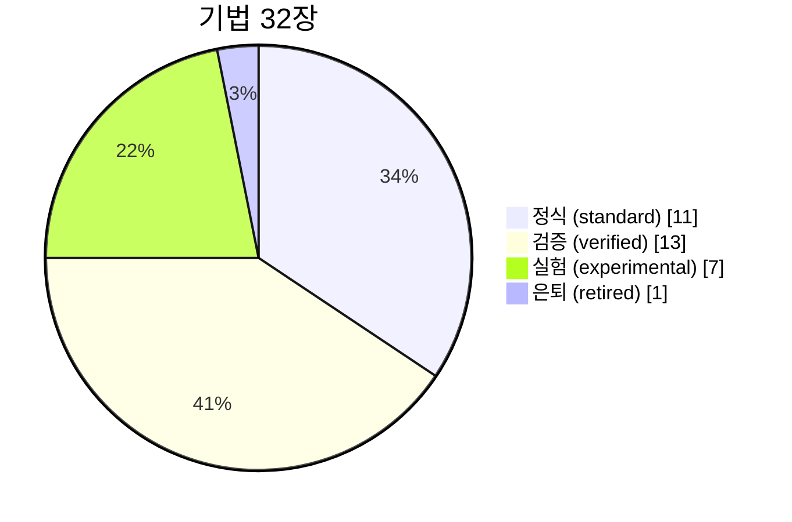

# clone-kb — 클론 시스템 무기고 (기법 레지스트리 + 평가 원장)

> **자동 생성 대시보드** (`scripts/gen_dashboard.py`, 2026-07-14 22:21). 직접 편집 금지 — 카드/원장을 고치고 재생성.
> 운영: 평시=AI 직접 커밋(근거 포함) · **승격/은퇴=Issue 제안→오너 승인** · status=standard만 skills/ 보유 가능(강등 시 스킬도 제거).

## 🔴 라이브 상태판 (무인 런 추적)

- [canvas 캠페인](status/canvas.md) — 무인 런 중 이벤트마다 자동 갱신

## 런 매니페스트 (runs/ — 세션 로직의 축적)

| 날짜 | 런 | 캠페인 | 상태 | 로딩 기법 수 |
|---|---|---|---|---|
| 2026-07-14 | [canvas 세션 11 — P2 델타 소탕 + 탐사기 승격 (무인 10h)](runs/2026-07-14-canvas-p2-deltasweep-explorer.md) | canvas | done | 10 |
| 2026-07-14 | [canvas 세션 12 — 오너 트리아지 판정 소비 (오케=opus)](runs/2026-07-14-canvas-s12-triage-consume.md) | canvas | done | 7 |
| 2026-07-14 | [canvas 세션 13 — 생성 동작 파리티 파일럿 + 델타 소탕 (무인 3h)](runs/2026-07-14-canvas-s13-gen-parity.md) | canvas | done | 8 |
| 2026-07-13 | [canvas 세션 10 — P1 크로스-페이스트 파일럿](runs/2026-07-13-canvas-p1-crosspaste.md) | canvas | done | 6 |
| 2026-07-13 | [notion RUN4 — P3 수복 자동체인 (분류기 계층화 + rip_repair)](runs/2026-07-13-notion-p3-repair-chain.md) | notion | done | 5 |
| 2026-07-13 | [notion RUN5 — 동영상 블록 파리티 + RIP 2층 대조 + 정렬기 매칭 v2](runs/2026-07-13-notion-run5-video-block.md) | notion | done | 6 |

## 기법 상태 분포

## 기법 카드

### 정식 (standard) — 11

| 기법 | 실증 | 카드 |
|---|---|---|
| 적대적 검증 (빌더 ≠ 검증자, verify-first 루프) | canvas, notion | [techniques/adversarial-verification.md](techniques/adversarial-verification.md) |
| Append-only 로깅 (워크로그·티켓·갭매트릭스) | canvas, notion, akiflow, kit | [techniques/append-only-logging.md](techniques/append-only-logging.md) |
| CDP 비파괴 정찰 (peek 패턴, 리로드 금지) | canvas, notion, akiflow | [techniques/cdp-nondestructive-recon.md](techniques/cdp-nondestructive-recon.md) |
| 클립보드 JSON을 정본으로 (노드캔버스 앱) | canvas | [techniques/clipboard-source-of-truth.md](techniques/clipboard-source-of-truth.md) |
| DOM 기반 측정 (픽셀 스샷 대체) | canvas, notion | [techniques/dom-first-measurement.md](techniques/dom-first-measurement.md) |
| 야간 무인 런 SOP (graceful skip · 안전경계 · 큐) | kit, notion, akiflow, canvas | [techniques/night-run-sop.md](techniques/night-run-sop.md) |
| 오케스트레이터 모델 라우팅 (fable 오케 / sonnet 빌더 / opus 검증) | canvas | [techniques/orchestrator-model-routing.md](techniques/orchestrator-model-routing.md) |
| 포트+프로필 격리 (프로젝트당 전용 CDP 포트·Chrome 프로필) | canvas, notion, akiflow, kit | [techniques/port-profile-isolation.md](techniques/port-profile-isolation.md) |
| 번호매김 회귀 검증 스위트 (_bN_verify.py / *_gate.py) | canvas, notion, akiflow | [techniques/regression-harness-suite.md](techniques/regression-harness-suite.md) |
| RIP 레이어① CSS/DOM 전수 덤프 | canvas, notion | [techniques/rip-css-dump.md](techniques/rip-css-dump.md) |
| 서브에이전트 병렬화 규칙 (독립·무충돌만 병렬) | kit, canvas, notion | [techniques/subagent-fanout-rules.md](techniques/subagent-fanout-rules.md) |

### 검증 (verified) — 13

| 기법 | 실증 | 카드 |
|---|---|---|
| 원자적 localStorage 주입 (bulk_inject) | notion | [techniques/atomic-localstorage-inject.md](techniques/atomic-localstorage-inject.md) |
| CDP Raw 드라이버 (좀비 탭 우회) | canvas | [techniques/cdp-raw-driver.md](techniques/cdp-raw-driver.md) |
| 크로스-페이스트 파리티 (라운드트립 diff 0) | canvas | [techniques/cross-paste-parity.md](techniques/cross-paste-parity.md) |
| 실사용(dogfooding)으로 버그 발견 — BORI 사례 | canvas | [techniques/dogfooding-as-bug-discovery.md](techniques/dogfooding-as-bug-discovery.md) |
| 모델 매트릭스 diff (카탈로그 전수 검증, GENERATE 비용 0) | canvas | [techniques/model-matrix-diff.md](techniques/model-matrix-diff.md) |
| osascript 트러스티드 입력 하이브리드 (한글 IME 우회) | notion | [techniques/osascript-trusted-hybrid.md](techniques/osascript-trusted-hybrid.md) |
| 호버 중 레코딩 (Clone Inspector + ci_agent) | notion | [techniques/record-during-hover.md](techniques/record-during-hover.md) |
| RIP 레이어② 인터랙션 크롤러 | canvas, notion | [techniques/rip-crawler.md](techniques/rip-crawler.md) |
| RIP 레이어③ 자동 수복 루프 | canvas, notion | [techniques/rip-repair-loop.md](techniques/rip-repair-loop.md) |
| 상태 탐색기 (커버리지 % 자동 측정) | canvas | [techniques/state-explorer.md](techniques/state-explorer.md) |
| 상태 명세 JSON (URL + 도달 절차 재현) | notion | [techniques/state-spec-json.md](techniques/state-spec-json.md) |
| URL 이탈 가드 (크롤러 실수 네비게이션 방어) | canvas | [techniques/url-escape-guard.md](techniques/url-escape-guard.md) |
| G1 비주얼 판정 시트 (bbox 오버레이 + 크롭) | notion, canvas | [techniques/visual-triage-sheet.md](techniques/visual-triage-sheet.md) |

### 실험 (experimental) — 7

| 기법 | 실증 | 카드 |
|---|---|---|
| 애니메이션 리퍼 (트랜지션 지문 일치) | — | [techniques/animation-ripper.md](techniques/animation-ripper.md) |
| 자산 출처 게이트 (시각 자산 provenance — 자작 대체 재발방지) | notion | [techniques/asset-provenance-gate.md](techniques/asset-provenance-gate.md) |
| 블라인드 A/B 판별 테스트 (사람 눈으로 최종 확인) | — | [techniques/blind-ab-test.md](techniques/blind-ab-test.md) |
| 파리티 CI (교차앱 자동 회귀 파이프라인) | — | [techniques/parity-ci.md](techniques/parity-ci.md) |
| 파리티 감시 데몬 (99% 선언 이후 유지) | — | [techniques/parity-watch-daemon.md](techniques/parity-watch-daemon.md) |
| 픽셀 지문 게이트 (≥99% 점수 재현성) | — | [techniques/pixel-fingerprint-gate.md](techniques/pixel-fingerprint-gate.md) |
| 트윈 미러 하네스 (실물·클론 동시 재생 비교) | — | [techniques/twin-mirror-harness.md](techniques/twin-mirror-harness.md) |

### 은퇴 (retired) — 1

| 기법 | 실증 | 카드 |
|---|---|---|
| 픽셀 스크린샷을 1차 오라클로 (은퇴) | — | [techniques/pixel-screenshot-as-primary-oracle.md](techniques/pixel-screenshot-as-primary-oracle.md) |

## 파이프라인 (조립도)

- **99% 파리티 판정식 (v2 — 6축 게이트)** — [pipelines/99-percent.md](pipelines/99-percent.md)
- **야간 무인 런 파이프라인** — [pipelines/night-run.md](pipelines/night-run.md)
- **RIP 파이프라인 v1 (전수 리핑 3단 조립도)** — [pipelines/rip-v1.md](pipelines/rip-v1.md)
- **Verify-First 루프 (측정→대조→티켓→구현→검증→커밋)** — [pipelines/verify-first-loop.md](pipelines/verify-first-loop.md)

## 캠페인 진행 (cases/)

| 캠페인 | 상태 | 사례 |
|---|---|---|
| 캠페인 사례 — Akiflow 클론 (260622_akiflow-clone) | verified | [cases/akiflow.md](cases/akiflow.md) |
| 캠페인 사례 — Higgsfield Canvas 클론 (260615_canvas-clone) | verified | [cases/canvas.md](cases/canvas.md) |
| 캠페인 사례 — Notion 클론 (260622_notion-clone) | verified | [cases/notion.md](cases/notion.md) |

## 최근 평가 원장 (ledger/)

| 날짜 | 프로젝트 | 기법 | 판정 | 증거 |
|---|---|---|---|---|
| 2026-07-13 | canvas | rip-css-dump | 성과 — 2번째 프로젝트 실증(19상태, 미지 델타 다수), standard 승격 | canvas ref/_RIP_MASTER_DELTA.md |
| 2026-07-13 | canvas | rip-crawler | 성과 — 3상태 파일럿 성공, 동작 델타 4건 기계 발견 | canvas ref/_RIP_CRAWL_PILOT.md |
| 2026-07-13 | canvas | dogfooding-as-bug-discovery | 성과 — BORI 실전 제작으로 치명 버그 6건(자동저장 부재 등) 발굴 | canvas ref/_DOGFOOD_BORI.md |
| 2026-07-13 | canvas | cdp-raw-driver | 성과 — 좀비 탭으로 Playwright 전멸 상황 우회, 이후 표준 드라이버화 | canvas harness/cdp_raw.py |
| 2026-07-13 | canvas | adversarial-verification | 성과 — 캠페인 누적 결함 29건 중 빌더 자가선언 오류 다수 적발 | canvas ref/_VERIFY_r1.md §X |
| 2026-07-13 | canvas | pixel-screenshot-as-primary-oracle | 실패(확정) — retina 드리프트·우측 요소 누락, dom-first로 대체·은퇴 | notion CLONE-METHOD.md §측정 |
| 2026-07-13 | (운영) | night-run-sop | 중립 — 서브에이전트 'Monitor 통지 대기' 정지 3회: 브리프에 '통지 대기 금지·bounded 폴링' 명문화로 해소 | canvas _WORKLOG 세션5 |
| 2026-07-13 | notion | rip-repair-loop | 성과 — 체인 스크립트화(rip_repair.py triage/rerip/verify), view_gallery 파일럿 -16%·회귀 0, "클론만 재덤프" 원칙 코드 고정 | notion ref/rip/repair_view_gallery_cycle1.md |
| 2026-07-13 | notion | rip-crawler | 성과 — §함정(Jaccard 과잉분류)을 classify_layered 3계층으로 해소, 반응다름 8→2·진짜델타 비승격 보존, 게이트 6/6 | notion ref/rip/crawl_peek_open_delta_v3.md |
| 2026-07-13 | notion | orchestrator-model-routing | 성과 — fable 오케(코드 0줄)+sonnet 빌더 2기 직렬, 양쪽 다 게이트 1발 통과·오케 독립 재검증으로 자가선언 리스크 차단 | notion _WORKLOG 2026-07-13 RUN4 |

## 소비 방법 (에이전트)

1. 캠페인 시작 시 `index.md` → 관련 카드만 로드 (스킬 로딩 패턴)
2. 세션 결산 시 사용 기법의 판정을 `ledger/`에 append + `python3 scripts/gen_dashboard.py`
3. 새 기법 = experimental 카드로 등록 → 2프로젝트 실증 시 verified → Issue 승인으로 standard(스킬 포장) → 대체 시 retired(`superseded_by`)
