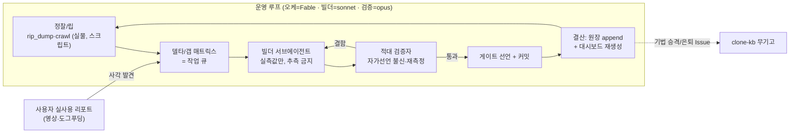

# 캠페인 사례 — Higgsfield Canvas 클론

**외부 작업폴더**: `~/Documents/project/260615_canvas-clone/` (실물 앱: Higgsfield Canvas, 노드캔버스형 생성 AI 툴)

## 현재 상태 (2026-07-13 기준)
- **dev 서버**: `localhost:5175` (`npm run dev`) · **CDP 포트**: 9223, 프로필 `~/.chrome-canvas-clone`
- **파리티 게이트**: 9종 통과 (셸·노드·인터랙션·모델/업로드·상태/서피스/도구·크롤러·**크로스-페이스트**) — 99% 판정식 항목④ 달성(2026-07-13 세션 10)
- **RIP 레이어① 상태**: 19/19 전수 덤프, 0 스킵. attribute-diff 38,476 → 30,580(세션7 리셋) → isolated 기준선 33,538 → 28,642(세션11) → **27,762** (세션12 트리아지 소비, 누적 -9.2%)
- **테스트**: `npx vitest run` — 73/73(실측 JSON 픽스처 기반 클립보드 테스트 36개 포함), 상시 GitHub Actions CI
- **브랜치**: `polish-effects`(구 데모 레이어, 2026-07-13 철거) vs `parity`(활성 캠페인 브랜치)

## 이 캠페인이 낳은 기법
- [[techniques.rip-css-dump]] · [[techniques.rip-crawler]] · [[techniques.rip-repair-loop]] — RIP 3단 파이프라인 원류 ([[pipelines.rip-v1]])
- [[techniques.cdp-raw-driver]] — 좀비 탭 우회 (cdp_raw.py)
- [[techniques.model-matrix-diff]] — 66개 모델 카탈로그 전수 검증, GENERATE 비용 0
- [[techniques.dogfooding-as-bug-discovery]] — BORI 사례, 실사용 4회 실생성으로 6개 실버그 발견·수정
- [[techniques.url-escape-guard]] — 크롤러가 실제로 유발한 네비게이션 사고에서 신설
- [[techniques.orchestrator-model-routing]] — 빌더(sonnet)≠검증자(opus/fable) 규칙의 원 출처
- [[pipelines.99-percent]] — 6축 판정식 정의 원 출처
- [[techniques.cross-paste-parity]] — P1 파일럿(세션 10)으로 verified 승격: 실물 직렬화 계약(마커+localStorage) 채택, 왕복 4/4 diff 0. [[techniques.clipboard-source-of-truth]]의 "클립보드에 JSON 직접" 서술을 교정한 재실측(r2)도 이 라운드의 산물

## 현재 캠페인 루프 (도식 — 결산 시 갱신)

**진행 단계 (99% 로드맵 — [[pipelines.99-percent]])**:
| 단계 | 상태 |
|---|---|
| 게이트 8종 (셸~크롤러) | ✅ 통과 |
| P1 크로스-페이스트 | ⬜ 미착수 (다음) |
| P2 탐사기+델타 소탕 | ⬜ |
| P3 애니메이션 립→쌍둥이 미러 | ⬜ |
| P4 픽셀 지문→99% 판정식 | ⬜ |

## 잔여 티켓 / 남은 일
- RIP 잔여 델타: 커서 불일치(740), fontWeight(620), 색상 근사(#fff↔#f7f7f8, ~3,400), display/position(~1,600) — 시스템 토큰으로 안 잡히는 컴포넌트별 케이스워크로 분류.
- 모델피커 Featured 카피 시각 diff — T-E 원 범위, 아직 미해결.
- 크롤러 상태 커버리지 확장.
- 99% 판정식 P1(cross-paste)~P4(pixel-fingerprint) 전부 미착수 — [[pipelines.99-percent]] 참고.
- 커스터마이징 트랙(Comfy 노드, live LLM planner)은 `src/live/`에 보존만 된 채 미배선.

## 최근 세션
2026-07-13 (RIP-T-E 배치, `--radius-btn`/`--radius-pill` 토큰 분리 마무리).
