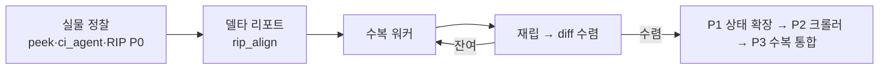

# 캠페인 사례 — Notion 클론

**외부 작업폴더**: `~/Documents/project/260622_notion-clone/` (실물 앱: Notion, app.notion.com)
**프로젝트 repo**: https://github.com/csbakk/devotion (private, 2026-07-14 root 단일 repo로 이관 — clone/ 구 히스토리=`clone-history` 브랜치, 원 해시 보존)

## 현재 상태 (2026-07-13 저녁, "RUN4" 기준)
- **dev 서버**: `localhost:5185` (Vite, strictPort) · **CDP 포트**: 9224, 프로필 `~/.chrome-notion-clone`
- **RIP 파이프라인**: P0~P3 완료(P3-4 R4흡수 검토만 잔여). P3-1 분류기 계층화(`classify_layered` 3단 라벨, `--layered` opt-in, 반응다름 8→2) + P3-3 수복 자동체인(`rip_repair.py` triage/rerip/verify, view_gallery 파일럿 -16%·회귀 0). 정렬기 상대좌표 모드(T46)·parity_exceptions.json 보호 레지스트리 가동
- **devotion 채널** (2026-07-13 오후): 클론=AI 통신 채널화 — ①페이지 실시간 파일 영속(pages/*.md+json) ②멀티셀렉 "⤓ AI로 보내기"(selections/*.json) ③**ops API v1**(POST /op→열린 탭 실시간 적용·presence-lite·annotate.py) — 동시편집 게이트 9/9. 3단계 Yjs 전환은 T51 설계서 완비
- **회귀**: click_audit **508/508 PASS (100%)** (501→508=devotion 테스트 페이지 추가), tsc/build 클린
- **RIP 델타 축소**: 전체 1539→1083(-30%), 캘린더 157→18(**-88.5%**, 최대폭), 타임라인 348→324→60(T46 상대좌표 수정 후 -81.5%), date popup 152→27(-82.2%), title_hover 29→**0**(완전 수렴)
- **무인 10시간 런**: 명시적 번호매김 2회(RUN2 0712, RUN3 0713), 그 전 5H/무번호 10H 런 3회
- **클론 규모**: 페이지 191(rowdoc +86 포함), DB 58, row 418
- **미해결 블로커**: B20 — Chrome 9224가 `app.notion.com` 새 탭에서 `about:blank`에 멈춤, 사용자 Chrome 재시작 필요

## 이 캠페인이 낳은 기법
- [[techniques.adversarial-verification]] — `ci_agent.py`+`ci_compare.py`, 동일 제스처 이중 오라클
- [[techniques.record-during-hover]] — Clone Inspector 확장 연동
- [[techniques.osascript-trusted-hybrid]] — 한글 IME 우회 (2026-06-26 돌파, B4 해결)
- [[techniques.atomic-localstorage-inject]] — `bulk_inject.py`, "localStorage away-클로버" 사고 이후 도입
- [[techniques.state-spec-json]] — `ref/rip/states/*.json` 10종
- [[techniques.dom-first-measurement]], [[techniques.pixel-screenshot-as-primary-oracle]] 은퇴 — 2026-07-10 채택 원 출처 중 하나

## 현재 캠페인 루프 (도식 — 결산 시 갱신)

**진행 단계 (RIP 로드맵)**: P0 파일럿 ✅ → P1 상태 9종 수렴 ✅(F1~F5+T34) → P2 크롤러 ✅(peek_open 파일럿) → P3 수복 루프 통합 ✅(분류기 계층화+rip_repair 체인, P3-4 R4흡수 검토만 잔여)

## 잔여 티켓 / 남은 일
- P3-4: R4 템플릿-페어 4쌍을 RIP 상태 spec으로 흡수(rip_repair 체인에 태우기).
- ~~갤러리 G1 판단~~ → ADR-0008(original-first) 채택·17건 수복 완료(구조 30→5). 잔여: 구조 5건=geom_score 매칭 아티팩트(`--relative` 적용 검토) · 신규 매칭쌍이 노출한 속성 델타 G2 사이클.
- triage transition 휴리스틱 정제 · T47 타임라인 툴바 잔여 · 크롤러 깊이 확장(depth 1→2+).
- T51 Yjs 멀티유저 전환(설계서 완비, 배포 시점) — `ref/design/T51_yjs_migration.md`.
- ~~사용자 확인 대기~~ → 2026-07-13 결정 5건 전부 실행 완료(아이콘 원복·즉시랜덤 동일화·과잉구현 무반응화·T46 -81.5%·채널 개통). B20도 해소.

## 최근 세션
2026-07-13 저녁 (RUN4: P3 완주 — 분류기 계층화 6/6 PASS·rip_repair 체인 파일럿 -16%·회귀 0 · 세션시작 포인터 체인 첫 실전 · click_audit 508/508). 직전: RUN3(RIP P0~P2 완주 · 결정 5건 · devotion 채널 3종 · clone-kb 주입).
