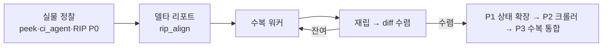

# 캠페인 사례 — Notion 클론

**외부 작업폴더**: `~/Documents/project/260622_notion-clone/` (실물 앱: Notion, app.notion.com)

## 현재 상태 (2026-07-13, "무인 런3" 기준)
- **dev 서버**: `localhost:5185` (Vite, strictPort) · **CDP 포트**: 9224, 프로필 `~/.chrome-notion-clone`
- **RIP 파이프라인**: 구조 CSS diff + 인터랙션 크롤러 P0~P2 완료, P3(자동수복+분류기 정밀도) 미착수
- **회귀**: click_audit **501/501 PASS (100%)**, tsc/build 클린
- **RIP 델타 축소**: 전체 1539→1083(-30%), 캘린더 157→18(**-88.5%**, 최대폭), 타임라인 348→324→60(T46 상대좌표 수정 후 -81.5%), date popup 152→27(-82.2%), title_hover 29→**0**(완전 수렴)
- **무인 10시간 런**: 명시적 번호매김 2회(RUN2 0712, RUN3 0713), 그 전 5H/무번호 10H 런 3회
- **클론 규모**: 페이지 191(rowdoc +86 포함), DB 58, row 418
- **미해결 블로커**: B20 — Chrome 9224가 `app.notion.com` 새 탭에서 `about:blank`에 멈춤, 사용자 Chrome 재시작 필요

## 이 캠페인이 낳은 기법
- [[techniques.adversarial-verification]] — `ci_agent.py`+`ci_compare.py`, 동일 제스처 이중 오라클
- [[techniques.record-during-hover]] — Clone Inspector 확장 연동
- [[techniques.osascript-trusted-hybrid]] — 한글 IME 우회 (2026-06-26 돌파, B4 해결)
- [[techniques.atomic-localstorage-inject]] — `bulk_inject.py`, "localStorage away-클로버" 사고 이후 도입
- [[techniques.state-spec-json]] — `ref/rip/states/*.json` 10종
- [[techniques.dom-first-measurement]], [[techniques.pixel-screenshot-as-primary-oracle]] 은퇴 — 2026-07-10 채택 원 출처 중 하나

## 현재 캠페인 루프 (도식 — 결산 시 갱신)

**진행 단계 (RIP 로드맵)**: P0 파일럿 ✅(부분 성공) → P1 상태 확장 ⬜ → P2 크롤러 ⬜(캔버스에서 선행 실증됨) → P3 수복 루프 통합 ⬜

## 잔여 티켓 / 남은 일
- P3 자동수복 루프 + mutation-Jaccard 분류기 정밀도(과잉분류 문제).
- R4 템플릿-페어링 잔여 4쌍.
- 크롤러 깊이 확장(현재 `peek_open` 상태 이후 미확장).
- 사용자 확인 대기 항목(`_USER_CHECK_0712.md`): 스크래치 페이지 랜덤 아이콘/커버 배정 유지 여부, 클론 과잉구현 3건(파일첨부/멘션/ArrowLeft) 제거 여부, T46 디자인 리뷰.
- B20 Chrome 재시작 필요.

## 최근 세션
2026-07-13 (RIP-PIPELINE 10상태 테스트, RUN3 무인 10시간 런).
