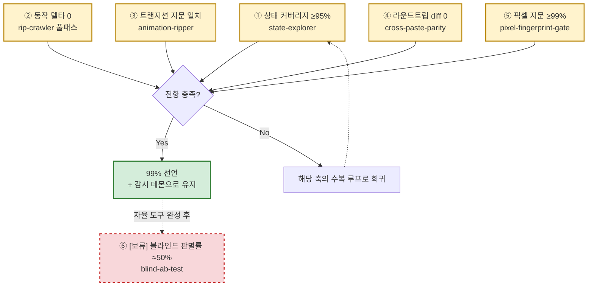

# 99% 파리티 판정식 (v2 — 6축 게이트)

**한 줄**: "99% 다 됐다"는 감(感)이 아니라 6개의 수치 게이트로 조작적 정의한다. canvas-clone `docs/2026-07-13-99-percent-plan.md`가 정의한 전체 판정식. 전항 통과해야 "99% 선언".

## 왜 4축 문제로 시작하나
"안 되는 1%"의 원인을 4개 축으로 분해: ① 공간 커버리지(未visited 상태) ② 시간축(동작/애니메이션 불일치) ③ 데이터 등가(직렬화 불일치) ④ 인간 지각(feel). 이 4축을 6개의 자동/반자동 게이트로 다시 쪼갠 것이 아래 판정식.

## 6축 판정식

- 항목⑥은 **의도적 보류** — "정답률≈50%=사람이 구분 불가=99%의 조작적 정의"이지만, 자율 도구(①~⑤) 완성 전에 돌리면 무의미한 신호만 준다는 판단으로 뒤로 미룸.
- 판정식 원문 표현: "성격: 99% 파리티 달성을 위한 도구·로직 설계 + 실행 로드맵."

## 파일럿 승격 기준 (§6 발췌)
| 축 | 파일럿 통과 기준 |
|---|---|
| ① state-explorer | 사람이 열거 안 한 신규 상태 ≥5개 자동 발견 |
| ④ cross-paste-parity | 실물→클론 paste 재현 + 라운드트립 diff 0(노드 3타입 이상) |
| ⑤ pixel-fingerprint-gate | ≥99% 점수 재현성(2회 연속 ±0.1%) |

## 로드맵 (§5)
P1(cross-paste, ~1세션) → P2(explorer 승격+커버리지%, 잔여 델타 정리 — 무인 10h 런에 적합) → P3(animation-ripper→twin-mirror-harness) → P4(pixel-fingerprint-gate 대시보드→판정식 실행, 항목⑥ 보류 유지). 감시 데몬 + CI(GitHub Actions build+vitest)는 P1·P4와 병행 상시 운영.

## 운영 불변식 (판정식과 별개로 항상 지키는 것)
"실측=스크립트(토큰0), 판단=검증자(빌더≠검증자), Chrome 1워커, GENERATE 금지, 통지 대기 금지." → [[techniques.adversarial-verification]], [[techniques.night-run-sop]]와 동일 뿌리.

## 상태 (2026-07-13 기준)
6축 중 완전 통과한 축 없음. ①은 [[techniques.rip-crawler]]가 가장 가까운 프로토타입(커버리지 % 미산출), ②는 [[pipelines.rip-v1]]이 부분 실행 중, ③④⑤⑥은 모두 experimental(설계만, 미착수).

## 관련
- [[pipelines.rip-v1]] — 이 판정식의 ①②를 채우는 실제 실행 파이프라인
