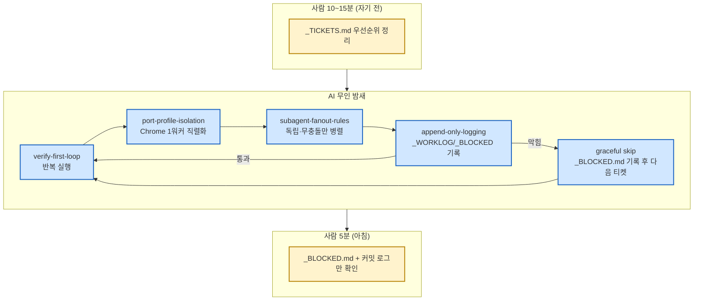

# 야간 무인 런 파이프라인

**한 줄**: [[pipelines.verify-first-loop]]를 사람 없이 밤새 반복시키기 위한 상위 조립 — 격리·로깅·병렬화·안전경계 4개 기법을 하나의 운영 SOP로 묶는다.

## 조립도

## 핵심 불변식 ([[techniques.night-run-sop]]에서 상속)
완료 판단은 디스크 산출물로만(워커 자가보고 불신), 막힘 카운트 초과 시 부분결과 저장 후 정지, 무맹목 삭제·실데이터 mutation·포커스 스틸(`bringToFront`) 금지.

## 실적
- notion-clone: 10시간 무인 런 2회(RUN2, RUN3) — RIP 구조 델타 30%↓.
- akiflow-clone: cmux 기반 무인 오케스트레이터가 이 파이프라인을 그대로 채택해 킥오프.

## 관련
- [[pipelines.verify-first-loop]] — 이 파이프라인이 반복시키는 작업 단위
- [[techniques.orchestrator-model-routing]] — 무인 런의 오케스트레이터/빌더/검증자 모델 배정(canvas 한정 실증, 다른 캠페인은 역할분리까지만 확인됨)
