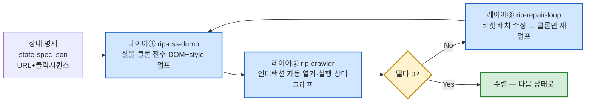

# RIP 파이프라인 v1 (전수 리핑 3단 조립도)

**한 줄**: "아는 것만 체크리스트로 재는" 방식을 버리고, 상태를 전수(全數)로 뜯어 기계가 델타를 자동 발견하게 하는 3단 파이프라인. canvas·notion 두 캠페인에서 독립적으로 도달·검증된 방법론.

## 조립 순서

## 각 단계 요약
1. **상태 명세** ([[techniques.state-spec-json]]) — 재현할 상태를 URL+클릭 시퀀스 JSON으로 못박는다. `cleanup[]`으로 비파괴 원칙 강제.
2. **레이어① CSS/DOM 전수 덤프** ([[techniques.rip-css-dump]]) — 같은 덤프 스크립트를 실물·클론 양쪽에 실행, class-agnostic 자동 정렬로 엘리먼트 매칭, 속성 diff 산출. 좀비 탭 문제는 [[techniques.cdp-raw-driver]]로 우회.
3. **레이어② 인터랙션 크롤러** ([[techniques.rip-crawler]]) — 상태 내 상호작용을 전수 실행해 상태그래프 diff. 안전장치로 [[techniques.url-escape-guard]] 결합.
4. **레이어③ 자동 수복 루프** ([[techniques.rip-repair-loop]]) — 델타를 4개 그룹(판단필요/구현명확/시각확인/하네스버그)으로 분류해 배치 수정 → 클론만 재덤프 → 수렴까지 반복.

## 실측 성과 (두 캠페인 합산)
- canvas: 19/19 상태 전수, attribute-diff 38,476→30,580(-20.5%).
- notion: 10개 상태, 구조 델타 1539→1083(-30%), 캘린더 뷰 -88.5%, title_hover 완전 수렴(29→0).

## 관련
- [[pipelines.99-percent]] — 이 파이프라인의 산출물이 채우는 상위 6축 판정식의 항목①②
