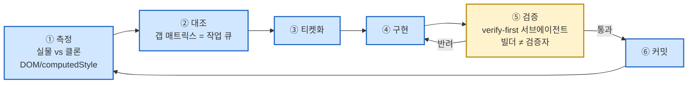

# Verify-First 루프 (측정→대조→티켓→구현→검증→커밋)

**한 줄**: 클론 캠페인의 범용 작업 단위 루프. "구현했다"가 아니라 "독립적으로 재측정해서 통과했다"를 완료 기준으로 삼는다. 3캠페인 전부에서 각자 다른 도구로 실증.

## 루프 조립도

## 검증 주체 확장 규칙
초기 렙(rep)은 메인 세션이 직접(수치+육안) 검증한다. 갭이 티켓 단위로 쪼개져 병렬 여지가 생기면 그때부터 [[techniques.adversarial-verification]] 서브에이전트로 확장(빌더≠검증자, 검증자 모델 ≥ 빌더 모델 — [[techniques.orchestrator-model-routing]]).

## 3캠페인 구현 형태
- **canvas**: 이 루프를 문서로 명문화한 원 출처(`parity-rep-method.md`). ⑤검증은 `_bN_verify.py` 스위트([[techniques.regression-harness-suite]])가 담당.
- **notion**: ①②를 `ci_agent.py`+`ci_compare.py`가 실물·클론 동시 실행으로 자동화, ⑤검증은 다양한 `*_gate.py`.
- **akiflow**: ⑤검증을 `gate.py` 하나로 통합해 "parity 24/24 · flow 56/56 · glyph mismatch 0"을 한 번에 리포트하는 형태로 진화.

## 로깅 규율
루프의 매 사이클이 [[techniques.append-only-logging]] 원칙으로 워크로그에 기록되어야 다음 세션(특히 무인 야간 런)이 어디까지 왔는지 신뢰하고 이어갈 수 있다.

## 관련
- [[pipelines.night-run]] — 이 루프를 사람 없이 밤새 반복시키는 상위 운영 SOP
