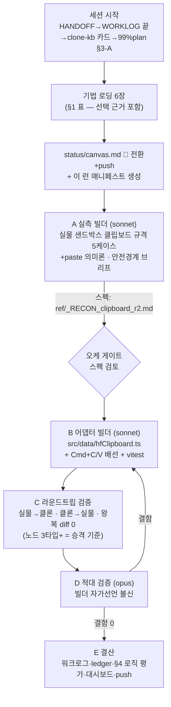

# 런 매니페스트 — canvas 세션 10 (P1 크로스-페이스트 파일럿)

> **runs/ = 세션 로직의 축적 기록** (status/=라이브 덮어쓰기와 역할 분리).
> 시작 시 "로딩 기법+선택 근거+세션 로직 도식"을 쓰고, 결산 시 §4 로직 평가를 채운다.
> 런 매니페스트끼리의 diff = 하네스가 진화해온 과정.

## 1. 로딩된 기법 + 선택 근거

| 기법 카드 | status | 이번 세션에서의 역할 (선택 근거) |
|---|---|---|
| [[techniques.clipboard-source-of-truth]] | standard | P1의 기반 원칙 — 실물 Cmd+C JSON = 직렬화 계약. 이번 세션은 이 원칙의 자동화 확장 |
| [[techniques.cross-paste-parity]] | experimental | **이번 세션의 주인공** — 설계만 있던 카드를 첫 파일럿 실행으로 검증(승격 후보) |
| [[techniques.orchestrator-model-routing]] | standard | 오케=Fable(조율·게이트)/빌더=sonnet/적대검증=opus — 사용자 지정 라우팅 |
| [[techniques.adversarial-verification]] | standard | 빌더 자가선언 불신 — D단계 opus 게이트 |
| [[techniques.cdp-raw-driver]] | verified | 좀비 탭(766028e1) 상존 → Playwright 전면 attach 대신 단일 타겟 raw CDP |
| [[techniques.port-profile-isolation]] | standard | CDP 9222 전용 프로필(~/.chrome-canvas-clone) 전제 |

## 2. 세션 로직 도식 (이번 세션은 이렇게 돈다)

**안전 경계(빌더 브리프 공통)**: GENERATE 금지 · 보존 결과노드 2개 불가침 · URL 이탈 가드 · 클립보드 백업/복원+stale 마커 검증 · 좀비 탭 접근 금지 · 통지 대기 금지(bounded 폴링).

## 3. 이벤트 요약

- 세션 시작, 진입 문서 4종+기법 카드 로드, 환경 확인(CDP 9222·클론 5175 정상).
- A 실측 빌더 투입 (백그라운드).
- A 완료 (커밋 b6d2eb3): ★직렬화 계약 = 마커(OS클립보드)+페이로드(localStorage) 2단 구조 — 과거 "클립보드에 JSON 직접" 가정 뒤집힘. 5케이스 실측, 댕글링 엣지 2중 교차검증, paste 의미론은 미실측으로 정직 보고. 보존노드 4개 100% 복원.
- 로직 수정: 도식의 "A→게이트→B" 직렬 흐름에 A2(paste 의미론 실측)를 B와 병렬로 추가 — A의 미실측 항목이 C(라운드트립) 전제조건이라서. 파일 충돌 없음(B=src/, A2=harness+실물 탭).
- B 완료(5695f3f, 55/55)·A2 완료(f43d3ff — 커서 기반 position·전면 id 재매핑·node_id quirk·key code 9 방법론)·B2 정렬(59d8ef4, 64/64).
- C 라운드트립(a3eab93): 실물→클론 5/5·클론→실물 4/4·왕복 4/4 diff 0 + 결함 1(unknown 렌더) → B3 수복(a21f491, 73/73) — 수복 루프 1회전.
- D 적대검증(opus, §Z): 4렌즈 통과, **승격 기준 충족(MET)·신규 결함 0** → P1 게이트 통과.
- E 결산: 워크로그·HANDOFF·ledger 6건·카드 2장(cross-paste verified 승격·clipboard-SSOT 교정)·본 매니페스트 §4.

## 4. 로직 평가 (결산 시 채움 — ledger·카드 승격의 근거)

- **작동한 것**: ①실측→어댑터→정렬→검증→적대검증 체인이 전 티켓 1발 게이트 통과 ②A2∥B 병렬화(파일 경계 분리)로 A의 공백(paste 의미론)을 대기 없이 메움 ③실측 JSON을 vitest 픽스처로 직접 쓰는 패턴(스펙 문서↔테스트 괴리 원천 차단) ④방법론 발견(key code 9)을 다음 브리프(C)로 즉시 승계 ⑤수복 루프 1회전(C 결함 발견→B3→재검증)이 게이트 앞에서 완결.
- **병목/실패**: ①오케 브리프의 "보존 노드 2개"가 실제 4개 — 사전 인벤토리를 기억에 의존(에이전트가 방어적으로 4개 전부 보존해 무사고) ②A가 멀티셀렉트·신규 엣지 생성에 장시간 소진 — GENERATE 금지 제약과 케이스 의존관계(빈 노드=출력 포트 없음)를 사전 설계에서 못 걸러 구조적 막다른 길에 진입 ③실측 시 뷰포트 zoom 미기록 → 다중노드 배치 공식 미확정(가정으로 잔존) ④OS 클립보드가 공유 머신에서 외부 오염 — 검증 신호로 단독 사용 불가(localStorage 마커로 전환).
- **다음 런에서 바꿀 것**: ①실측 브리프에 "뷰포트 상태(zoom/pan) 기록 의무" 명문화 ②사전 인벤토리는 오케가 시작 시 직접 1회 실측해 브리프에 박기 ③실측 케이스 설계 시 금지 제약→의존 그래프를 먼저 그려 막다른 길 사전 제거 ④공유 머신에선 OS 전역 자원(클립보드·포커스)을 신뢰 신호로 쓰지 않기.
- **ledger 반영**: ledger/2026-07.md 6건 append(cross-paste 성과·clipboard-SSOT 부분 배신·osascript 강화·routing·adversarial·runs 신설).
