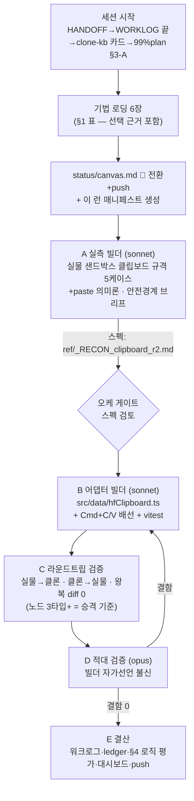

# 런 매니페스트 — canvas 세션 10 (P1 크로스-페이스트 파일럿)

> **runs/ = 세션 로직의 축적 기록** (status/=라이브 덮어쓰기와 역할 분리).
> 시작 시 "로딩 기법+선택 근거+세션 로직 도식"을 쓰고, 결산 시 §4 로직 평가를 채운다.
> 런 매니페스트끼리의 diff = 하네스가 진화해온 과정.

## 1. 로딩된 기법 + 선택 근거

| 기법 카드 | status | 이번 세션에서의 역할 (선택 근거) |
|---|---|---|
| [[techniques.clipboard-source-of-truth]] | standard | P1의 기반 원칙 — 실물 Cmd+C JSON = 직렬화 계약. 이번 세션은 이 원칙의 자동화 확장 |
| [[techniques.cross-paste-parity]] | experimental | **이번 세션의 주인공** — 설계만 있던 카드를 첫 파일럿 실행으로 검증(승격 후보) |
| [[techniques.orchestrator-model-routing]] | standard | 오케=Fable(조율·게이트)/빌더=sonnet/적대검증=opus — 사용자 지정 라우팅 |
| [[techniques.adversarial-verification]] | standard | 빌더 자가선언 불신 — D단계 opus 게이트 |
| [[techniques.cdp-raw-driver]] | verified | 좀비 탭(766028e1) 상존 → Playwright 전면 attach 대신 단일 타겟 raw CDP |
| [[techniques.port-profile-isolation]] | standard | CDP 9222 전용 프로필(~/.chrome-canvas-clone) 전제 |

## 2. 세션 로직 도식 (이번 세션은 이렇게 돈다)

**안전 경계(빌더 브리프 공통)**: GENERATE 금지 · 보존 결과노드 2개 불가침 · URL 이탈 가드 · 클립보드 백업/복원+stale 마커 검증 · 좀비 탭 접근 금지 · 통지 대기 금지(bounded 폴링).

## 3. 이벤트 요약

- 세션 시작, 진입 문서 4종+기법 카드 로드, 환경 확인(CDP 9222·클론 5175 정상).
- A 실측 빌더 투입 (백그라운드).
- (이하 결산 시 채움)

## 4. 로직 평가 (결산 시 채움 — ledger·카드 승격의 근거)

- **작동한 것**: (미기입)
- **병목/실패**: (미기입)
- **다음 런에서 바꿀 것**: (미기입)
- **ledger 반영**: (미기입)
