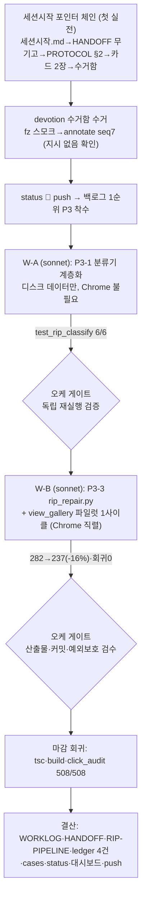

# 런 매니페스트 — notion RUN4 (P3 수복 자동체인)

> **runs/ = 세션 로직의 축적 기록** (status/=라이브 덮어쓰기와 역할 분리).
> ※ 이 매니페스트는 결산 시점 소급 작성 — runs/ 레이어가 세션 도중(canvas 세션 10) 신설됨.

## 1. 로딩된 기법 + 선택 근거

| 기법 카드 | status | 이번 세션에서의 역할 (선택 근거) |
|---|---|---|
| [[techniques.rip-repair-loop]] | verified | **주인공①** — P3-3의 설계 원본(4그룹 분류·클론만 재덤프·전역치환 금지). 카드의 수동 루틴을 `rip_repair.py` 체인으로 코드화 |
| [[techniques.rip-crawler]] | verified | **주인공②** — 카드 §함정(Jaccard 과잉분류)이 P3-1의 문제 정의. `classify_layered()` 3계층으로 해소 |
| [[techniques.orchestrator-model-routing]] | standard | 오케=Fable(판정·게이트만)/빌더=sonnet — 세션시작 명령어 지정 라우팅 |
| [[techniques.night-run-sop]] | standard | 워커 수칙(대기금지·저장완결·완료판정=디스크)·백로그 큐 운영 |
| [[techniques.port-profile-isolation]] | standard | CDP 9224·dev 5185·전용 프로필 전제 |

## 2. 세션 로직 도식 (이번 세션은 이렇게 돌았다)

**안전 경계(브리프 공통)**: 실물 Notion 접속 금지(기존 real 덤프 재사용) · bringToFront 금지 · 탭 열면 닫기 · parity_exceptions.json 불가침 · 전역치환 수복 금지 · 대기 금지.

## 3. 이벤트 요약

- 진입 의식 → fz 수신확인(annotate seq7) → status 🔴 push.
- W-A 완료(17:38, 게이트 6/6 PASS → 오케 독립 재실행으로 재확인) → status push.
- W-B 완료(18:05, 파일럿 -16%·view_board 스팟 회귀 0·커밋 `2aa2157`).
- 마감 회귀 508/508·tsc/build 클린 → 결산 push.

## 4. 로직 평가 (ledger·카드 승격의 근거)

- **작동한 것**: ① 세션시작 포인터 체인 — 정본 4곳(HANDOFF·PROTOCOL·카드·수거함)을 갈아타며 상태를 완전 복원, 명령어 파일 수정 없이 작동(설계 의도 검증). ② 카드 §함정 → 작업 정의 직결(rip-crawler §함정이 P3-1 스펙이 됨) — "카드에 함정을 기록해두면 다음 세션의 백로그가 된다"는 축적 효과 첫 실증. ③ opt-in 플래그 관례(T46 선례→ --layered 재적용) — 회귀 걱정 없는 하네스 진화 패턴으로 정착. ④ 오케 독립 재실행 게이트 — 빌더 자가선언 불신을 저비용(테스트 1회 재실행)으로 구현.
- **병목/실패**: ① click_audit(508건)이 마감 회귀의 wall-clock 지배 항목(~15분) — 상태별 스팟 모드가 있으면 사이클 짧아짐. ② 시스템 python3에 playwright 없어 게이트 재실행 1회 헛발( .venv 강제 명시가 브리프에 필요). ③ W-B의 transition 델타 판단 보류처럼 "G2 자동분류를 사람이 뒤집는" 케이스가 곧 triage 휴리스틱의 다음 정제 지점.
- **다음 런에서 바꿀 것**: ① P3-4 — R4 페어를 RIP 상태 spec으로 흡수해 rip_repair 체인에 태우기(별도 풀루프 폐지 검토). ② 워커 브리프에 `.venv/bin/python` 강제 문구 표준화. ③ triage에 transition/애니메이션 계열 자동 G1 강등 규칙 추가.
- **ledger 반영**: rip-repair-loop 성과 / rip-crawler 성과 / orchestrator-model-routing 성과 / night-run-sop 성과 (ledger/2026-07.md 2026-07-13 notion 4행).

## 5. 후속 (같은 날 저녁, 사용자 피드백 즉시 반영)
- 오너 보고 "G1이 텍스트뿐이라 판단 불가" → W-C(sonnet) 투입, `rip_repair.py visual` 신설(클론 실캡처+실물 덤프 와이어프레임 오버레이+크롭+정체설명 시트). 게이트 4검증 PASS+오케 눈검증. **신기법 [[techniques.visual-triage-sheet]] experimental 등록** — "판단을 요구하는 자동화는 판단 가능한 형식으로 증거를 내야 한다"는 원칙의 첫 코드화. 위 "병목/실패 ③"의 G1 병목이 시트로 해소되는지 다음 런에서 평가.
