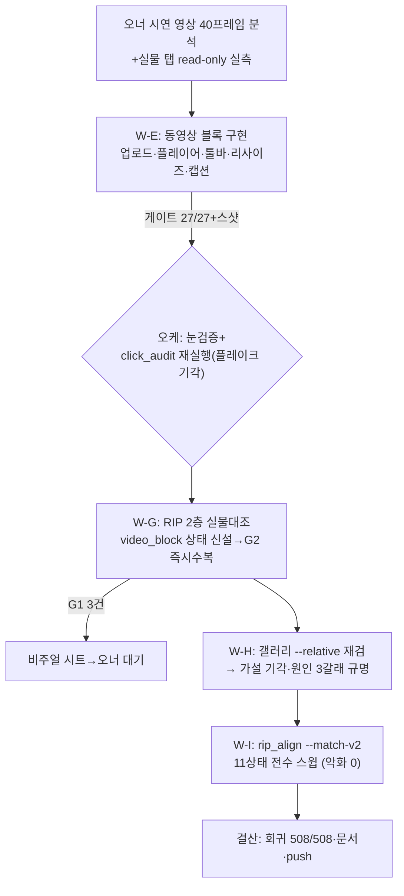

# 런 매니페스트 — notion RUN5 (동영상 블록, 2h 무인)

## 1. 로딩된 기법 + 선택 근거

| 기법 카드 | status | 역할 (선택 근거) |
|---|---|---|
| [[techniques.cdp-nondestructive-recon]] | standard | 실물 레퍼런스가 오너의 **라이브 페이지**(스크래치 아님) — read-only attach·DOM 질의만, 클릭/호버 금지로 가장 엄격하게 적용 |
| [[techniques.rip-css-dump]] | standard | 신규 기능(비디오)을 만들자마자 2층 대조에 편입 — "1층 기능테스트만으론 부족" 오너 지적의 응답 |
| [[techniques.rip-repair-loop]] | verified | video_block triage→G2 즉시수복→rerip 수렴(48→47) |
| [[techniques.visual-triage-sheet]] | experimental | 비디오 G1 3건 판정 시트 — **2번째 실전**(verified 승격 요건 충족 여부는 오너 열람 후) |
| [[techniques.orchestrator-model-routing]] | standard | 오케=Fable / 빌더 sonnet 직렬 4기, 게이트마다 오케 독립 재실행 |
| [[techniques.night-run-sop]] | standard | 2h 무인, Chrome 직렬, 이벤트마다 status push |

## 2. 세션 로직 도식

## 3. 이벤트 요약
- W-E 완료(게이트 27/27, 브릿지 Range 결함 발견·수정) → 오케 click_audit 재검 508/508(워커 보고 506/507=플레이크 기각).
- W-G 완료(G2 2건 수복 bb30e39, G1 3건 시트). 실물 탭 무결 확인(18탭·URL 보존).
- W-H: --relative 아티팩트 가설 **기각** — 카드 정렬순서 제품델타+스코어러 약점 2건 실측 규명.
- W-I: --match-v2 구현, 스윕 개선5/불변6/악화0. 오케 독립 재실행 PASS.
- 마찰: DevTools 창 표출 문의(canvas 세션10 추정) → ledger 중립 기록.

## 4. 로직 평가

- **작동한 것**: ① "오너 시연 영상→프레임 실측→구현→즉시 2층 대조" 풀루프가 한 런에서 완결 — 신규 기능도 만든 직후 RIP 상태로 편입하면 파리티 부채가 안 쌓임. ② W-H의 가설 기각이 W-I의 정확한 스펙이 됨 — "억지 수렴 금지·정직 보고" 수칙이 하네스 진화의 입력 품질을 보장(기각 보고가 없었으면 잘못된 방향으로 튜닝했을 것). ③ 게이트가 제품 결함을 선제 적발(브릿지 Range — 게이트 없이는 사용자가 스크럽 깨짐으로 발견했을 것). ④ 빌더 자가선언 불신(click_audit 재실행)이 이번엔 워커 무죄를 판정 — 불신 게이트는 유죄/무죄 양방향으로 가치.
- **병목/실패**: ① 실물 라이브 페이지의 호버 전용 UI는 read-only 제약과 충돌(비디오 툴바 실물 확인 불가로 G1 잔존) — 스크래치 존에 비디오 블록을 만들어두면 해소 가능(다음 런). ② click_audit 전체(508)가 여전히 마감 지배 항목 — 상태별 스팟 모드 미착수.
- **다음 런에서 바꿀 것**: ① 실물 스크래치 페이지에 비디오 블록 추가(오너 1회 업로드 필요)→호버 툴바·핸들 실측으로 G1 해소 ② P3-4는 사용자 입회 세션으로 ③ visual-triage-sheet 2회 실증 완료 — verified 승격 Issue 검토.
- **ledger 반영**: rip-css-dump 성과 / visual-triage-sheet 성과(2회차) / night-run-sop 중립(DevTools 마찰) — ledger/2026-07.md.

## 5. 후속 (2026-07-14 새벽 — 사용자 버그 리포트 대응, W-J·W-K)
- **오너 실사용이 게이트 27/27을 뚫은 버그를 발견**(dogfooding): 파인더 드래그 업로드 무반응. 근본원인=.editor-trailer(빈 영역) drag/drop 핸들러 부재 — W-E 게이트의 JS 합성 DragEvent가 dragover 수용 요건을 우회해 거짓 양성. CDP `Input.dispatchDragEvent` 계측으로 확정, 수정(580da51), 게이트를 네이티브 경로로 교체+trailer mp4/mov 케이스 → 29/29.
- parity_exceptions_gate FAIL 추적(W-K): 제품 회귀 아님 — 게이트 하드코딩 절대좌표(x=6)가 사이드바에 명중하던 픽스처 결함(오후 PASS는 사이드바 접힘 우연). 요소 상대좌표로 수리, 게이트 3종 PASS.
- **로직 평가 추가**: ①"게이트 통과"≠"실사용 검증" — 입력 이벤트류는 합성이 우회하는 브라우저 게이트를 먼저 물어야(카드 함정 2건 추가) ②오너의 재현 영상(capture-draw events+timeline)이 원인 격리를 크게 가속 — 재현 영상 제공을 버그 리포트 표준으로.
