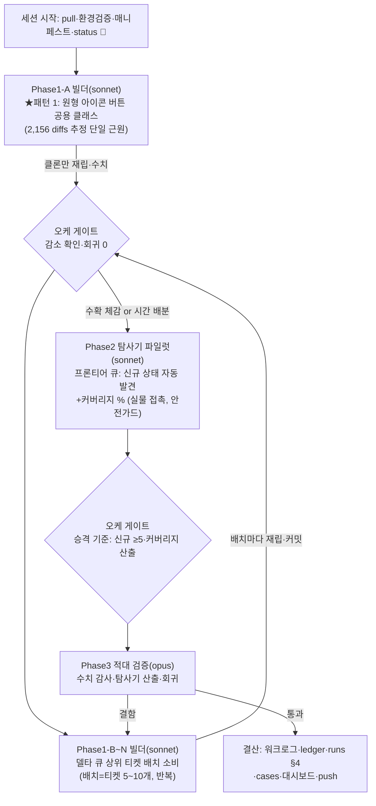

# 런 매니페스트 — canvas 세션 11 (P2, 무인 10h)

## 1. 로딩된 기법 + 선택 근거

| 기법 카드 | status | 역할 (선택 근거) |
|---|---|---|
| [[techniques.rip-repair-loop]] | verified | Phase 1 골격 — 델타 큐 소비→패치→클론만 재립→수치 검증 사이클 |
| [[techniques.rip-css-dump]] | standard | 재립 도구(rip_resweep_clone.py, 클론 전용 — 실물 무접촉 원칙) |
| [[techniques.state-explorer]] | experimental | **이번 런의 승격 후보** — 프론티어 큐 자동 탐사, 기준: 신규 상태 ≥5 자동 발견+커버리지 % |
| [[techniques.rip-crawler]] | verified | 탐사기의 기반(후보 열거·mutation 기록·안전가드 재사용) |
| [[techniques.night-run-sop]] | standard | 무인 규율: graceful skip·bounded 폴링·통지 대기 금지·상태판 라이브 |
| [[techniques.orchestrator-model-routing]] | standard | fable 오케/sonnet 빌더/opus 적대검증 |
| [[techniques.adversarial-verification]] | standard | Phase 3 게이트 — 델타 감소 수치 감사+탐사기 산출 검증 |
| [[techniques.cdp-raw-driver]] | verified | 표준 드라이버(좀비 탭 상존) |
| [[techniques.url-escape-guard]] | verified | Phase 2 실물 탐사 필수 가드 |
| [[techniques.regression-harness-suite]] | standard | 배치 후 회귀 스팟(vitest+선별 _bN) |

## 2. 세션 로직 도식

**세션 10 개선 반영**: ①실측 브리프에 뷰포트 상태(zoom/pan) 기록 의무 ②실물 보존 노드 = **4개**(r2 §7 실측 id — "2개" 아님)로 브리프 정정, Phase 2 시작 전 오케가 인벤토리 직접 재확인 ③금지 제약(GENERATE)→의존 그래프를 케이스 설계에 선반영 ④OS 전역 자원(클립보드·포커스)을 검증 신호로 단독 사용 금지.
**안전 경계(전 브리프 공통)**: GENERATE 금지 · 보존 노드 4개 불가침 · URL 가드 · 좀비 탭(766028e1) 금지 · Chrome 실물 조작 동시 1워커 · bounded 폴링 · 엔진 코어 불변 · 티켓 단위 커밋(오케).

## 3. 이벤트 요약
- 시작: pull 완료, CDP 9222(실물·클론 탭)·클론 5175 정상.
- (진행하며 갱신)

## 4. 로직 평가 (결산 시 채움)
- **작동한 것**: (미기입)
- **병목/실패**: (미기입)
- **다음 런에서 바꿀 것**: (미기입)
- **ledger 반영**: (미기입)
