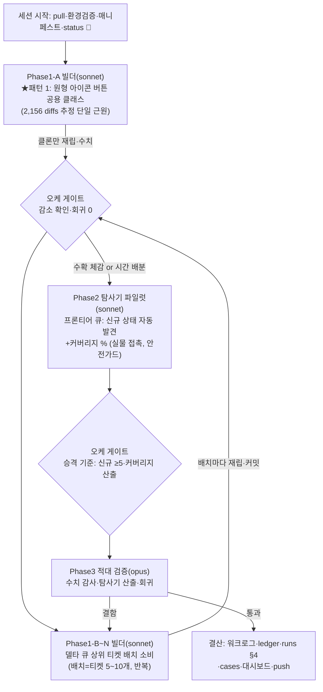

# 런 매니페스트 — canvas 세션 11 (P2, 무인 10h)

## 1. 로딩된 기법 + 선택 근거

| 기법 카드 | status | 역할 (선택 근거) |
|---|---|---|
| [[techniques.rip-repair-loop]] | verified | Phase 1 골격 — 델타 큐 소비→패치→클론만 재립→수치 검증 사이클 |
| [[techniques.rip-css-dump]] | standard | 재립 도구(rip_resweep_clone.py, 클론 전용 — 실물 무접촉 원칙) |
| [[techniques.state-explorer]] | experimental | **이번 런의 승격 후보** — 프론티어 큐 자동 탐사, 기준: 신규 상태 ≥5 자동 발견+커버리지 % |
| [[techniques.rip-crawler]] | verified | 탐사기의 기반(후보 열거·mutation 기록·안전가드 재사용) |
| [[techniques.night-run-sop]] | standard | 무인 규율: graceful skip·bounded 폴링·통지 대기 금지·상태판 라이브 |
| [[techniques.orchestrator-model-routing]] | standard | fable 오케/sonnet 빌더/opus 적대검증 |
| [[techniques.adversarial-verification]] | standard | Phase 3 게이트 — 델타 감소 수치 감사+탐사기 산출 검증 |
| [[techniques.cdp-raw-driver]] | verified | 표준 드라이버(좀비 탭 상존) |
| [[techniques.url-escape-guard]] | verified | Phase 2 실물 탐사 필수 가드 |
| [[techniques.regression-harness-suite]] | standard | 배치 후 회귀 스팟(vitest+선별 _bN) |

## 2. 세션 로직 도식

**세션 10 개선 반영**: ①실측 브리프에 뷰포트 상태(zoom/pan) 기록 의무 ②실물 보존 노드 = **4개**(r2 §7 실측 id — "2개" 아님)로 브리프 정정, Phase 2 시작 전 오케가 인벤토리 직접 재확인 ③금지 제약(GENERATE)→의존 그래프를 케이스 설계에 선반영 ④OS 전역 자원(클립보드·포커스)을 검증 신호로 단독 사용 금지.
**안전 경계(전 브리프 공통)**: GENERATE 금지 · 보존 노드 4개 불가침 · URL 가드 · 좀비 탭(766028e1) 금지 · Chrome 실물 조작 동시 1워커 · bounded 폴링 · 엔진 코어 불변 · 티켓 단위 커밋(오케).

## 3. 이벤트 요약
- 시작: pull 완료, CDP 9222(실물·클론 탭)·클론 5175 정상.
- Phase1-A 패턴1(-87% 지문, 대조군 재립 노하우) — 단 "통지 대기" 정지 1회→SendMessage 복구. 이후 브리프에 실사고 인용으로 강화, 6기 재발 0.
- Phase1-B~G: 배치 소비(-301/-1952/-985)·트리아지 시트(13클러스터)·C1/C11(-315)·aria 파리티(-1343). 누적 33538→28642(-14.6%), 역행 0.
- Phase 2 탐사기 파일럿: 신규 상태 자동 발견+커버리지 산출+무사고. 미방문 큐 112상태(멀티나이트 이월).
- Phase 3 opus: Phase1 TRUSTED·탐사기 조건부 MET(AA-D1 novelty 분류기 실물측 맹점 적발 — 빌더 미포착).
- 결산: 워크로그·ledger 5건·카드 2장 승격(state-explorer·visual-triage-sheet →verified)·본 매니페스트.

## 4. 로직 평가 (결산 시 채움)
- **작동한 것**: ①"패턴 우선→티켓 배치→트리아지→확신분만 소탕" 레버리지 순서(패턴·전역 리셋이 감소분 대부분) ②대조군 재립로 하네스 드리프트/실효과 분리 — 수치 신뢰의 핵심 ③트리아지 시트가 기계 수복 불가 영역을 "판독 가능한 자료"로 전환(오너 개입 최소화) ④매칭 신뢰화(aria 파리티)가 측정 자체를 개선해 새 갭을 드러냄 — "측정 인프라 수복이 곧 파리티 수복" ⑤오케 직접 인벤토리 실측→브리프 명기(세션10 개선 이행).
- **병목/실패**: ①"통지 대기" 정지 재발(브리프 명문화만으론 불충분 — 실사고 사례 인용 후 재발 0: 규칙보다 사례가 효과적) ②novelty 분류기 실물측 맹점(AA-D1)을 빌더 자기검증이 못 잡음 — 적대 게이트가 잡음 ③허브 상태(후보 100+)가 탐사 스텝 예산 소진 — 커버리지 낮음, 멀티나이트 구조 필요.
- **다음 런에서 바꿀 것**: ①서브에이전트 브리프에 금지 규칙은 "과거 실사고 인용"으로 서술(추상 규칙 대비 재발 억제 실증) ②탐사기: KNOWN_SPEC_KEYWORDS 실물 접두 보강(필수)+허브 상태 후보 샘플링 전략 ③트리아지 "약한 확신"은 오너 결정 대기 큐로 명시 분리(C9).
- **ledger 반영**: 5건(rip-repair-loop 성과·state-explorer 조건부 성과·visual-triage-sheet 2차 실증·night-run-sop 부분 배신·adversarial 성과).
