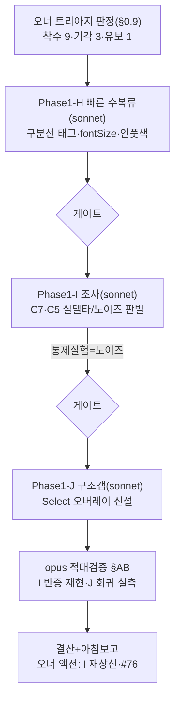

# 런 매니페스트 — canvas 세션 12 (오너 트리아지 판정 소비)

## 1. 로딩 기법 + 근거
| 기법 | status | 역할 |
|---|---|---|
| [[techniques.visual-triage-sheet]] | verified | 오너 라디오 판정(§0.9)이 작업 큐의 입력 — 이 세션 전체의 기점 |
| [[techniques.rip-repair-loop]] | verified | H·J 수복 사이클(패치→isolated 재립→수치→역행체크) |
| [[techniques.adversarial-verification]] | standard | opus 게이트 — 오너 판정과 배치되는 반증(I) 검증 포함 |
| [[techniques.orchestrator-model-routing]] | standard | 오케 opus로 전환(사용자) / 빌더 sonnet 3기 / 검증 opus |

## 2. 세션 로직 도식

## 3. 이벤트
- 오케 opus 전환(사용자). 트리아지 §0.9 착수 9클러스터 소비 시작.
- H(c36d5a9,-592)·I(bdb0a1f,노이즈확정)·J(b48bac8,-288). 게이트 §AB TRUSTED.
- isolated 28642→27762(-880), 누적 30580→27762(-9.2%).

## 4. 로직 평가
- **작동한 것**: ①오너 판정→§0.9 정본→빌더 소비 루프가 처음으로 완전히 닫힘 ②조사 페이즈(I)가 "오너 착수 판정"조차 실측으로 교정(통제실험 반증) — 판정 권위와 실측 권위의 건강한 긴장 ③구조갭 구현(J)까지 무인 확장, onClick 상상 없이 버블링으로 회귀 0 ④빌더의 과욕(H span래퍼 +875)을 빌더 스스로 대조군으로 revert.
- **병목/실패**: ①커밋 문구 "19상태 증가 0"이 측정 드리프트 포함 과대(AB-D1) — "총계 기준 역행 0"으로 통일 필요 ②오너 착수 2건이 노이즈였음 = 트리아지 시각 판정의 한계(크롭만으론 측정 노이즈 구분 어려움) → 조사 페이즈가 안전망 역할.
- **다음 런에서 바꿀 것**: ①커밋/보고 수치 문구를 "속성델타 총계 기준"으로 표준화 ②트리아지 시트에 "노이즈 의심" 사전분류를 더 명확히(오너가 착수/기각 오판 줄이게) ③#76류 "샘플 1건 실델타"는 자동으로 "추가 샘플링 티켓"으로 분기.
- **ledger 반영**: 3건(rip-repair-loop·visual-triage-sheet·adversarial).
