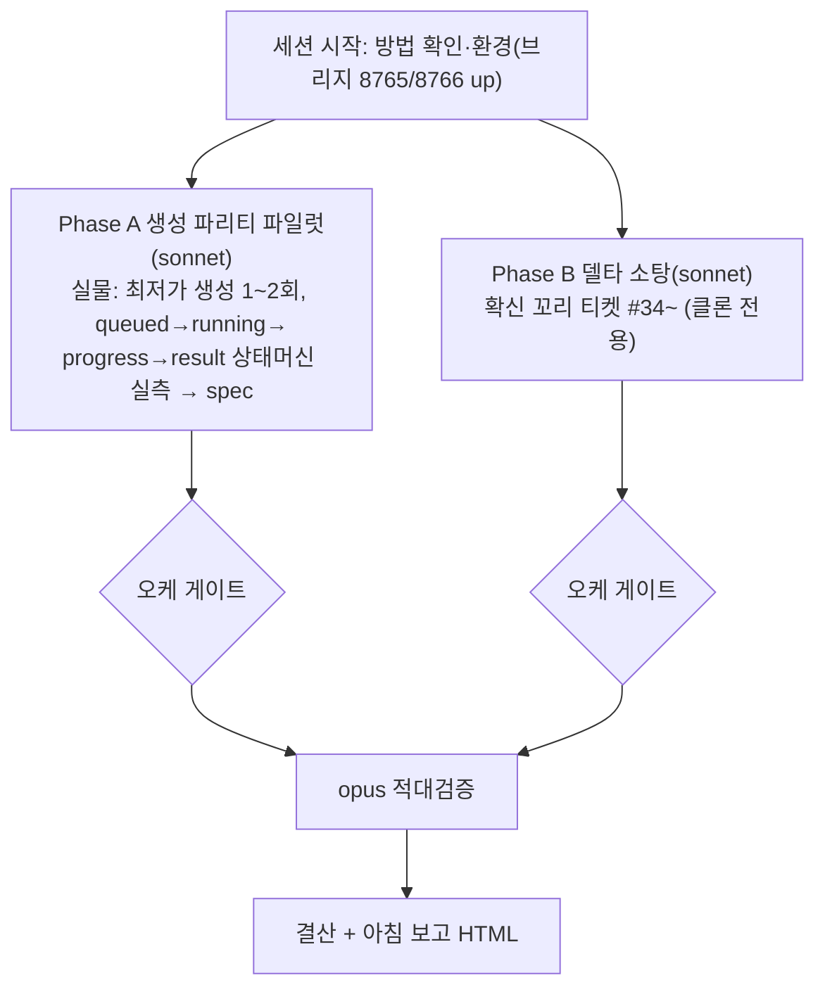

# 런 매니페스트 — canvas 세션 13 (생성 동작 파리티 + 델타 소탕)

## 1. 로딩 기법 + 근거
| 기법 | status | 역할 |
|---|---|---|
| [[techniques.cdp-nondestructive-recon]] | standard | **개방 반영판** — 실물 GENERATE 실측(도그마 소거 후 첫 적용) |
| [[techniques.state-spec-json]] | verified | 생성 상태머신(queued/running/progress/result/error) spec 산출 |
| [[techniques.rip-repair-loop]] | verified | Phase B 델타 소탕 사이클 |
| [[techniques.adversarial-verification]] | standard | opus 게이트 |
| [[techniques.night-run-sop]] | standard | 무인 규율(개방 반영: GENERATE 허용·저크레딧·bounded) |

**업데이트된 클론 방법 반영**: 2026-07-14 오너 실물 조작 전면 개방 → GENERATE 포함 테스트가 이번 세션의 핵심. 그동안 미실측이던 생성 상태머신을 처음으로 실측(99%-plan §0 "미실측 상태" 공백 메움).

## 2. 세션 로직 도식

A=실물 탭 / B=클론 탭 → 탭 분리라 병렬 무충돌.

## 3. 안전 (개방 반영)
- **허용(신규)**: 실물 GENERATE·파괴적 조작(redo 가능). 빌더도 실물 조작 가능.
- **저크레딧 우선**: 최저가 모델(nano_banana_flash 등)·batch_size 1·최저 해상도/duration. GENERATE **하드 캡 2회**, 크레딧 잔량 전후 확인.
- **여전히 금지**: 외부 전송·게시·결제·계정변경·영구삭제. 무한/고크레딧 생성 루프. 통지 대기(bounded 폴링).
- 스크래치 생성물은 캡처 후 정리(redo 가능이라 삭제 자유).

## 4. 이벤트 요약
- 세션 시작. 업데이트 방법 확인(실물 개방·asset-provenance-gate). 환경 정상.
- (진행하며 갱신)

## 5. 로직 평가 (결산 시)
- (미기입)
