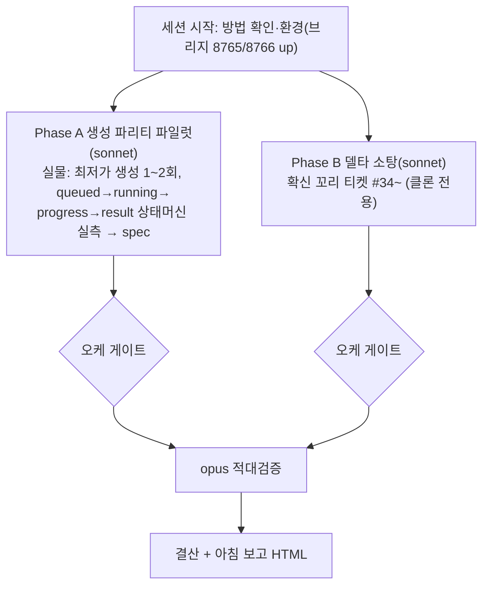

# 런 매니페스트 — canvas 세션 13 (생성 동작 파리티 + 델타 소탕)

## 1. 로딩 기법 + 근거
| 기법 | status | 역할 |
|---|---|---|
| [[techniques.cdp-nondestructive-recon]] | standard | **개방 반영판** — 실물 GENERATE 실측(도그마 소거 후 첫 적용) |
| [[techniques.state-spec-json]] | verified | 생성 상태머신(queued/running/progress/result/error) spec 산출 |
| [[techniques.rip-repair-loop]] | verified | Phase B 델타 소탕 사이클 |
| [[techniques.adversarial-verification]] | standard | opus 게이트 |
| [[techniques.night-run-sop]] | standard | 무인 규율(개방 반영: GENERATE 허용·저크레딧·bounded) |

**업데이트된 클론 방법 반영**: 2026-07-14 오너 실물 조작 전면 개방 → GENERATE 포함 테스트가 이번 세션의 핵심. 그동안 미실측이던 생성 상태머신을 처음으로 실측(99%-plan §0 "미실측 상태" 공백 메움).

## 2. 세션 로직 도식

A=실물 탭 / B=클론 탭 → 탭 분리라 병렬 무충돌.

## 3. 안전 (개방 반영)
- **허용(신규)**: 실물 GENERATE·파괴적 조작(redo 가능). 빌더도 실물 조작 가능.
- **저크레딧 우선**: 최저가 모델(nano_banana_flash 등)·batch_size 1·최저 해상도/duration. GENERATE **하드 캡 2회**, 크레딧 잔량 전후 확인.
- **여전히 금지**: 외부 전송·게시·결제·계정변경·영구삭제. 무한/고크레딧 생성 루프. 통지 대기(bounded 폴링).
- 스크래치 생성물은 캡처 후 정리(redo 가능이라 삭제 자유).

## 4. 이벤트 요약
- 세션 시작. 업데이트 방법 확인(실물 개방 반영·asset-provenance-gate). 환경 정상(브리지 8765/8766 up).
- Phase A(d63307d): 생성 상태머신 최초 실측, 저크레딧 1.5cr, 캡 2회. Phase B(ab4da66): 델타 -705, 실버그 2건. (탭 분리 병렬 무충돌)
- ⚠ opus 게이트 잠자기 중단 → 재실행(§AC 미작성이라 손실 0). §AC: B TRUSTED·A 조건부(AC-D1 정정).
- 오케 후속: error 상태 문서 정정(AC-D1, 재측정 불요) + 클론 파리티 갭 GEN-ERR-1 티켓 도출.

## 5. 로직 평가
- **작동한 것**: ①오너 개방 지시를 방법에 즉시 반영(도그마 소거)해 그동안 불가였던 생성 상태머신 실측을 저크레딧으로 개통 — "개방 지시 받으면 잔존 조항 즉시 소거"의 실효 ②실물(A)·클론(B) 탭 분리 병렬로 대기 0 ③적대 게이트가 빌더 자기 덤프의 자기모순(AC-D1)을 크레딧 0으로 적발 — 신규 영역(생성)일수록 게이트 가치 큼 ④A의 실측 결함이 곧 클론 파리티 갭(GEN-ERR-1) 발견으로 전환.
- **병목/실패**: ①컴퓨터 잠자기로 게이트 중단(빌더 산출물은 커밋으로 안전했으나 게이트 재실행 비용) — 장시간 무인 런 전 caffeinate 필요 ②A가 error 상태를 "속성 사라짐"으로 오독(자기 덤프와 모순) — 실측 직후 자기 산출물 재대조를 브리프에 넣었으면 자체 발견 가능 ③크레딧 잔액 UI를 못 찾음(전후 차이 계측 불가, 배지 환불 문구로 대체).
- **다음 런에서 바꿀 것**: ①무인 런 시작 시 caffeinate로 잠자기 차단(오케 셋업 단계) ②실측 브리프에 "결론 단언 전 자기 덤프로 반례 1회 체크" 추가(AC-D1류 자기모순 예방) ③생성 파리티는 이제 개통됐으니 클론 대조 트랙(GEN-ERR-1 + waiting/in_progress 배지)을 정규 배치로.
- **ledger 반영**: 3건(cdp-nondestructive-recon 개방판·rip-repair-loop·adversarial).
