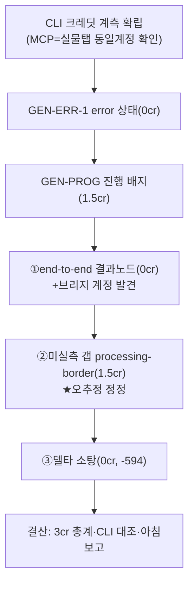

# 런 매니페스트 — canvas 세션 14 (생성 파리티 트랙 + CLI 크레딧 계측)

## 1. 로딩 기법 + 근거
| 기법 | status | 역할 |
|---|---|---|
| [[techniques.cdp-nondestructive-recon]] | standard | 개방판 — 생성 상태 실물 실측(저크레딧) |
| [[techniques.state-spec-json]] | verified | error·진행·완료·processing-border spec 대조 |
| [[techniques.model-matrix-diff]] | verified | CLI 크레딧 계측(balance/transactions) 확장 |
| [[techniques.rip-repair-loop]] | verified | ③델타 소탕 |

## 2. 세션 로직 도식

각 생성 티켓 전후 오케가 CLI balance+transactions로 크레딧 대조.

## 3. 이벤트
- CLI 크레딧 계측 확립(MCP=cafe24 mine 2206cr=실물탭). GEN-ERR-1(0cr)·GEN-PROG(1.5cr)·①E2E(0cr)·②GAP(1.5cr)·③델타(0cr). 총 -3.0cr, 전부 CLI 대조 정확.
- 발견: 클론 브리지 기본계정=cafe24(16741cr, MCP 추적불가)≠실물탭. GEN-TOAST-1 구조갭. processing-border 오추정 정정.

## 4. 로직 평가
- **작동한 것**: ①CLI 크레딧 계측 루프(전 balance→작업→후 balance+transactions 항목) 확립·검증 — 생성 작업의 크레딧 통제 인프라 완성, 5티켓 3cr ②저크레딧 원칙(1k·batch1·캡1회)로 생성 대조를 실물에서 안전 실행 ③강제 렌더(window.__loadDoc) 대조로 생성 안 해도 되는 티켓(error·결과노드)은 0cr ④오케 직접 스팟(CDP 강제렌더 독립재현)으로 빌더 자가선언 불신 유지 ⑤빌더가 클론 브리지 계정 불일치를 감지하고 실생성 자제(추적 투명성 우선) — 안전 판단.
- **병목/실패**: ①processing-border 오추정(selected 상태로만 캡처해 라임으로 문서화됐던 것)이 이번에야 정정 — "관측 불가 상황을 추정으로 메우면 안 된다"(deselect 실측 필요) ②queued 3연속 미관측(서버부하 의존) ③클론 브리지 계정≠추적계정 — 클론 실생성 파리티가 계정 결정까지 블록 ④isolated가 병행 커밋으로 스테일(총계 27057→실제 26986) — 재립 선행 필요.
- **다음 런에서 바꿀 것**: ①실측 브리프에 "관측 방해요소(selection 등) 먼저 제거하고 단독 관측" 명시(오추정 예방) ②델타 배치 시작 시 git log로 병행 세션 여부·isolated 재립 선행 ③클론 실생성은 계정 라우팅 결정 후.
- **ledger 반영**: 3건(cdp-nondestructive-recon·model-matrix-diff·rip-repair-loop).
