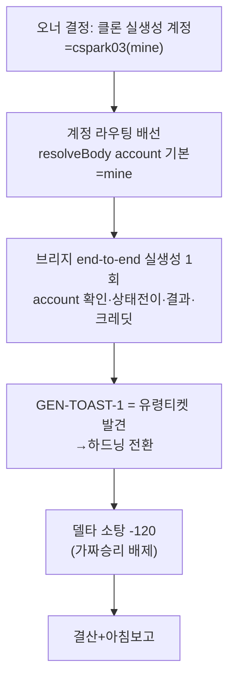

# 런 매니페스트 — canvas 세션 15 (계정 라우팅·end-to-end·유령티켓·델타)

## 1. 로딩 기법 + 근거
| 기법 | status | 역할 |
|---|---|---|
| [[techniques.cdp-nondestructive-recon]] | standard | 클론 실생성 end-to-end 대조(계정 라우팅 검증) |
| [[techniques.model-matrix-diff]] | verified | CLI 크레딧 계측(mine 계정 라우팅·유료추적 미검증 판정) |
| [[techniques.rip-repair-loop]] | verified | 델타 소탕 + 유령티켓/가짜승리 배제 |

## 2. 세션 로직 도식

## 3. 이벤트
- 오너 계정 결정 반영(mine 라우팅). end-to-end(abdd045): mine 확인·실물 일치·0cr. GEN-TOAST-1 정정(5c4d3d9). 델타 e57ce9d(-120).
- 크레딧 세션 15 추가 0cr(클론 검증 무료).

## 4. 로직 평가
- **작동한 것**: ①오너 결정을 코드 배선+런타임 실측(요청 body intercept)으로 확인 — "코드 리딩 말고 실측" 원칙 ②강제주입 넘어 실생성 end-to-end로 생성 파리티 최종 검증 ③유령티켓(GEN-TOAST-1)·가짜승리(assets_panel)를 빌더가 "실재 재확인/무수정 대조"로 자력 배제 — 큐 스테일·하네스 불안정 두 함정을 규율로 통과 ④크레딧 CLI 계측이 "0cr(무료)"까지 정확히 판별(브리지 credits_spent+MCP balance+거래내역 3중).
- **병목/실패**: ①델타 큐 표가 스테일해 유령티켓 반복 위험(GEN-TOAST-1) — 큐를 isolated 기준 재생성해야 신뢰 ②하네스 캡처 불안정(assets_panel matched 274→92 가짜)이 반복 — 무수정 대조군이 필수 절차화 ③유료 클론생성 MCP추적 미검증(base 모델 무료라).
- **다음 런에서 바꿀 것**: ①델타 배치 시작 시 큐 표를 isolated에서 재생성(스테일 티켓 원천 차단) ②assets_panel류 불안정 상태는 비교 제외 목록으로 관리 ③유료 클론생성 1회로 MCP추적 최종 확인.
- **ledger 반영**: 3건(cdp-nondestructive-recon·rip-repair-loop·model-matrix-diff).
