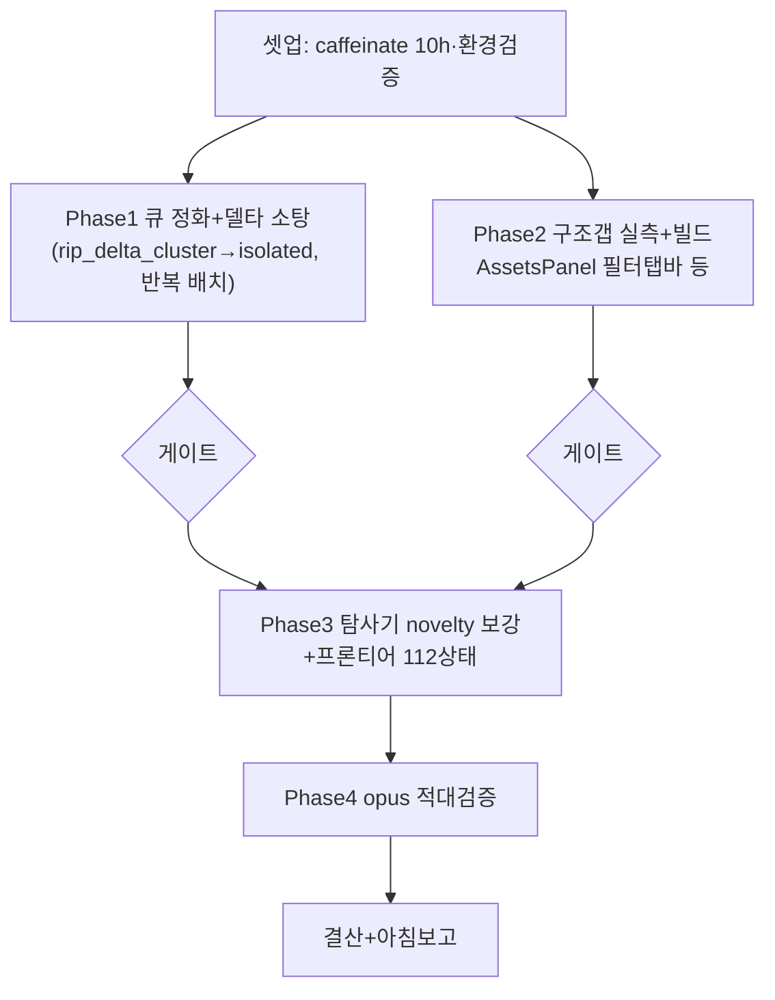

# 런 매니페스트 — canvas 세션 16 (무인 10h)

## 1. 로딩 기법 + 근거
| 기법 | status | 역할 |
|---|---|---|
| [[techniques.rip-repair-loop]] | verified | Phase1 델타 소탕(정화된 큐 기반) |
| [[techniques.cdp-nondestructive-recon]] | standard | Phase2 구조갭 실물 실측(개방판) |
| [[techniques.state-explorer]] | verified | Phase3 탐사기 novelty 보강+프론티어 |
| [[techniques.adversarial-verification]] | standard | Phase4 opus 게이트 |
| [[techniques.night-run-sop]] | standard | 무인 규율(caffeinate·bounded·통지대기 금지) |

**세션 15 개선 반영**: ①델타 큐 스테일→유령티켓/가짜승리 → **큐를 isolated 기준 재생성 후 소탕**(rip_delta_cluster.py를 isolated 읽도록 수정) ②무수정 대조군 재립을 불안정 상태 판별에 필수화 ③caffeinate로 잠자기 차단(세션13 중단 재발 방지, PID 39637).

## 2. 세션 로직 도식

P1=클론 탭 / P2·P3=실물 탭 → 탭 분리 병렬(실물은 1워커 순차).

## 3. 안전 (개방 반영)
- 실물 조작 개방(파괴·GENERATE 허용, redo 가능). **크레딧 ~0 목표**(생성 거의 없음 — 탐사·구조갭·델타는 무생성). 유료 생성 필요 시 저크레딧(1k)+CLI 계측+캡.
- 여전히 금지: 외부전송·게시·결제·영구삭제. 무한 생성. 통지 대기(bounded 폴링).
- 좀비 탭 766028e1 금지. 실물 조작 1워커.

## 4. 이벤트 요약
- 셋업(caffeinate 39637)·환경 정상. Phase1(큐정화+델타)·Phase2(구조갭) 병렬.
- Phase2 필터탭바=오탐(3연속 유령) → 계획 조정: 구조갭 맹목빌드 중단, 탐사기 비중↑. Phase3(탐사기) 투입.
- Phase1(e0cef71): ★큐 근본수정(isolated 소스)·진짜 총계 23,581·20티켓 -39. Phase3(4a8bd73): AA-D1 보정·커버리지 15.9%·진짜갭 2(i18n).
- Phase5(3f44688): i18n 수복+델타 -84(연쇄개선). Phase6(29c50b2): canvasmenu 9+2티켓 일괄 -120.
- opus §AD: 큐 근본수정·소탕 TRUSTED, AD-D1(역행0 문구) 경미. 실물 4노드 무결.
- isolated 23,581→23,338(-243), 크레딧 0.

## 5. 로직 평가
- **작동한 것**: ①3연속 유령/오탐이 헛수고로 안 끝나고 근원(rip_delta_cluster가 동결본 읽음)을 규명→영구수정으로 전환 — "반복 실패의 패턴을 근본원인으로" ②방법론 전환: 스테일 큐(유령 양산)→측정기반 탐사기(진짜 갭, 유령 0) ③빌더들이 유령/가짜승리를 자력 배제(양쪽앱 확인·무수정 대조군·클론 실측 교차확인) — 규율 정착 ④i18n 수복이 aligner 매칭 개선→숨은 갭 노출 연쇄 ⑤caffeinate로 잠자기 무중단 완주 ⑥크레딧 0(전 페이즈 무생성으로 10h).
- **병목/실패**: ①델타 큐가 근본적으로 스테일이라 3페이즈(GEN-TOAST-1·필터탭바·assets_panel)를 유령에 소모 — 근본수정 전까지 반복 ②"역행 0" 문구 과대(재덤프 동적표면 노이즈, AD-D1) — "대상상태 역행0"으로 정밀화 필요 ③탐사 clone 커버리지 7.4%(허브 후보폭발로 정체) ④i18n 보류 4건(실물 덤프 부재).
- **다음 런에서 바꿀 것**: ①델타 배치 착수 전 "이미 구현됐나 클론 실측" 게이트 필수(유령 3연속 방지) ②수치 문구는 "대상상태 기준 역행" + 동적표면 노이즈 분리 표기 ③탐사 허브 상태 샘플링 전략 ④진짜 총계(23,581)를 문서·대시보드에 반영(30,580 동결본 폐기).
- **ledger 반영**: 3건(rip-repair-loop 근본·state-explorer·adversarial).
