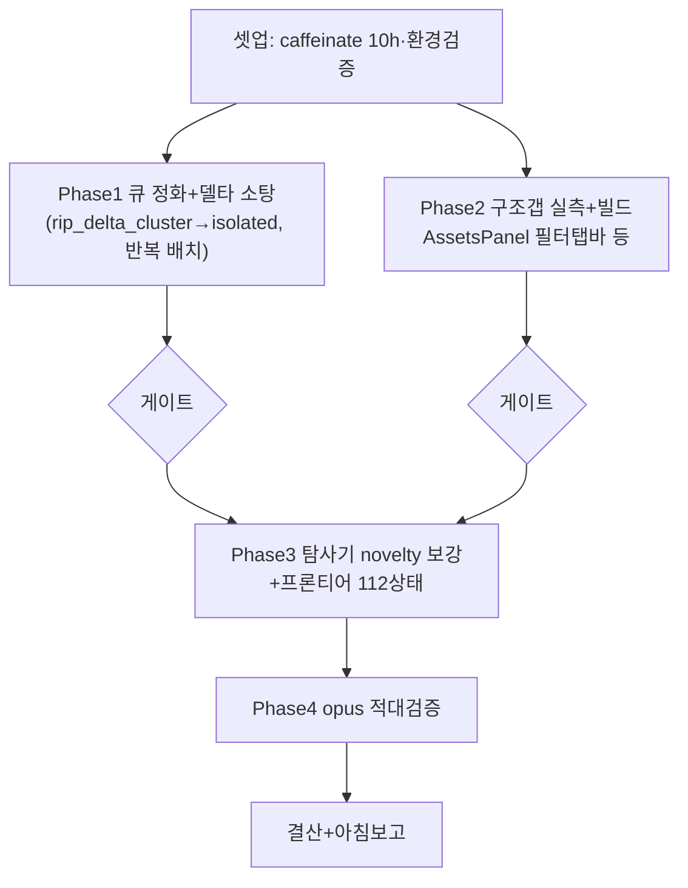

# 런 매니페스트 — canvas 세션 16 (무인 10h)

## 1. 로딩 기법 + 근거
| 기법 | status | 역할 |
|---|---|---|
| [[techniques.rip-repair-loop]] | verified | Phase1 델타 소탕(정화된 큐 기반) |
| [[techniques.cdp-nondestructive-recon]] | standard | Phase2 구조갭 실물 실측(개방판) |
| [[techniques.state-explorer]] | verified | Phase3 탐사기 novelty 보강+프론티어 |
| [[techniques.adversarial-verification]] | standard | Phase4 opus 게이트 |
| [[techniques.night-run-sop]] | standard | 무인 규율(caffeinate·bounded·통지대기 금지) |

**세션 15 개선 반영**: ①델타 큐 스테일→유령티켓/가짜승리 → **큐를 isolated 기준 재생성 후 소탕**(rip_delta_cluster.py를 isolated 읽도록 수정) ②무수정 대조군 재립을 불안정 상태 판별에 필수화 ③caffeinate로 잠자기 차단(세션13 중단 재발 방지, PID 39637).

## 2. 세션 로직 도식

P1=클론 탭 / P2·P3=실물 탭 → 탭 분리 병렬(실물은 1워커 순차).

## 3. 안전 (개방 반영)
- 실물 조작 개방(파괴·GENERATE 허용, redo 가능). **크레딧 ~0 목표**(생성 거의 없음 — 탐사·구조갭·델타는 무생성). 유료 생성 필요 시 저크레딧(1k)+CLI 계측+캡.
- 여전히 금지: 외부전송·게시·결제·영구삭제. 무한 생성. 통지 대기(bounded 폴링).
- 좀비 탭 766028e1 금지. 실물 조작 1워커.

## 4. 이벤트 요약
- 셋업(caffeinate 39637)·환경 정상. Phase1·2 병렬 투입.
- (진행하며 갱신)

## 5. 로직 평가 (결산 시)
- (미기입)
