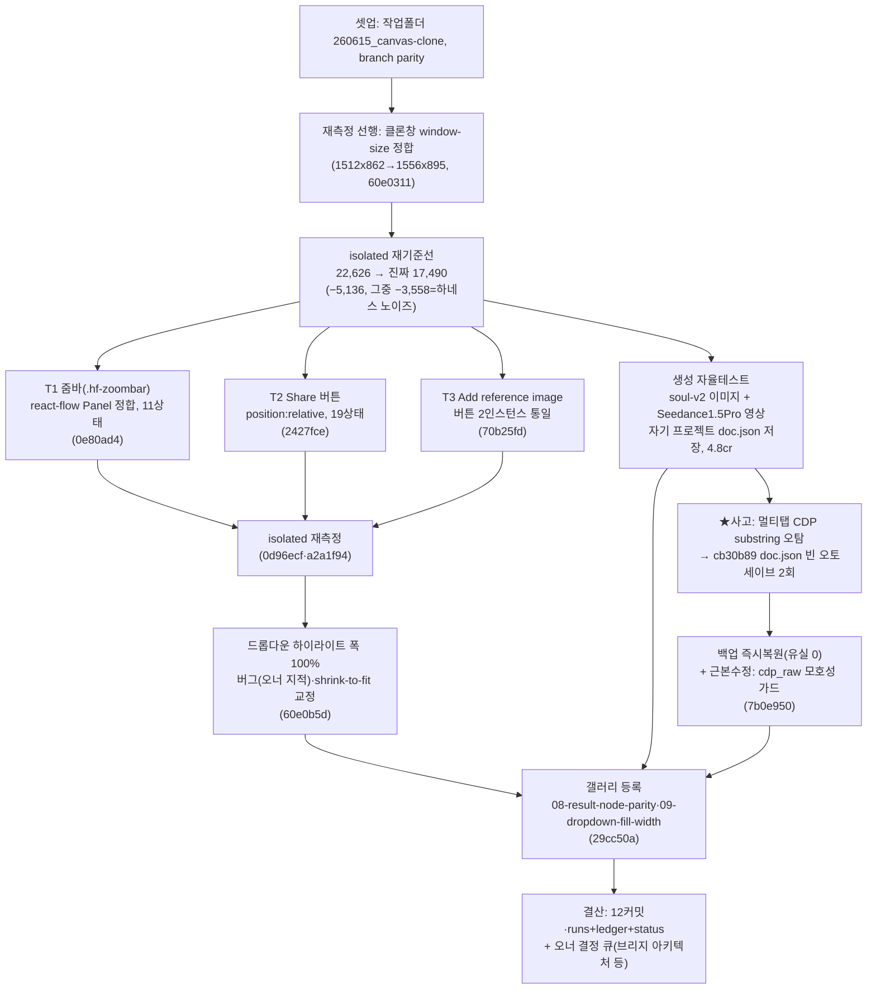

# 런 매니페스트 — canvas 세션 17 (무인 밤런)

## 1. 로딩 기법 + 근거
| 기법 | status | 역할 |
|---|---|---|
| [[techniques.dom-first-measurement]] | standard | 재측정 전 클론창 window-size를 실물 캡처 규격(1512x862→1556x895)에 정합 — 가짜 bbox 델타 원천 차단 |
| [[techniques.rip-repair-loop]] | verified | 정합된 isolated 기준선 위에서 진짜갭 3건(줌바·Share·ref-add) 수복 |
| [[techniques.state-explorer]] | verified | 프론티어 1패스(measure-only) — `--resume` 스테일 trigger-text 함정 재확인 후 §10 갭후보 목록만 산출(과대보고 방지) |
| [[techniques.cdp-raw-driver]] | verified | 멀티탭 substring 비결정성 사고 이후 모호성 가드 신설(다중매칭 시 시끄럽게 실패) |
| [[techniques.cdp-nondestructive-recon]] | standard | 실물 확정 근거 갤러리(08 결과노드, 09 드롭다운) 실측 |
| [[techniques.night-run-sop]] | standard | 저크레딧 우선 생성 자율테스트(4.8cr) — 실패 3회 전액환불, 무한 재시도 없이 종료 |

**세션 16 대비 전환**: ①측정 전 "정합 선행"을 규율화 — 재측정하기 전 클론창 크기부터 맞춰 노이즈를 원천에서 분리 ②탐사기(state-explorer)를 델타 생산 도구가 아니라 "갭 후보만 내고 라이브 재검증 없이는 갭으로 안 세는" 절제된 measure-only 모드로 축소 운용 ③생성 파리티를 대조·수복 넘어 클론의 **자율 생성 능력 자체**(독립 프로젝트에 이미지+영상 저장까지)를 실증하는 단계로 확장.

## 2. 세션 로직 도식

전물 조작 개방(R&D redo 가능) 하 저크레딧 생성 1건만 실주입, 나머지는 클론 전용 무크레딧 작업.

## 3. 안전
- 실물 조작 개방(파괴·GENERATE 허용, redo 가능). 크레딧 순지출 **4.8cr**(영상 1회, Seedance 1.5 Pro 8s/480p). GPT Image 2 미사용. 실패 시도 3회는 **전액 환불(0cr)** — 무한 재시도 없이 실패를 인정하고 종료.
- 이미지 soul-v2는 세션 전 완료분(0.36cr) 재확인만, 신규 차감 없음.
- 여전히 금지: 외부전송·게시·결제·영구삭제. 통지 대기(bounded 폴링 유지, 이번 세션 재발 없음).
- **사고 1건**: 멀티탭 CDP substring 매칭이 같은 dev 포트(5175)에 열린 2탭 중 비결정적으로 엉뚱한 탭에 attach → 클론 자체 생성 프로젝트 `cb30b89ae3d4/doc.json`이 오토세이브로 2회 빈 채 덮어써짐. **데이터 유실 0** — 백업에서 즉시 복원 확인. 근본수정: `cdp_raw.py`가 다중 매칭 시 침묵하지 않고 즉시 시끄럽게 실패하도록 가드 추가(커밋 `7b0e950`). 조치: 탭당 1빌더·canvas-id 고정 운용으로 전환.

## 4. 이벤트 요약
- 재측정 선행(`60e0311`): isolated 측정 전 클론창을 실물 캡처 창 크기(1512x862→1556x895)에 정합 — 이 정합 없이 측정하면 가짜 bbox 델타가 대량 발생함을 확인.
- isolated 진짜 기준선: 22,626 → **17,490**(−5,136). 이 중 **−3,558은 window-size 하네스 노이즈**로 규명(클론창 크기만 안 맞았던 것, 코드 변경 무관) — 나머지가 진짜갭 3건 수복분.
- T1(`0e80ad4`): 줌바(`.hf-zoombar`)가 react-flow `Panel` 규격에 안 맞던 것을 정합 — 11상태 반복 델타 근본수정.
- T2(`2427fce`): Share 버튼 `position:relative` 누락 수복 — 19상태 전원 일치.
- T3(`70b25fd`): "Add reference image" 버튼 2개 인스턴스(노드 내/결과 hover)가 서로 다른 스펙이던 것을 실물 기준으로 통일.
- isolated 재측정(`0d96ecf`·`a2a1f94`): T1~T3 반영 후 기준선 재확정.
- 드롭다운 하이라이트 폭 버그(`60e0b5d`): **오너가 직접 지적** — 옵션 하이라이트가 폭 100%를 못 채우던 것을 `button` shrink-to-fit 속성 교정으로 해소.
- state-explorer 프론티어 1패스(`6354f61`, measure-only): §10 갭후보 목록만 산출. `--resume` 클론그래프가 세션16 캡처의 **스테일 trigger-text를 이고 있어** "이미 수복/존재"하는 항목을 갭으로 과대보고할 뻔했음 — 라이브 재검증 없이는 갭으로 확정하지 않는 원칙으로 걸러냄.
- 생성 자율테스트: 클론이 **독립적으로** 이미지(soul-v2)+영상(Seedance 1.5 Pro, 8s/480p)을 생성해 자기 프로젝트(`canvas-projects/cb30b89ae3d4/doc.json`)에 저장 — 디스크 실측(mp4 3.9MB+poster)으로 확인. 오너가 클론 대시보드 "생성 테스트 0715"에서 직접 열람 가능.
- ★사고 발생·복구: 위 §3 참고. 근본수정 커밋 `7b0e950`.
- 갤러리(`29cc50a`): `reports/gap-tests/`에 `08-result-node-parity`(생성 자율테스트 실측 검증), `09-dropdown-fill-width`(드롭다운 폭 버그) 추가 — 총 9갭.
- 문서화: `6011fff`(세션17 수복 3건+파킹 2건 기록, 파킹 사유 명시로 유령 재등록 방지), `c097602`(이월항목 해소+캡처노이즈 캐비어트), `a2a1f94`/`0d96ecf`(재측정 커밋).
- 세션17 로컬 커밋 총 12개, 미푸시(branch parity).

## 5. 로직 평가
- **작동한 것**: ①"측정 전 정합 선행" 규율이 실전에서 즉시 값을 냄 — 클론창 크기 하나 맞췄더니 22,626 중 3,558(15.7%)이 순수 노이즈였음이 드러나 진짜갭 규모가 급격히 명확해짐 ②`state-explorer`를 조심스러운 measure-only 모드로 축소 운용한 것이 세션16의 "3연속 유령" 재발을 막음 — `--resume` 스테일 trigger-text 함정을 재확인 즉시 라이브 재검증 게이트로 걸러냄 ③드롭다운 버그를 오너가 직접 육안으로 잡아 그 자리에서 수복 — 자동측정 파이프라인이 못 잡는 종류의 버그(하이라이트 폭)를 사람 눈이 보완하는 루프가 여전히 유효 ④생성 자율테스트가 "파리티 대조"를 넘어 "클론이 실제로 자기 프로젝트에 결과를 영구 저장하며 동작한다"는 **더 강한 증거**를 냈고, 크레딧도 4.8cr로 통제됨(실패 3회 전액환불 확인까지 완료) ⑤사고(멀티탭 오탐)가 발생했지만 데이터 유실 없이 즉시 복구 + 같은 세션 안에서 근본수정까지 커밋됨.
- **병목/실패**: ①★멀티탭 CDP substring 매칭이 같은 dev 포트의 두 탭에서 비결정적으로 엉뚱한 탭을 잡아 자율생성 결과물 저장소가 두 번 빈 채로 오토세이브됨 — 근본수정 전까지는 잠재 위험이었음 ②세션17 종료 시점에 **브리지 아키텍처 모순**이 새로 드러남: 클론 `canvasBridge.ts`는 지속성 백엔드로 8765(creative-hub)를 찌르는데, creative-hub는 커밋 `d17957b`에서 그 엔드포인트를 의도적으로 제거함(HANDOFF: "별개 프로젝트, 클론은 자체 `bridge_copy.py`로"). 지금은 제거 이전의 stale 프로세스(PID 65612)가 메모리에 남아 우연히 서빙 중이라 재기동 시 저장/로드가 404날 잠재 리스크가 있음(생성된 파일 자체는 디스크에 안전 — 서빙 취약성이지 데이터 유실 아님) ③클론갭 2건 이월: 참조이미지 퀵어태치가 실제 generate 요청 input_images에 안 들어가는 문제, 모델별 duration/resolution 드롭다운 값이 실제 API 허용값과 불일치(Seedance 예: 클론 5/8/10/15s vs 실제 4/8/12s).
- **다음 런에서 바꿀 것**: ①탭당 1빌더·canvas-id 고정을 하네스 레벨에서 기본값으로 강제(사람이 매번 확인 안 해도 되게) ②브리지 아키텍처 결합(8765) vs 분리(자체 브리지) 결정을 오너에게 받은 뒤 `canvasBridge.ts` 리포인트 — 권장은 분리(HANDOFF 권고와 일치) ③refslot input_images·드롭다운 API값 갭은 실물 재정찰 후 착수 ④G1(LLM 노드)+G2(오디오/보이스 노드) 인라인 패널은 실물 확장상태 read-only DOM 캡처를 먼저 하고 함께 처리.
- **ledger 반영**: 4건(rip-repair-loop 근본·state-explorer·adversarial-verification·night-run-sop).
