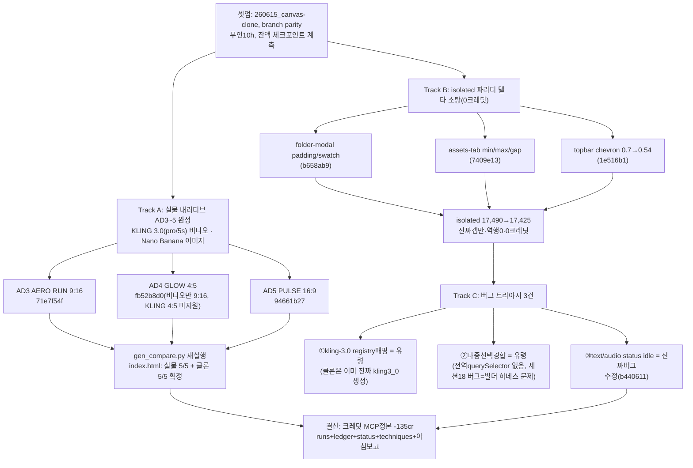

# 런 매니페스트 — canvas 세션 19 (무인 10h, 2트랙)

## 1. 로딩 기법 + 근거
| 기법 | status | 역할 |
|---|---|---|
| [[techniques.rip-repair-loop]] | verified | isolated 파리티 델타 진짜갭 3건(folder-modal·assets-tab·topbar chevron) 수복, 17,490→17,425 역행 0 |
| [[techniques.dom-first-measurement]] | standard | isolated 재측정 기준선 유지 — 세션17 정합 선행 규율 그대로 적용 |
| [[techniques.adversarial-verification]] | standard | Track C 버그 트리아지 3건 — 빌더/세션18 자가선언(kling-3.0 registry매핑·다중선택경합) 불신하고 클론 소스 실측(grep·전역querySelector 확인)으로 유령 2건 확정, 진짜버그 1건(status idle)만 좁혀 수복 |
| [[techniques.cdp-raw-driver]] | verified | 실물 힉스필드 브라우저를 직접 몰아 AD3~5 씬·비디오 생성(KLING 3.0 pro/5s) 완주 |
| [[techniques.night-run-sop]] | standard | 무인 10h, 2트랙 병행(A=실물 내러티브 완주, B=클론 0크레딧 델타 소탕) — 저크레딧 우선·크레딧은 MCP 거래내역 정본으로만 계측 |
| [[techniques.model-matrix-diff]] | verified | KLING v3.0 실단가(MCP 거래내역 기준 12.5cr/클립)가 registry 표시비용보다 정확·seedance(17.5cr)보다 저렴함을 실측 확정 |

**세션 18 대비 전환**: ①세션18에서 스톨로 미완이던 실물 AD3~5를 KLING 3.0(pro/5s)으로 완주해 **내러티브 파리티 5/5+5/5** 첫 완성 ②세션18 발견 갭 목록(§2 7건) 중 2건(다중선택경합·kling-3.0 registry매핑)을 이번 세션 실측으로 **유령**임을 재확정 — "발견 즉시 갭으로 등록"이 아니라 "다음 세션 재검증 후 확정"하는 원칙이 실효 ③파리티 델타 소탕을 클러스터 순위(`rip_delta_cluster` 확신 티켓) 기반이 아니라 **상태별 delta.md 직접 훑기**로 전환 — 위양성률이 높다는 걸 이번 세션에 실측으로 확인.

## 2. 세션 로직 도식

실물 조작 개방(R&D redo 가능) 하 Track A 생성 실주입, Track B/C는 클론 전용·0크레딧.

## 3. 안전
- 실물 조작 개방(파괴·GENERATE 허용, redo 가능) 유지. 크레딧 순지출 **135cr**(세션 시작 1202.74 → 종료 1067.74, MCP 거래내역 정본). 내역: KLING v3.0 ×10=125cr(12.5cr/클립 — seedance 17.5보다 저렴함을 이번 세션 확정), Nano Banana ×10=10cr, 실수 Seedream 1cr(주 목적 외 오조작, 소액·즉시인지).
- 파리티 델타 소탕(Track B)·버그 트리아지(Track C)는 클론 전용 작업으로 **0크레딧**.
- 여전히 금지: 외부전송·게시·결제·영구삭제. 통지 대기(bounded 폴링) 준수, 이번 세션 재발 없음.
- 사고 없음(세션17류 멀티탭 CDP 사고 재발 0 — 세션17 근본수정(다중매칭 가드) 유효 확인).

## 4. 이벤트 요약
- Track A 착수 — 세션18 핸드오프(스톨로 미완)를 이어받아 실물 힉스필드 브라우저에서 AD3 AERO RUN(9:16, 러닝화)→AD4 GLOW(4:5, 스킨케어)→AD5 PULSE(16:9, 전기차) 순서로 앵커→씬 fan-out 참조체이닝 완주. 비디오 모델을 seedance 대신 **KLING 3.0(pro/5s)**으로 전환(실물 AD1~2는 기존 Seedance 2.0 Fast 유지, AD3~5부터 KLING). AD4는 KLING이 4:5 비율 미지원이라 비디오만 9:16으로 예외 처리(이미지는 4:5 유지).
- gen_compare.py 갱신 + index.html 재생성 — 실물 AD3~5(fb52b8d0·71e7f54f·94661b27 등) 스크린샷·캔버스 링크 반영, 헤더 문구를 "실물 AD1~2=Seedance/AD3~5=KLING 3.0" 명시로 교정. **내러티브 파리티 실물 5/5 + 클론 5/5** 완성 확정(20/20 씬 참조체이닝은 세션18에 이미 검증됨, 이번엔 실물 쪽 5/5 완주가 핵심).
- Track B 델타 소탕 3건: folder-modal padding 16px 균등+swatch 24px flex중앙(`b658ab9`), assets-tab 탭 버튼 min-width/max-width/gap 계산값 정합(`7409e13`), topbar 캔버스메뉴 chevron 색 0.7→0.54 실측 정합(`1e516b1`). isolated 재측정 17,490→**17,425**(-65, 진짜갭만·역행 0·0크레딧).
- Track C 버그 트리아지 — 세션18 §2에서 발견 기록만 해두고 미수정이던 갭 3건을 실측 재확인:
  - ①kling-3.0 registry 매핑 갭 의심 — 클론 소스 재확인 결과 **이미 진짜 kling3_0 모델로 생성 중**(의심 자체가 유령).
  - ②노드 다중선택 경합(세션18 §2-1, 전역 querySelector가 엉뚱한 완료노드 Regenerate 오클릭) — 클론 소스에 **문제의 전역 querySelector가 존재하지 않음** 확인. 세션18 당시 현상은 **빌더가 쓴 테스트 하네스 자체의 스코프 문제**였지 클론 버그가 아니었음으로 재확정.
  - ③text/audio 결과 완료판정 `data-domain-status` idle 잔류(세션18 §2-4) — 이건 재확인 결과 **진짜버그**로 확정, `idle→completed` 정합 수정(`b440611`).
- 세션19 로컬 커밋 5개(1e516b1·7409e13·b440611·b658ab9 + narrative-parity 갱신, 이 중 narrative-parity 산출물은 결산 시점 미커밋). 미푸시(branch `parity`).

## 5. 로직 평가
- **작동한 것**: ①세션18에서 실물 빌더 스톨로 미완이던 AD3~5를 이번 세션에 **완주**해 내러티브 파리티(참조체이닝 일관성 콘텐츠)가 실물 5/5·클론 5/5로 처음 완성됨 — 대조 갤러리(`reports/narrative-parity/index.html`)가 "진행 중" placeholder 없이 전편 확정 ②비디오 모델을 KLING 3.0으로 전환하면서 **실단가가 12.5cr/클립로 seedance(17.5cr)보다 저렴**함을 MCP 거래내역으로 확정 — 이번 세션 크레딧 지출(135cr)이 예산 내로 통제된 이유 중 하나 ③Track C 버그 트리아지에서 **"세션18에 발견으로 기록해뒀다고 곧바로 갭으로 확정하지 않고 재검증한다"** 원칙이 실효 — 3건 중 2건이 실측 결과 유령(빌더 하네스 문제·이미 정상 동작)으로 밝혀져 헛수고 구현을 막았고, 진짜버그 1건만 정확히 좁혀 수복 ④isolated 델타 소탕이 여전히 역행 0을 유지하며 17,490→17,425로 미세 전진(0크레딧).
- **병목/실패**: ①★**클러스터 기반 "확신 티켓" 판정의 위양성률이 높다는 게 이번 세션에 다시 드러남** — `rip_delta_cluster`가 상위로 올린 확신 클러스터를 약 24건 조사했지만 실제로 진짜갭인 것은 소수였고, 오히려 **상태별 delta.md를 처음부터 직접 훑는 방식**에서 진짜 발견(Track C ③)이 나왔다. 클러스터 순위가 "조사할 곳을 좁혀준다"는 원래 목적과 달리 "그럴듯해 보이지만 실은 하네스/캡처노이즈인 것"을 확신으로 잘못 승격시키는 경향이 재확인됨 ②AD4의 KLING 4:5 미지원처럼 모델별 비율 제약이 실물 UI에서 사전 고지 없이 실패로만 드러나 예외 처리(비디오만 9:16)로 우회해야 했음 — 모델별 지원 비율 매트릭스가 문서화돼 있지 않아 매번 시행착오로 확인하는 비용 발생 ③크레딧 지출 내역 합계(125+10+1=136)가 MCP 실측 순지출(135)과 1cr 차이 — 반올림/부분환불 가능성으로 추정되나 원인 미확정(경미, 예산 이탈 아님).
- **다음 런에서 바꿀 것**: ①델타 소탕은 `rip_delta_cluster` 순위를 1차 필터로 쓰지 말고, **상태별 delta.md 직접 훑기 + product/harness/캡처노이즈 3분류 게이트**를 기본 절차로 전환(§ledger 반영, techniques/rip-repair-loop.md 함정에 명문화) ②모델별 지원 비율(aspect ratio) 매트릭스를 한 번 정찰해 `model_matrix_diff.py` 기준 JSON에 편입 — AD4류 시행착오 재발 방지 ③오너 결정 대기 2건(seedance→KLING 통일 재생성 여부·디버그 부산물 정리) 반영 후 착수 ④이월 갭(Upscale 노드·Voice 실행·kling3_0 mode 파생 로직·G1/G2 인라인 패널·folder-modal/modelpicker/addmenu 아키텍처급 파리티)은 각각 전용 세션으로 분리 필요 — 한 세션에 욱여넣지 않기.
- **ledger 반영**: 4건(rip-repair-loop·adversarial-verification·night-run-sop·model-matrix-diff, 방법론 교훈은 rip-repair-loop·night-run-sop 항목에 포함).
