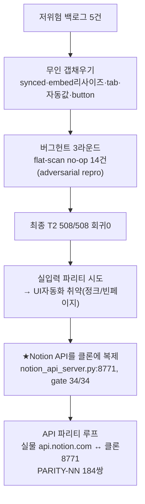

# 런 매니페스트 — notion 2026-07-16 (무인 → API 파리티)

## 1. 한 줄
저위험 백로그 → 무인 갭채우기(블록/컬럼 타입 실물 전부 커버) → **잠복버그 14건**(트리 SoT 잔여 flat-scan) → **Notion 공개 API를 클론에 복제** → **API 파리티 루프**(실물↔클론 동일요청). **35커밋 push, main 그린.**

## 2. 세션 로직

## 3. 핵심 성과
- **블록·DB컬럼 갭 종료**: tab(2단 컨테이너, 컨테이너 일반화)·자동값 4종·button 컬럼 → 실물 관측 타입 전부 커버(transcription=오디오 out-of-scope).
- **잠복버그 14건**(전부 repro): W-BA store 10·W-BB 인터랙션 3(중첩블록 복사 클립보드빔 등)·W-BC 백링크 1. flat-scan 클래스 **소진 확정**.
- **하네스**: 태그관대 매칭(table 104→91)·숫자 tie-break(calendar 18→16, timeline 텍스트델타 -85.5%). rip 유닛 그린.
- **★Notion API 클론**: `harness/notion_api_server.py`(8771, stdlib) — 클론이 공개 API 계약을 로컬에서 말함(pages/blocks, 블록10종, rich_text·에러·헤더 계약, atomic setState 주입→5185 렌더). `notion_api_gate` 34/34.
- **API 파리티**: 같은 요청을 실물+클론에 → PARITY-NN 매칭 문서(184쌍, real+clone 전부 OK). UI 실입력 자동화(취약)를 대체.

## 4. 판단·전환
- **UI 실입력 파리티 → API 파리티로 피봇**: 실물·클론 양쪽 UI 자동화가 취약(실물 정크카드·클론 빈페이지). 오너 지시 "api 규격도 클론"이 정답 — 클론 API가 있으면 동일 요청 비교로 결정적·견고. 실물 오라클이라 실물 입력핸들링 테스트 불요.
- **헛워커 사전 차단**: bookmark·file·link_preview(이미 구현, 문서만 stale)·table footer(의도적 데모 선택). 착수 전 grep 확인.
- **오너 결정 0716**: ①footer 데모유지 ②transcription out-of-scope ③T52 드롭힌트차단 ④다음큐 4종.

## 5. 한계·다음 (핸드오프 §4 상세)
- ⚠ 파리티 루프 5스펙 순환 → 실물 **184페이지 중복**(PARITY-TEST 루트 하위, 통째 아카이브 가능). **정리 1순위.**
- 클론 API v2: DB·속성 전타입·relation/rollup/formula·search·페이징·code language 매핑.
- 파리티 diff 자동화(응답 구조 + 시각). 스펙 확장(DB/컨테이너). T52 구현. 뷰 잔여(list·timeline·sort-key·rowdoc).

## 6. 산출
- 코드: notion-clone `harness/notion_api_server.py`·`harness/live_parity/`·게이트 다수. 35커밋(csbakk/devotion, main).
- 문서: `ref/research/{02-parity-status,03-techniques-for-clone-kb,04-notion-api-spec-and-clone-design}.md` · `ref/reports/{RUN-overnight-0716-morning.html,SESSION-2026-07-16-handoff.md}`.
