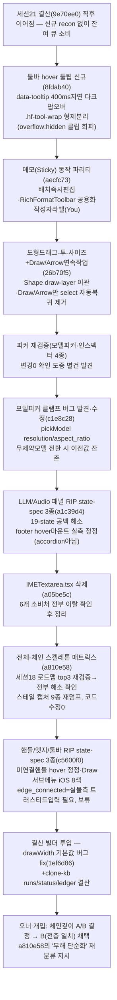

# 런 매니페스트 — canvas 세션 22 ("남은것 다" 라운드)

## 1. 로딩 기법 + 근거
| 기법 | status(런 시작 시점) | 역할 |
|---|---|---|
| [[techniques.structure-first-cloning]] | standard(canvas 세션21 retrofit 첫 실증) | 세션21이 확정한 top3 골격 갭(헤더span·라이트박스메타·프롬프트골격) 이후의 잔여 큐 소비 축 — 이번 라운드는 골격보다 **동작 파리티**(hover/드래그/연속작업)와 **RIP 커버리지 확장**(LLM/Audio·핸들/엣지/툴바 전용 state-spec 신규) 쪽으로 무게중심 이동 |
| [[techniques.dom-first-measurement]] | standard | 툴팁·메모·도형드래그·핸들hover·Draw서브메뉴 전부 live CDP `getComputedStyle`+`outerHTML` verbatim 실측 근거(추측 치수 0) — 8fdab40·aecfc73·26b70f5·c5600f0 전 커밋 공통 방법론 |
| [[techniques.regression-harness-suite]] | standard | 8커밋 전부 tsc -b 클린 + vitest 102/102 게이트, 회귀 0 |
| [[techniques.state-spec-json]] | verified | LLM/Audio(a1c39d4)·핸들/엣지/툴바(c5600f0) 두 라운드에서 19-state RIP 스위트의 커버리지 갭을 전용 state-spec JSON 신규 작성으로 메움 — 카드가 서술한 재사용 패턴(rip_states_r.py 헬퍼)이 2회 연속 실증 |
| [[techniques.cdp-raw-driver]] | verified | RIP 스크래치 캔버스(`3ad36980c5eb`)에 canvas-id로 고정 어태치, 실사용자 산출물 탭·보호 캔버스 무접촉 |
| [[techniques.cdp-nondestructive-recon]] | standard | a810e58(전체-체인 스켈레톤 매트릭스 재검증)은 read-only 재검증 성격 — 코드 수정 없이 "이미 해소됐다"를 체인/상태전이 레벨로 재확인만 수행 |
| [[techniques.adversarial-verification]] | standard | a810e58 자체가 세션18 로드맵의 "확정 갭" 클레임을 자가선언으로 받지 않고 조상체인+상태전이 diff로 재검증한 사례(결과: top3 전부 이미 다른 커밋으로 해소 확인) |

## 2. 세션 로직 도식

전 구간 RIP 스크래치 캔버스(`3ad36980c5eb`)만 조작(load_doc 합성 주입, cleanup 원상복구). 실물(`75c36e2a`)은 read-only(live CDP 실측 목적 접근만, GENERATE 미호출). 보호 캔버스(오너정리 `a12eb16a`·산출물 `cb30b89`/`0d94e6151053`/`8e1d50011180`·좀비 `766028e1`) 전 구간 무접촉.

## 3. 안전
- 실물: 무접촉(GENERATE 0건). live CDP 실측(getComputedStyle/outerHTML)만 read-only 목적으로 8fdab40·aecfc73·26b70f5·c5600f0에서 수행.
- 클론: RIP 스크래치 캔버스(`3ad36980c5eb`)만 조작. 동시 작업 중이던 다른 빌더 파일(핸들/엣지/툴바 세션 중 `harness/rip_dump.py`·`Shell.tsx`·`styles.css` 등)은 26b70f5·a810e58 양쪽 커밋 메시지에 "diff 확인 후 미스테이징/미접촉" 명시 — 파일 단위 충돌회피 프로토콜이 실제로 작동.
- 크레딧: **0크레딧** — MCP `balance` 재확인 결과 **692.21cr**, 세션21 종료 시점 체크포인트(`3ab442a` 커밋 본문 "692.21 재확인")와 **완전 일치**(소수점까지 불변). 이번 라운드 8커밋 + drawWidth fix 전부 GENERATE 미호출 확인.
- 여전히 금지: 외부전송·게시·결제·영구삭제.

## 4. 이벤트 요약
- **①툴바 hover 툴팁(`8fdab40`)** — 실물 sandbox(`75c36e2a`) 실측: 버튼 hover 시 ~400ms 지연 후 "Label (Key)" 다크 팝오버(`data-tooltip` 속성값 그대로). 클론은 `aria-label`만 있어 배선된 키보드 단축키(V/H/D/N/R/T/S/C)를 사용자가 발견할 길이 없었던 순수 시각 갭. computed 실측(bg `rgb(23,23,23)`·border `rgb(34,34,34)`·radius 8px·padding 4px 8px·font 12px/500·shadow-md). `.hf-tool` 자체가 원형 클립용 `overflow:hidden`이라 `.hf-tool-wrap` 형제 래퍼로 분리해 클리핑 회피.
- **②메모(Sticky) 동작 파리티(`aecfc73`)** — 실측(`t_tools_04_real_sticky.py`) 3갭: (1) 배치 즉시 편집모드 진입 누락 — `CanvasApp.tsx` `onPaneClick`이 text 타입 전용 특례였던 것을 실측 재확인(sticky/shape/sticker/comment 전부 즉시선택)해 click-to-place 계열 전체로 확장. (2) 선택 시 플로팅 포맷 툴바+우측 원형배지 부재 — TextNode 전용 JSX를 `RichFormatToolbar` 공용 컴포넌트로 추출, StickyNoteNode도 재사용(중복제거+파리티 동시 확보). (3) 좌하단 작성자 라벨(`.canvas-sticky-note-author`) 부재 — 실계정 시스템 없어 StickerNode와 동일 규약 "You" 고정 표기.
- **③도형 드래그-투-사이즈 + Draw/Arrow 연속작업(`26b70f5`)** — 실측(`t_tools_09/10_real_*.py`) 2갭: (1) Shape 드래그 시 실물은 드래그 델타=결과 width/height(실측 dx=120,dy=90→w=119.995,h=89.996, 거의 정확한 1:1)인데 클론은 클릭배치 고정120×120뿐 — Shape를 Draw/Arrow와 동일 draw-layer 포인터캡처 오버레이로 이관. (2) 실물은 Draw/Arrow가 1개 그린 후에도 툴 활성 유지(연속작업 가능)인데 클론은 3종 전부 `onDrawUp` 끝에서 무조건 `setTool("select")` — Shape만 자동복귀 유지하고 Draw/Arrow는 제거.
- **④피커 재검증(변경 0)** — 모델피커·인스펙터 피커 4종을 실측 재대조, 이미 정합 확인(코드 변경 없음). 재검증 과정에서 별건으로 `pickModel()` 클램프 로직 버그 발견 → **c1e8c28**: `MODEL_PARAM_CONSTRAINTS[modelId]` 미등록(무제약) 모델 전환 시 클램프 블록 전체를 스킵해 이전 모델의 `resolution`(예: Minimax `"512"`) 값이 새 모델(예: Seedance 2.0)에 잔존하던 버그를 게이팅 조건을 "제약 존재 여부"에서 "해당 subtype에 그 필드 존재 여부"(GEN_SUBTYPES)로 교체해 수정. CDP 검증: minimax-hailuo-02-fast(resolution="512")→Seedance 2.0 전환 후 정상 클램프(`"480p"`) 확인.
- **⑤LLM/Audio 패널 RIP state-spec 3종(`a1c39d4`)** — `llm_node_expanded`/`llm_system_expanded`/`audio_node_expanded` 신규(19-state 스위트 갭 메움). 라이브 CDP 실측(3회 독립 시행)으로 **원 recon의 "System 펼쳤을 때만 footer 마운트" 추측을 정정** — 실측 결과 LLM 노드 footer(모델·추론·생성버튼) 마운트는 System Prompt 아코디언 상태와 무관하게 **순수 hover 게이팅**. `GenNodePanels.tsx`/`GenerateNode.tsx`의 `controlsMounted`를 accordion 기반에서 hover 기반으로 교체. Audio voice-label에 `line-height:1` 추가(실측 10px vs 상속 15px 렌더 델타 수정). 부수: `rip_dump.py` `click_text`에 `scrollIntoView` 추가(Add메뉴 하단 "Voiceover" 클릭이 스크롤 밖 좌표라 무음 실패하던 버그 수정).
- **⑥`IMETextarea.tsx` 삭제(`a05be5c`)** — 세션21이 이월시킨 정리 과제. grep으로 참조 0(import 전무, 잔여는 다른 동시 빌더가 작업 중이던 파일의 히스토리 설명 주석뿐)을 확인 후 삭제. 주석 참조 파일(`GenNodePanels.tsx`)은 충돌 회피로 미접촉.
- **⑦전체-체인 스켈레톤 매트릭스(`a810e58`)** — 세션18 로드맵(`ref/_STRUCTURE_FIRST_ROADMAP.md`)이 확정한 top3 갭(헤더span·라이트박스메타·프롬프트textarea→richtext)이 이 세션 중 다른 커밋들(`e73c8ab`·`6d8c485`·`3a88c8d`·`8b888f2`·`a1c39d4`)로 이미 해소됐음을 **잎→루트 조상체인 + resting/hover/selected 상태전이 diff 레벨**로 재검증. 신규 발견: **상태 전이 메커니즘이 real=mount/unmount+reflow, clone=상시마운트+opacity토글로 구조적으로 다름**(§0-3). 스테일 캡처 9종(`ref/rip/*_clone.json`이 위 커밋들보다 Jul13 시점이라 구식) 재덤프로 바로잡음. `harness/rip_chain.py`(조상체인 추출)·`rip_state_diff.py`(상태전이 diff) 신규 — 코드 수정 0건(재검증 결과 진짜 신규갭 없음, 저위험 항목은 §9에 다음 세션 후보로 기록). **이 라운드 시점에는 real13층 vs clone10층·mount/unmount vs opacity토글을 "무해 단순화"로 판정했으나, 결산 시점 오너 개입으로 이 판정이 뒤집힘(§5 참고)**.
- **⑧핸들/엣지/툴바 RIP state-spec 3종(`c5600f0`)** — `handle_direct_hover`·`toolbar_draw_submenu`·`edge_connected` 신규(19-state 스위트의 또 다른 커버리지 갭). 실측 정정: 빈 노드의 **미연결** 입력 핸들은 direct-hover 시 배경색이 `rgb(46,48,49)→rgb(78,84,88)`로 밝아짐(같은 스냅샷 내 대조군으로 확인) — 기존 "direct-hover 시각변화 없음"(결과/연결 핸들 기준 실측) 결론을 미연결 핸들 한정으로 정정, `styles.css`에 hover 배경 규칙 복원. Draw 서브메뉴 실측: 브러시/스와치 버튼 32→36px, 색상 팔레트가 Tailwind 근사값이 아니라 **iOS 시스템컬러 8색**(검정 1개 누락 발견·복원), 스와치 gap 0(전용 `hf-swatch-group` 신규), active 브러시 배경=accent 라임 틴트(`rgba(209,254,23,.14)`). `edge_connected`는 클론 측만 실측 완료, **실물 측은 CDP 합성 pointer-drag로 핸들 연결 제스처 트리거 안 됨**(OS-트러스티드 입력 cliclick/pyautogui 미설치 필요) — 스코프 밖 보류.
- **⑨drawWidth 기본값 fix(`1ef6d86`, 이 결산 빌더 수행)** — `CanvasApp.tsx` L337 `useState(4)`가 `DRAW_WIDTHS=[2.5,6]`(`Shell.tsx` L86) 어느 옵션과도 안 맞아 앱 시작 시 Draw 서브메뉴 두 브러시(Thin/Thick)가 모두 비활성으로 보이던 버그. 실물은 Thin(2.5)이 기본 active — `useState(2.5)`로 수정. tsc -b 클린·vitest 102/102(회귀 0) 확인 후 단독 커밋.

## 5. 로직 평가
- **작동한 것**: ①[[techniques.state-spec-json]] 재사용 패턴이 이번 라운드 2회(LLM/Audio·핸들/엣지/툴바) 연속으로 "19-state 스위트 커버리지 갭 → 전용 state-spec 신규 작성"으로 반복 성공, 매번 실측 재정정을 동반(LLM footer=순수hover / 핸들=미연결한정 hover변화) — RIP 확장이 매번 "추측 정정" 부산물을 낳는 패턴이 재확인됨. ②[[techniques.adversarial-verification]]을 코드 레벨이 아니라 **문서 레벨**(a810e58: "세션18 로드맵의 확정 갭 클레임을 자가선언으로 안 받고 조상체인/상태전이 diff로 재검증")에도 적용해 top3 전부 이미 다른 빌더 커밋으로 해소됐음을 정확히 확인 — 재작업 방지(불필요한 리팩터 시도 0). ③동시 다중 빌더 작업(26b70f5·a810e58·c5600f0가 사실상 겹치는 파일영역인 핸들/엣지/툴바·프롬프트골격을 동시에 건드림) 상황에서 매 커밋이 "동시작업 중인 다른 빌더 파일은 diff 확인 후 미스테이징" 원칙을 명시적으로 지켜 충돌 0건 — [[techniques.subagent-fanout-rules]]의 "독립·무충돌만 병렬" 원칙이 파일 단위 스코프 분리로 실제 지켜짐. ④피커 재검증(변경0 확인 작업)이 "아무것도 안 바뀜"으로 끝나지 않고 별건 버그(c1e8c28)를 발견 — 재검증 자체가 리스크 낮은 회귀 사냥 기회로 기능.
- **병목/실패**: ①`edge_connected` 실물 측이 OS-트러스티드 입력 없이는 검증 불가로 보류 — [[techniques.osascript-trusted-hybrid]] 계열 우회가 canvas의 핸들 연결 제스처엔 아직 적용 안 됨(다음 세션 후보). ②a810e58이 "real13층 vs clone10층·mount/unmount vs opacity토글"을 스스로 **"무해 단순화"로 판정**했으나, 결산 시점에 오너가 직접 개입해 이 판정을 **B(전층 일치 목표)로 뒤집음** — 빌더의 "최종 픽셀 등가면 충분"이라는 판단 기준이 오너의 "프로들이 그 층 구조를 이유있게 만들었다, 실물이 기능을 추가해도 클론이 따라갈 수 있어야 한다"는 더 엄격한 기준과 충돌한 사례. 자율 판정이 오너 원칙과 어긋날 수 있음을 재확인 — 앞으로 "무해 단순화"류 판정은 최종 확정이 아니라 **오너 확인 대기 항목**으로 명시해야 함(이번엔 사후 반영, 다음부터는 사전 플래그).
- **다음 런에서 바꿀 것**: ①**체인깊이 B 채택 반영** — a810e58 §5/§9의 "무해 단순화" 항목(프롬프트 real13 vs clone10층, hover mount/unmount+reflow vs opacity토글)을 "다음 실행에서 실물 층수·메커니즘까지 일치시킬 것"으로 재분류. 구체적으로: (a) 프롬프트 리치에디터에 Lexical류 decorator/스크롤 래퍼 3~4층 추가 이식, (b) hover 전이를 clone의 "상시마운트+opacity토글"에서 real의 "인스턴스 mount/unmount+reflow"로 재작성(렌더러 심장부급, 신규 리스크 — 게이트망 선행 필수). ②라이트박스 메타데이터 배치(우측 aside vs 하단 가로 row)도 B 원칙 하에서는 "저위험 잔여"가 아니라 aside 이관 대상으로 재검토 필요. ③핸들 조상체인 커버리지(className 미캡처로 `rip_dump.py` 신뢰성 있는 특정 불가, a810e58 §7)를 `rip_dump.py`의 `WALK_JS_TEMPLATE`에 `el.className` 필드 추가로 해소 — 하위호환 저위험 확장, 다음 세션 1순위 인프라 작업. ④`edge_connected` 실물 측 검증에 OS-트러스티드 입력(cliclick/pyautogui) 설치 후 재시도. ⑤결과노드 hover mount/unmount(clone=0/0) — 트리거 미발화 vs 의도된 무반응 두 가설 미구분(a810e58 §3-1) — 육안 스크린샷 대조로 확정 필요.
- **ledger 반영**: 8건([[techniques.state-spec-json]] 2회 연속 재사용(LLM/Audio·핸들/엣지/툴바)·[[techniques.dom-first-measurement]] 6실측 세션(툴팁·메모·도형드래그·핸들hover·Draw서브메뉴)·[[techniques.adversarial-verification]] 문서레벨 재검증(a810e58)·[[techniques.regression-harness-suite]] 8+1커밋 무회귀 게이트·[[techniques.subagent-fanout-rules]] 파일단위 충돌회피 실증·[[techniques.structure-first-cloning]] "무해 단순화" 판정이 오너 개입으로 뒤집힌 사례(카드 §함정에 "빌더 판정은 잠정, 오너 확인 전까지 확정 아님" 추가 검토 대상)·drawWidth 기본값 버그 수정(신규 실증 아님, dom-first-measurement 재사용)·MCP balance 실측 재확인(692.21cr, 크레딧 계측 정본 원칙 재적용)).
