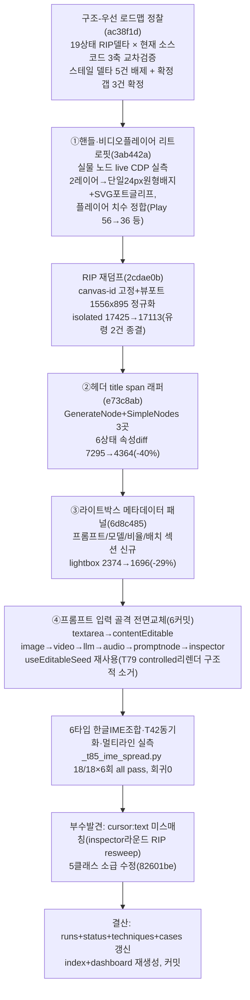

# 런 매니페스트 — canvas 세션 21 (구조-우선 소급 레트로핏)

## 1. 로딩 기법 + 근거
| 기법 | status(런 시작 시점) | 역할 |
|---|---|---|
| [[techniques.structure-first-cloning]] | standard(notion 실증, 오너 채택 1순위 원칙) | 이번 런의 축 — notion에서 확립된 "①골격→②스타일→③동작" 순서를 **canvas에 소급(retrofit)** 적용. 이미 스타일-먼저로 진행된 캠페인의 retrofit 사례(카드 §함정에 명시된 시나리오) |
| [[techniques.rip-repair-loop]] | verified | 리트로핏 전 신선한 기준선 확보를 위해 RIP 재덤프(canvas-id 고정+뷰포트 정규화) 1회 수행, 이후 블록별 resweep으로 무회귀 확인 |
| [[techniques.dom-first-measurement]] | standard | 핸들·비디오플레이어 리트로핏의 실측 근거 — 실물 노드를 live CDP `getComputedStyle`+`outerHTML` verbatim으로 직접 측정(추측 치수 0) |
| [[techniques.regression-harness-suite]] | standard | 매 커밋 tsc -b 클린 + vitest 102/102 게이트, 6라운드 전부 무회귀 확인 |
| [[techniques.cdp-raw-driver]] | verified | RIP 스크래치 캔버스(`3ad36980c5eb`)에 canvas-id로 고정 어태치, 실사용자 산출물 탭·보호 캔버스(AD1/T5/CW1/AD5) 무접촉 |
| [[techniques.cdp-nondestructive-recon]] | standard | 정찰(ac38f1d) 단계는 read-only·0크레딧·코드수정 없음 — 실물 재실측 없이 기존 RIP산출물+소스코드 교차검증만으로 우선순위 확정 |

**세션 20 대비 전환**: 세션20까지는 "복잡 워크플로우 파리티"(콘텐츠 빌드·생성 대조) 축이었으나, 세션21은 **노션 캠페인이 당일 확립한 구조-우선 원칙**(`clone-kb/techniques/structure-first-cloning.md`, 오너 직접 채택)을 canvas 캠페인에 최초로 이식하는 방법론 전환 런. 스타일-먼저로 누적된 canvas의 "보정 스택"을 걷어내고 골격부터 재정렬하는 **retrofit**(카드 §함정 "이미 스타일-먼저로 진행된 캠페인은 골격을 retrofit" 시나리오의 첫 실증 사례).

## 2. 세션 로직 도식

전 구간 read-only 정찰(§1) 이후는 RIP 스크래치 캔버스(`3ad36980c5eb`)만 조작. 실물은 무접촉(GENERATE 미호출, 기존 RIP 덤프+live 실측만). 보호 캔버스(오너정리 a12eb16a·산출물 cb30b89/AD/CW/T·좀비766028e1) 전 구간 무접촉.

## 3. 안전
- 실물: 무접촉(GENERATE 0건, 기존 RIP 산출물 재사용 + 핸들/비디오플레이어 리트로핏 시에만 live CDP 실측 목적으로 read-only 접근).
- 클론: RIP 스크래치 캔버스(`3ad36980c5eb`)만 조작, load_doc 합성 주입으로 테스트 후 정리 완료. 보호 캔버스(a12eb16a·cb30b89·AD/CW/T·766028e1) 무접촉.
- 크레딧: **0크레딧** — 전 커밋에서 GENERATE 미호출 확인(잔액 692.31cr 세션20 종료 시점에서 불변, 3ab442a 커밋 본문에도 692.21 재확인 기록 — 소수점 표기 차이는 있으나 두 자릿수 단위 불변 확인).
- 여전히 금지: 외부전송·게시·결제·영구삭제.

## 4. 이벤트 요약
- **정찰(ac38f1d)**: 신규 CDP 캡처 없이 기존 RIP 산출물(`ref/rip/*_delta.md`, 19상태) + 서술형 RECON 문서(`ref/_RECON_*.md`) + 현재 소스코드(git log/grep) 3축 교차검증. 핵심 발견: 델타 문서(7/13 캡처 기준)의 상당수가 스테일(모델피커·인스펙터피커·LLM/Audio패널·미니툴바radius·out-of-view토스트는 7/15~17 커밋으로 이미 해결) 또는 캡처 아티팩트(resultnode_video_selected·multiselect는 소스 주석이 이미 자인)로 판명. 현재도 유효한 확정 갭 3건 확정: ①프롬프트 입력 골격(전 노드 공통, 렌더러 심장부급) ②라이트박스 메타데이터 패널 부재 ③헤더 타이틀 span 래퍼 누락. `ref/_STRUCTURE_FIRST_ROADMAP.md` 신설(28KB).
- **①핸들·비디오플레이어(3ab442a)**: 오너 지적("실물과 다름") 대응 — AD1 결과노드를 live CDP로 실측(`getComputedStyle`+`outerHTML` verbatim). 핸들: 실물은 히트박스/시각 미분리 단일 24×24 원형 배지인데 클론은 28px squircle+투명히트박스+내부pill 2레이어(`hf-port-visual`) — 단일 배지로 통합, hover scale(1.08) 확대 제거(실물 무확대), 좌우 오프셋 10/28px→18px 통일, 세로간격 36→34px, 4종 실물 SVG 포트글리프 이식. 비디오 플레이어: 중앙Play 56→36px, 컨트롤바 인셋 0→8px/높이 auto→24px, 버튼 22→14px, duration 폰트 12→10px, Play/Mute/Fullscreen 실물 SVG 이식.
- **RIP 재덤프(2cdae0b)**: 클론 5175 탭이 4개 동시 열려(RIP 스크래치+실사용자 산출물 3개) `url_substr="5175"` 매칭이 모호성 위험 상태였던 것을, state-spec 19개+resweep 하네스 2개를 canvas-id(`3ad36980c5eb`)로 영구 고정 + `Emulation.setDeviceMetricsOverride`로 1556x895 뷰포트 정규화 후 전체 재립. isolated 17425→17113(-312, 순수 차분) / 최상위 베이스라인 30580 대비 -44%. 미니툴바 radius·out-of-view 토스트 유령 2건 종결(제품 갭 아닌 하네스 아티팩트로 확정). 이후 산출물탭 오염이 harness 21파일 레벨에서 구조적으로 원천차단됨.
- **②헤더 span 래퍼(e73c8ab)**: 실물 골격(`div.header > span.icon + span.title`)과 동치화 — `GenerateNode.tsx`의 헤더 타이틀이 div 직속 텍스트노드로 렌더되던 걸 span으로 포장(같은 버그 패턴인 `SimpleNodes.tsx`의 media/promptnode 헤더도 동일 수정, 총 3곳). CSS 변경 없음(부모 flex 상속, 시각 회귀 0). RIP isolated resweep 6개 상태(imagenode_idle/hover·resultnode_image_idle/hover/selected·resultnode_video_selected) 속성diff 7295→4364(-2931, -40%).
- **③라이트박스 메타데이터 패널(6d8c485)**: 실물 라이트박스는 프롬프트·모델명·종횡비·배치카운터 클러스터가 있으나 클론은 미디어+Download/Close뿐 — 기존 stage/actions 구조는 그대로 두고 `.hf-lightbox__meta` sibling 섹션만 신규 추가(state에 nodeId 추가, 렌더 시점에 `rf.getNode`+results 조회로 계산, carouselIdx 상태 리프팅 불필요). RIP isolated resweep(lightbox_open) 속성diff 2374→1696(-678, -29%).
- **④프롬프트 입력 골격 전면교체(6커밋, image→video→llm→audio→promptnode→inspector)**: 실물 프롬프트 입력은 리치텍스트/contenteditable 계열(다단 wrapper, div role=textbox)인데 클론은 네이티브 `<textarea>`(`IMETextarea`, T79 IME 우회용 의도적 아키텍처)였음 — 렌더러 심장부급 리팩터. TextNode/StickyNoteNode가 이미 프로덕션 검증한 언컨트롤드 contentEditable 패턴(`useEditableSeed`, `SimpleNodes.tsx`)을 재사용해 image(`3a88c8d`, 프로토타입)부터 순차 확산: video(`8b888f2`)→llm(`9548c0f`, User/System 2필드)→audio(`be0c3dd`)→promptnode(`b6daee6`)→inspector(`82601be`, 마지막·조기return 다수로 hooks 순서 방어적 재구성). children에 `{value}` 반응형 바인딩 없이 ref 주입 1회+onInput 커밋 방식이라 React 재조정이 조합 중 DOM을 덮어쓸 대상 자체가 없음 — T79 controlled 리렌더 버그의 근본원인이 **구조적으로 발생 불가**해짐. 커밋은 `textContent` 대신 `innerText`(멀티라인 Enter 블록 자식을 `\n`으로 정확히 근사).
- **6타입 IME 실측 검증**: `_t79_ime.py`를 CDP9222/포트5175/고정탭(`3ad36980c5eb`)용으로 이식한 `_t85_ime_spread.py`로 매 라운드 한글 조합(중간값까지)·영문·붙여넣기·멀티라인(`\n` 보존)·외부동기화(Inspector T42 시나리오)를 검증, 이후 라운드마다 이전 타입 전체를 무회귀로 재확인(18/18 × 6라운드, 최종 라운드 누적 all pass). 하네스 자체 개선 1건 발견·수정: "all" 연속실행에서 target 간 교차오염(이전 pan/zoom·포커스 잔재가 다음 target 오탐 유발) → 매 target 진입 전 재로드(`fresh_load`)로 격리.
- **부수 발견(82601be)**: RIP resweep 중 contentEditable div는 기본 `cursor:auto`, 네이티브 textarea는 UA 기본 `cursor:text`인데 실물은 `cursor:text` — 전 라운드 공통 미세 회귀였음을 마지막 라운드에서 실측 발견, 5개 전환 클래스(`.hf-gennode__prompt`·`.hf-promptnode__input`·`.hf-inspector__prompt-input`·`.canvas-llm-node__textarea`·`.canvas-audio-node__textarea`) 전부에 소급 적용.
- **결산**: LLM/Audio/PromptNode는 19-state RIP 스위트에 대응 state-spec이 없어(로드맵 §7-3 기존 확정 갭) IME 하네스+tsc+vitest로 대체 검증. `IMETextarea.tsx`는 6개 소비처 전부 이탈해 미사용 상태이나 파일 삭제는 이번 스코프 밖(다음 세션 후보).

## 5. 로직 평가
- **작동한 것**: ①[[techniques.structure-first-cloning]]이 notion에서 확립된 "①골격→②스타일→③동작" 순서를 canvas라는 **이미 스타일-먼저로 누적 진행된 캠페인**에 소급 적용한 첫 사례로서, 카드가 스스로 예견한 "이미 스타일-먼저인 캠페인은 골격을 retrofit(블록 단위 교체, 픽셀 기준선으로 무회귀 확인)" 시나리오를 실증 — 헤더span(-40%)·라이트박스(-29%) 등 구조 정합 하나가 스타일 단계 다수를 동반 개선하는 패턴이 canvas에서도 재현됨(notion 수렴루프에서 관측된 것과 동일 메커니즘) ②프롬프트 골격처럼 "렌더러 심장부급" 리팩터를, TextNode/StickyNoteNode가 **이미 프로덕션에서 검증한** `useEditableSeed` 패턴 재사용으로 신규 리스크 없이 6개 소비처에 확산 — 기존 검증된 패턴 재사용이 구조 레벨 리팩터의 리스크를 실질적으로 낮춤 ③매 라운드 이전 타입 전체를 무회귀 재확인하는 방식(18/18×6회 누적)이 "확산 중 어딘가 깨졌는데 마지막에야 발견" 시나리오를 방지 — 실제로 82601be에서 cursor:text 공통 회귀를 마지막 라운드에서 잡아 5개 클래스에 소급 적용할 수 있었던 것도 이 누적 검증 구조 덕분.
- **병목/실패**: ①LLM/Audio/PromptNode 3개 소비처는 19-state RIP 스위트에 대응하는 state-spec이 애초에 없어 IME 하네스+tsc+vitest로만 검증했다 — RIP 커버리지 갭이 이번 런에서도 해소되지 않고 그대로 이월(전용 state-spec 신규 작성 필요, 로드맵 §7-3에 이미 명문화됐던 기존 갭) ②모델피커 플라이아웃·인스펙터 피커는 RIP role 자동판정이 불가능한 대상이라 이번 런의 어떤 리트로핏 단계에서도 다뤄지지 않음(육안대조 전용 과제로 남음) ③핸들/엣지/툴바는 RIP 델타 커버리지 자체가 없어(§6 갭, 정찰 단계에서 이미 식별) 3ab442a가 핸들만 다뤘고 엣지·툴바는 미착수.
- **다음 런에서 바꿀 것**: ①LLM/Audio 패널 전용 RIP state-spec 신규 작성 — IME 하네스만으로는 색상·간격 등 스타일 레벨 회귀를 못 잡음(구조는 검증되나 스타일은 육안 스팟체크에 의존 중) ②모델피커 플라이아웃·인스펙터 피커 전용 육안대조 세션 분리 편성(RIP로 자동판정 불가한 유일한 잔여 큐) ③`IMETextarea.tsx` 삭제 — 6개 소비처 전부 이탈 확인됐으므로 다음 세션 첫 5분 작업으로 정리 가능 ④핸들 리트로핏에서 검증한 "실물 live CDP 실측(getComputedStyle+outerHTML verbatim)" 방법을 엣지·툴바 갭에도 그대로 적용 가능(신규 기법 불필요, 기존 [[techniques.dom-first-measurement]] 재사용으로 충분).
- **ledger 반영**: 6건([[techniques.structure-first-cloning]] canvas 첫 실증(retrofit 시나리오)·[[techniques.rip-repair-loop]] canvas-id 고정 재덤프·[[techniques.dom-first-measurement]] live CDP verbatim 실측 재사용·[[techniques.regression-harness-suite]] 6라운드 누적 무회귀 게이트·핸들/비디오플레이어 실물 파리티·프롬프트 골격 확산 6타입 완결).
