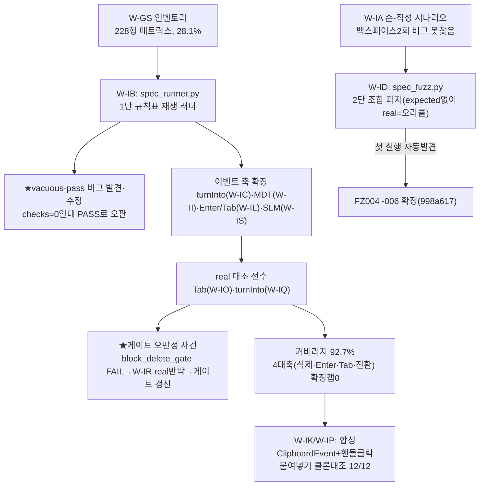

# 런 매니페스트 — notion 2026-07-21 저녁 (무인 10h 2차)

## 1. 한 줄
"사람이 쓰다가 발견"하던 파리티 갭 헌팅을 **차등 대조 파이프라인**(1단 규칙표 재생 러너 `spec_runner.py` → 2단 조합 퍼저 `spec_fuzz.py`)으로 전환. 규칙표 커버리지 28.1%→**92.7%**, 자동검출 갭(백스페이스 2회 버그·콜아웃 데이터손실·Enter 커서 이동) 전부 수복, 4대 축(삭제·Enter·Tab·전환) real 대조 전수 완료.

## 2. 세션 로직

## 3. 핵심 성과

- **★차등 대조 파이프라인 신설** — [[techniques.differential-conformance-pipeline]]. 1단(`spec_runner.py`, W-IB)은 `behavior-matrix.json` 규칙표를 진짜 UI 경로(store 직접주입 아님)로 재생·판정. 2단(`spec_fuzz.py`, W-ID)은 조합을 자동 생성해 real을 오라클로 삼아 clone과 직접 diff — expected를 사람이 미리 채울 필요가 없다.
- **자동검출 갭 3건 수복**: FZ004~006(백스페이스 2회, 998a617) · TRN10/19(콜아웃 전환 텍스트소실, f201cfa) · FE006(토글자식 Enter 커서이동, d57baa3).
- **커버리지 28.1%(64/228) → 92.7%(215/232)**(`spec_coverage.py` 실측) — turnInto 19행·MDT 15행·Enter/Tab 조합 축 확장이 대부분.
- **★게이트 오판정 정정 사건** → [[techniques.gate-oracle-staleness]] 신설. 오케가 `block_delete_gate.py` FAIL을 "클론 미구현"으로 단정해 잘못된 티켓을 냈으나, 워커(W-IR)가 real 실측 2건으로 "게이트 오라클이 낡았다"를 반박·확정(258c59e, 18/18 무회귀).
- **4대 축(삭제·Enter·Tab·전환) real 대조 전수 완료**: 삭제=기존 완료, Enter=갭발견+수복(FE006/ENT2-16), Tab=확정갭 0(가짜diff 1건 콜아웃 하네스 아티팩트로 배제), 전환(turnInto)=확정갭 0.
- **붙여넣기 클론 대조 12/12 완주** — [[techniques.non-intrusive-browser-automation]] §6 신설. 합성 ClipboardEvent(OS 클립보드 무접촉) 9행 + 키 사다리②(`commands:['Paste']`) 폴백 3행. 파리티 6 확정·갭 4(PST02 버그·PST05/06 오너결정).
- **★키 입력 사다리 3단 확정** — 붙여넣기 측정을 osascript(③)로 하다 오너 키입력과 오염된 사고(PST01) 이후, `Input.dispatchKeyEvent{commands:['Paste']}`(②)가 실물에서 OS 포커스 무접촉 동작함을 실측 확정 — ③ 대부분이 ②로 대체됐다.

## 4. 판단·전환

- **손-작성 시나리오 → 조합 자동생성으로 전환**: 오너가 겪은 실버그(백스페이스 2회)를 W-IA가 손으로 여러 축 시나리오를 짜서도 못 찾았다. spec_fuzz.py 첫 실행이 곧바로 찾아냈다 — "사람이 축을 다 상상 못 한다"는 것 자체가 조합폭발 문제의 증거.
- **게이트 FAIL을 곧바로 "버그"로 읽지 않기로 정책화**: 이번 오판정 사건 이후 `_POLICY.md` §검증에 "게이트 FAIL 시 코드/게이트 양쪽 다 의심, real 재실측으로 판정" 조항 신설(fa43740).
- **real 예산은 항상 상한(5~6행/세션) 안에서** — clone-only BREADTH 조합은 미대조로 정직하게 남기고 다음 세션 예산 후보로 분류(`needsConfirmation`).

## 5. 한계·다음

- `conformance-latest.json` 병렬 race 미수복(임시 규율: stamp 파일이 정본, latest는 참고용만) — `--no-latest` 옵션은 다음 세션 과제.
- MDT/SLM 축은 스키마 정규화가 부분적(MDT는 W-II가 완성, SLM은 7행 중 2행만 SKIP→PASS/FAIL 전환).
- turnInto callout-src 7행은 클론 어댑터 셋업 한계로 영구 SKIP(하네스 스키마 수정 전엔 대조 불가).
- PST05/06(URL 붙여넣기 팝오버 옵션 차이)은 신규 기능이라 오너 결정 대기, PST02는 확정 버그로 수복 대기.

## 6. 산출

- 코드: `260622_notion-clone/harness/{spec_lib,spec_runner,spec_fuzz,spec_coverage,spec_merge}.py`, `harness/wip_paste_clone.py`(합성 ClipboardEvent), `harness/wik_measure.py`(핸들클릭 선택).
- 데이터: `ref/spec/conformance-*.json`(스탬프별), `ref/spec/fuzz-findings-*.json`, `ref/spec/behavior-matrix.json`(215/232 measured).
- clone-kb: [[techniques.differential-conformance-pipeline]]·[[techniques.gate-oracle-staleness]] 신규, [[techniques.non-intrusive-browser-automation]]·[[techniques.clipboard-format-interop]] 갱신.
- 커밋(notion-clone repo, 선별): 998a617·f201cfa·d57baa3·258c59e·c036ed7·fa43740·ae67550·6a6266d·c9ea23e·ef26f06·6fcbc2f·17d8097.
