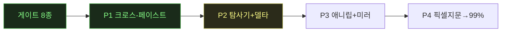

# ⚪ 대기 — canvas 캠페인 무인 런 상태판

> 갱신 정책(오너결정 2026-07-16): **마일스톤/아크 단위 + 런 시작·종료 시** 갱신·push(이벤트마다 X — 커밋 노이즈 방지). 런 없을 때 = 마지막 런의 최종 상태.
> 산출물(리포트·대조 갤러리·핸드오프)은 private `canvas-clone` 레포 → [산출물 대시보드](https://github.com/csbakk/canvas-clone)

**런 상태**: ⚪ 대기 — 세션20 종료(2026-07-17). 복잡 워크플로우 5주제 매칭(T1~T5) 실물↔클론 완성(각 15노드·7타입) · 대조갤러리 `reports/complex-workflows/index.html` · [[techniques.canvas-coord-inject-rearrange]] verified 승격 · 파리티 발견 3건(Upscale엣지divergence·T2 NSFW오탐·구성매칭) · 잔액 **692.31cr**(세션 시작 1067.74, −375.43 — MCP 전수재계산, 브리핑 276cr 정정) · 이월: Upscale 엣지 메커니즘 규명·NSFW 재현성 확인

## 🆕 세션 20 (2026-07-17, 완료)
- **복잡 노드 연결 워크플로우 5주제 매칭** — 오너 지시(모든 노드타입 총동원·프롬프트노드 인라인 금지·크로스타입 연결)로 T1커피·T2느와르·T3러닝·T4스킨케어·T5전기차 5개 주제를 실물·클론 **동일 프로젝트 이름·동일 15노드 구성**으로 완성. 노드타입 7종(Prompt·Image·Video·Upscale·LLM·Voice·Reference엣지), 앵커→씬 ref fan-out, neat 좌→우 정렬.
- **클론 인에이블(선행)** — LLM/오디오 인라인 패널(G1/G2)·Voice 배선(text2speech_v2)·Upscale 노드 타입 신규(`3167e9a`)·이미지젠 `input_images` 핸들 렌더 복원(`c02bfe5`, 앵커 fan-out 4엣지 갭 수복) — 세션19 이월 과제 완료.
- **[[techniques.canvas-coord-inject-rearrange]] verified 승격** — "TODO 실증대기" 카드가 실물 T1(패턴검증 패스)→T2~T5(패턴 재사용) 5/5 성공으로 확정. 핵심 quirk: Cmd+V 키다운 합성 무반응 → `dispatchEvent(new ClipboardEvent('paste'))` 직접 트리거+`Browser.grantPermissions(clipboardReadWrite)`로 우회. 엣지 재연결은 "Run pipeline" 정상 동작으로 무결 확인.
- **실물 클립보드 "서버 참조 ID" 가설 기각** — 오너가 관측한 마커를 신규 스크래치 탭에서 3중 증거로 재검증, 4일 전(세션10) 확정 구조(OS마커+localStorage payload) 그대로임을 재확인(`ref/_RECON_CLIPBOARD_API.md`).
- **파리티 발견 3건**: ①Upscale 엣지 divergence — 클론=img→Upscale 그래프엣지 연결(16엣지), 실물=Upscale DOM 핸들 미렌더로 엣지 연결 불가(15엣지, idle) — 메커니즘 이월 ②T2 NSFW 오탐 — 씬1(느와르 담배연기 프롬프트) 크레딧 자동환불, idle ③노드 컴포지션은 15노드·7타입·프롬프트노드 fan-out·neat 정렬로 5주제 전부 매칭.
- **크레딧(MCP 정본, 전수 재계산)**: 1067.74→**692.31cr**(−375.43). Kling v3.0 34건 −297.50cr · Nano Banana 49건 −47.00cr(순액) · Bytedance Upscale 12건 −20.00cr(순액) · Seed Audio 8건 −9.70cr · Voiceover 5건 −0.75cr · Soul V2(인에이블 테스트) 4건 −0.48cr. GPT Image 2 0건. ★오케 브리핑 수치("968→692≈276cr")는 T1~T3 완료(resume) 중간 체크포인트를 시작값으로 오인한 부분합이었음을 MCP 전수 재계산으로 적발·정정(-99.43cr 과소평가) — adversarial-verification 원칙을 크레딧 계측에도 예외 없이 적용해야 한다는 교훈.
- **대조 갤러리**: `reports/complex-workflows/gen_compare.py`(narrative-parity 패턴 재사용) 신규 작성 → `index.html`(5주제 좌=실물/우=클론, 파리티 발견 3건 상단 고정).
- **push**: 로컬 커밋만, 오너 승인 대기.
- 상세: `clone-kb runs/2026-07-17-canvas-complexwf.md` · 갤러리 `canvas-clone/reports/complex-workflows/index.html`.
- **남은 일**: Upscale 엣지 메커니즘 근본 규명(실물이 그래프엣지 대신 무엇으로 upscale 참조를 연결하는지) · T2 NSFW 오탐 재현성 확인(결정론적/랜덤) · 세션19 이월 갭(kling3_0 mode 파생·folder-modal/modelpicker/addmenu 아키텍처급 파리티) · 오너결정 대기 2건(영상 통일 재생성 여부·디버그 부산물 정리, 세션19부터 이월).

---
### (이력) 세션 19
- **내러티브 파리티 완성(첫 5/5)** — 세션18 스톨로 미완이던 실물 AD3~5(AERO RUN 9:16·GLOW 4:5·PULSE 16:9)를 이어받아 완주. 비디오 모델을 **KLING 3.0(pro/5s)**으로 전환(실물 AD1~2는 기존 Seedance 유지). AD4는 KLING이 4:5 미지원이라 비디오만 9:16 예외. 대조갤러리 `reports/narrative-parity/index.html` = **실물 5/5 + 클론 5/5** 확정.
- **파리티 델타 소탕** — 진짜갭 3건(folder-modal padding/swatch `b658ab9`·assets-tab min/max/gap `7409e13`·topbar chevron 0.54 `1e516b1`), isolated **17,490→17,425**(역행0·0크레딧).
- **Track C 버그 트리아지** — 세션18 발견 갭 3건 재검증: ①kling-3.0 registry매핑·②다중선택경합=**유령**(클론 실측 결과 문제 없음, ②는 세션18 당시 빌더 하네스 스코프 문제로 재규명) / ③text/audio status idle=**진짜버그**, 수정(`b440611`).
- **크레딧(MCP 정본)**: 1202.74→**1067.74cr**(−135). KLING v3.0 ×10=125cr(**12.5cr/클립 — seedance 17.5보다 저렴**), Nano Banana ×10=10cr, 실수 Seedream 1cr. 파리티·트리아지=0크레딧.
- **방법론 교훈**: ★클러스터 "확신 티켓"(`rip_delta_cluster`) 위양성률 높음 재확인(~24건 조사 중 실제갭 소수) → 상태별 delta.md 직접 훑기+3분류 게이트(product/harness/캡처노이즈)로 전환 권고([[techniques.rip-repair-loop]] 함정 갱신). 모델별 지원 비율 매트릭스 미문서화(AD4류 시행착오 재발 소지, 이월).
- **push**: 로컬 커밋만(branch `parity`), 오너 승인 대기.
- 상세: `clone-kb runs/2026-07-16-canvas-s19.md` · 아침 보고 `canvas-clone/reports/2026-07-16-session19-morning.html`.
- **남은 일**: 오너결정 2건(seedance↔KLING 영상 통일 재생성·디버그 부산물 정리) + 이월 갭(Upscale·Voice·kling3_0 mode·G1/G2·folder-modal/modelpicker/addmenu 아키텍처급 파리티, 각 전용 세션 필요).

---
### (이력) 세션 18
브리지 아키텍처 분리(자립, `22c08fb`) + 소갭 2건 + 내러티브 파리티 착수(클론 AD1~5 완성·실물 AD1~2만 완성, AD3~5 스톨로 미완 → 세션19가 완주) + 발견 갭 7건 기록(3건은 세션19 트리아지로 유령2/진짜1 판명). 크레딧 1971→1209cr(−761).

### (이력) 세션 17
isolated 22,626→17,490(진짜갭 3건 수복, −3,558은 window-size 하네스 노이즈 규명) + 생성 자율테스트 완주(4.8cr).

## 현재 페이즈

(✅=완료 초록 · 🟡=진행 노랑 · 현재: **P1 완료, P2 대기**)

## 가동 중 에이전트
| 에이전트 | 작업 | 투입 시각 | 상태 |
|---|---|---|---|
| 빌더(sonnet) | 클론 인에이블(G1/G2 인라인패널·Voice배선·Upscale노드타입·input_images핸들복원) | 세션 20 | ✅ 완료(3167e9a·c02bfe5) |
| 빌더(sonnet) | 실물 클립보드 "서버참조ID" 가설 재검증(신규 스크래치탭) | 세션 20 | ✅ 기각(ref/_RECON_CLIPBOARD_API.md) |
| 빌더(sonnet) | T1 패턴검증 패스(실물 좌표재배치 실측+클론 빌드) | 세션 20 | ✅ 완료(67796b9) |
| 빌더(sonnet) | T2~T5 패턴 재사용 빌드(실물+클론 양쪽) | 세션 20 | ✅ 완료(67796b9) |
| 오케(opus) | 갤러리+결산(gen_compare.py·크레딧 재계산·기법카드 verified) | 세션 20 | ✅ 완료 |
| 오케(opus) | 세션 19 무인 10h(내러티브완주+델타+트리아지) | 세션 19 | ✅ 종료 |
| 빌더(sonnet) | Track A 실물 AD3~5 완성(KLING 3.0) | 세션 19 | ✅ 완료(narrative-parity index.html) |
| 빌더(sonnet) | Track B 파리티 델타 3건(folder-modal·assets-tab·topbar) | 세션 19 | ✅ 완료(b658ab9·7409e13·1e516b1) |
| 빌더(sonnet) | Track C 버그 트리아지(kling매핑·다중선택·status idle) | 세션 19 | ✅ 완료(유령2·진짜1, b440611) |
| 오케(opus) | 세션 17 무인 밤런(정합→진짜갭3+생성자율테스트) | 세션 17 | ✅ 종료 |
| 빌더 T1(sonnet) | 줌바 react-flow Panel 정합(11상태) | 세션 17 | ✅ 완료(0e80ad4) |
| 빌더 T2(sonnet) | Share 버튼 position:relative(19상태) | 세션 17 | ✅ 완료(2427fce) |
| 빌더 T3(sonnet) | ref-add 버튼 2인스턴스 통일 | 세션 17 | ✅ 완료(70b25fd) |
| 빌더(sonnet) | 드롭다운 하이라이트 폭 100%(오너 지적) | 세션 17 | ✅ 완료(60e0b5d) |
| 빌더(sonnet) | 생성 자율테스트(soul-v2+Seedance1.5Pro, 4.8cr) | 세션 17 | ✅ 완료(29cc50a) |
| 빌더(sonnet) | 사고복구+harness cdp_raw 모호성 가드 | 세션 17 | ✅ 완료(7b0e950) |
| 오케(opus) | 세션 12 트리아지 큐 소비·게이트 | 세션 12 | ✅ 종료 |
| 오케(opus) | 세션 13 생성파리티+델타·게이트 | 세션 13 | ✅ 종료 |
| 오케(opus) | 세션 14 생성파리티 트랙·CLI계측 | 세션 14 | ✅ 종료 |
| 오케(opus) | 세션 16 무인 10h(3아크)·게이트 | 세션 16 | ✅ 종료 |
| 빌더 P1(sonnet) | 큐 정화+델타 소탕 | 세션 16 | ✅ 완료(e0cef71) |
| 빌더 P2(sonnet) | AssetsPanel 필터탭바 구조갭 | 세션 16 | ✅ 오탐(2d188bf) |
| 빌더 P3(sonnet) | 탐사기 novelty 보강+프론티어 | 세션 16 | ✅ 완료(4a8bd73) |
| 빌더 P5(sonnet) | i18n 진짜갭 2건 + 델타 소탕(정화큐) | 세션 16 | ✅ 완료(3f44688) |
| 빌더 P6(sonnet) | 정화큐 델타 소탕 추가배치 | 세션 16 | ✅ 완료(29c50b2) |
| 검증 D(opus) | 세션16 적대 검증(전체) | 세션 16 | ✅ TRUSTED(§AD) |
| 빌더 A(sonnet) | 실물 생성 상태머신 실측 | 세션 13 | ✅ 완료(d63307d,1.5cr) |
| 빌더 B(sonnet) | 델타 소탕 확신꼬리 #34~ | 세션 13 | ✅ 완료(ab4da66,-705) |
| 검증 D(opus) | 세션13 적대 검증 | 세션 13 | ✅ B TRUSTED·A 조건부(§AC) |
| 빌더 H(sonnet) | 빠른 수복류 일괄 | 세션 12 | ✅ 완료(c36d5a9,-592) |
| 빌더 I(sonnet) | 조사 2건 | 세션 12 | ✅ 완료(bdb0a1f,노이즈확정) |
| 빌더 J(sonnet) | C6 구조 갭 구현 | 세션 12 | ✅ 완료(b48bac8,-288) |
| 검증 D(opus) | 세션12 적대 검증 게이트 | 세션 12 | ✅ TRUSTED(§AB) |
| 빌더 B(sonnet) | hfClipboard.ts 어댑터+Cmd+C/V 배선 | 세션 10 | ✅ 완료(5695f3f) |
| 실측 A2(sonnet) | 실물 paste 의미론 실측 | 세션 10 | ✅ 완료(f43d3ff) |
| 빌더 B2(sonnet) | 클론 paste 의미론 정렬 | 세션 10 | ✅ 완료(59d8ef4) |
| 검증 C(sonnet) | 라운드트립 검증(실물↔클론) | 세션 10 | ✅ 완료(a3eab93) |
| 빌더 B3(sonnet) | unknown 슬러그 렌더 수복 | 세션 10 | ✅ 완료(a21f491) |
| 검증 D(opus) | P1 전체 적대 검증 게이트 | 세션 10 | ✅ 통과(§Z, MET·결함 0) |

## 티켓 보드
| 상태 | 티켓 |
|---|---|
| ✅ 완료(세션20) | 복잡 워크플로우 5주제 매칭(T1~T5) 실물↔클론 15노드 완성 · G1/G2+Voice+Upscale 클론 인에이블 · canvas-coord-inject-rearrange verified 승격 · 대조갤러리 index.html · 크레딧 재계산(브리핑 276cr→정본 375.43cr 정정) |
| ⬜ 대기(세션20 이월) | Upscale 엣지 실물 메커니즘 근본 규명 · T2 NSFW 오탐 재현성 확인 |
| ✅ 완료 | 게이트 8종 · GitHub 이관 · clone-kb 부트스트랩 |
| 🟡 진행 | — |
| ✅ 완료(추가) | P1 크로스-페이스트 파일럿 — 게이트 통과(왕복 4/4 diff 0), cross-paste 카드 verified 승격 |
| ⬜ 대기 | P2 탐사기+델타 소탕(무인 적합) · 크로스-페이스트 잔여(다중노드·⇧⌘C·오버레이) · 애니메이션 리퍼 · 픽셀 지문 |
| ✅ 완료(세션17) | 진짜갭 3건(줌바·Share·ref-add) 수복 · window-size 노이즈 규명(−3,558) · 드롭다운 하이라이트 버그 · 생성 자율테스트(4.8cr) |
| ✅ 완료(세션18) | 브리지 아키텍처 분리(오너결정 b 반영) · refslot input_images 갭 수복 · 드롭다운 API값 정합 · 내러티브 파리티 착수(클론 5/5) |
| ✅ 완료(세션19) | 내러티브 파리티 실물 5/5 완성(KLING 3.0 전환) · 파리티 델타 3건(-65, 17,490→17,425) · Track C 트리아지 3건(유령2·진짜1, status idle 수복) |
| ⬜ 대기 | G1(LLM 노드)+G2(오디오/보이스 노드) 인라인패널(실물 read-only DOM 캡처 선행) · 모델별 지원비율 매트릭스 정찰(AD4류 재발방지) · 이월 갭(Upscale·Voice 실행·kling3_0 mode 파생) |
| ⬜ 오너결정 대기 | 영상 통일 재생성 — 기존 seedance 영상(실물AD1~2·클론AD1~5)을 KLING으로 통일할지 vs 현행 혼합 유지(클론도 진짜 KLING 가능, 크레딧 추가) · 디버그 부산물(실패AD1 5개·Untitled 다수) 정리 여부 |

## 최근 이벤트
```
2026-07-13 18:10  상태판 신설 (다음 무인 런부터 이벤트마다 자동 갱신)
2026-07-13 세션10  P1 시작 — 진입문서·기법카드 로드 완료, A(실물 클립보드 규격 재실측) 착수
2026-07-13 세션10  A 완료·게이트 통과(b6d2eb3) — ★중대발견: 실물 Cmd+C=마커+localStorage 2단 구조(과거 가정 뒤집힘). 5케이스 실측, 보존노드 100% 복원
2026-07-13 세션10  B(어댑터 빌드)+A2(paste 의미론 실측) 병렬 투입
2026-07-13 세션10  B 완료·오케 재검증(tsc·vitest 55/55)·커밋 5695f3f — 어댑터+배선+테스트18. A2 결과로 paste 의미론 정렬 예정
2026-07-13 세션10  A2 완료·커밋 f43d3ff — paste: 전면 id 재매핑(단 node_id quirk)·커서 기반 position·엣지 복원·댕글링 드롭·stale 거부. 방법론: CDP 합성 Cmd+V 무반응→key code 9 필수
2026-07-13 세션10  B2 투입 — 클론 paste를 §6 실측에 정렬(재매핑 확장·quirk 재현·커서 position)
2026-07-13 세션10  B2 완료·오케 재검증(64/64)·커밋 59d8ef4. 잔여 가정 1: 다중노드 배치 스케일(실측 zoom 미기록)
2026-07-13 세션10  C 투입 — 라운드트립 검증: 실물→클론 5픽스처·클론→실물 3타입+·왕복 정규화 diff 0 판정 데이터
2026-07-13 세션10  C 완료(a3eab93) — 실물→클론 5/5·클론→실물 4/4·왕복 4/4 diff 0(기준 3타입+ 초과). 결함 1: paste 결과노드 unknown 렌더(카탈로그 세분 슬러그 부재)
2026-07-13 세션10  B3 투입 — unknown 슬러그 렌더 수복(모델 슬러그→카탈로그 해석)
2026-07-13 세션10  B3 완료(a21f491) — 렌더타임 역참조(직렬화 무변경, diff 0 보존), 73/73, E2E 모델칩 정확
2026-07-13 세션10  D 투입 — opus 적대 검증: 4렌즈(산출물 감사·코드 계약·실동작 스팟·경계/회귀), P1 승격 판정
2026-07-13 세션10  D 통과(§Z) — 승격 기준 충족(MET)·신규 결함 0. P1 완주
2026-07-13 세션10  E 결산 — 워크로그·ledger 6건·카드 2장(verified 승격+교정)·runs §4 로직 평가·대시보드 재생성
2026-07-13 세션10  (보너스) P2 델타 작업 큐 생성 — 30,580건→티켓 322(96%), ★공유 패턴 1(원형 아이콘 버튼, 2156 diffs) 선발견. docs/2026-07-13-p2-delta-queue.md
2026-07-14 세션11  P2 무인 10h 시작 — 런 매니페스트 runs/2026-07-14-canvas-p2-deltasweep-explorer.md, Phase1-A(패턴 1) 투입
2026-07-14 세션11  Phase1-A 1차 정지(통지 대기 — night-run-sop 기지 실패 모드 재발) → SendMessage 재개 지시로 복구
2026-07-14 세션11  Phase1-A 완료·커밋 78b6aa6 — 패턴 1 지문 -87%(3631→474), 대조군 실험으로 역행 없음 입증, isolated 기준선 신설. 티켓 #1~11·15~18·22 일괄 해소
2026-07-14 세션11  Phase1-B 투입 — 큐 다음 배치(확신 티켓) 소비
2026-07-14 세션11  Phase1-B 완료·커밋 488bb72 — 4수복(-301, 19상태 전부 감소·실클릭 회귀 검증)+4 잔여한계 분류(오클러스터·의도적 가드)
2026-07-14 세션11  Phase1-C 투입 — 확신 티켓 배치 3(8~12개)+수확 체감 판단 산출
2026-07-14 세션11  Phase1-C 완료·커밋 22c4b3d — ★전역 line-height 리셋 누락 발견, -1952(-5.9%)·역행 0. 판정: 수확 체감 미도달, 차기=패턴 2~9
2026-07-14 세션11  Phase1-D 투입 — §0.5 패턴 2~9 소탕(~2700 델타, HFSelect/모델피커 카드 계열)
2026-07-14 세션11  Phase1-D 완료·커밋 c1bf3b2 — 5수복+2부분+1구조(-985, 역행 0). ★교훈: border 전면 치환 실험 +756 역행→revert·스코프 적용. 공유 패턴 트랙 소진
2026-07-14 세션11  Phase1-E 투입 — 모호 78티켓 비주얼 트리아지 시트(오너 아침 검토용, notion 기법 2차 실증)
2026-07-14 세션11  Phase1-E 완료·커밋 eda9a1c — 13클러스터·34크롭. ★C1(툴바 SVG scale, 4995)=진짜 CSS 확신 / C4(3014)=오매칭 크롭 증명 / C6=기지 패턴2 연장
2026-07-14 세션11  Phase1-F 투입 — 트리아지 확신분(C1·C11) 즉시 소탕
2026-07-14 세션11  Phase1-F 완료·커밋 13cdbc9 — svg 20×20 근원 수복 등(-315, 역행 0). ★근본원인: 클론 툴바 aria-label 부재(실물은 보유) = 파리티 갭+매칭 실패 원인
2026-07-14 세션11  Phase1-G 투입(소형) — 툴바 aria-label 파리티 수복 후 Phase 2 전환
2026-07-14 세션11  Phase1-G 완료·커밋 d51f8b8 — aria 파리티 복원, 매칭 신뢰화로 -1343(-4.5%). Phase 1 마감: 7커밋, 33538→28642(-14.6%)·역행 0
2026-07-14 세션11  Phase 2 투입 — 탐사기 승격 파일럿(프론티어 큐, 실물+클론). 오케가 실물 인벤토리 4노드 직접 재실측 후 브리프 명기
2026-07-14 세션11  Phase 2 완료·커밋 e32de62 — 신규 상태 7패밀리(기준① 충족)·커버리지 산출(기준②)·무사고. 발견: 클론 한글 '닫기' 누수·Team Chat 패널 spec 밖·미방문 큐 112상태
2026-07-14 세션11  Phase 3 투입 — opus 적대 검증(4렌즈: 수치 감사·시각/기능 회귀·탐사기 산출·경계)
2026-07-14 세션11  Phase 3 통과(§AA) — Phase1 TRUSTED(결함 0)·탐사기 조건부 MET(AA-D1 적발). 세션 종료·결산 완료
2026-07-14 세션11  결산 — 델타 -14.6%·카드 2장 verified 승격·이월 큐 8건(_WORKLOG 세션11). 오너 검토 대기: 트리아지 시트(ref/rip/p2/triage_ambiguous.html)·C9
2026-07-14 세션12  시작(오케=opus) — 오너 트리아지 §0.9 소비. Phase1-H(빠른 수복류) 투입
2026-07-14 세션12  Phase1-H 완료(c36d5a9) — 구분선 태그·버튼 fontSize·인풋색(-592, 역행 0). Phase1-I(조사 2건) 투입
2026-07-14 세션12  Phase1-I 완료(bdb0a1f) — C7·C5 노이즈 확정(통제실험 증명), 오너 착수판정 대비 기각 재상신. Phase1-J(C6 구조 갭) 투입
2026-07-14 세션12  Phase1-J 완료(b48bac8) — Select 오버레이 신설(-288, 회귀 0). 트리아지 큐 소비 완료. opus 게이트 투입
2026-07-14 세션12  게이트 §AB TRUSTED — 세션12 -880(누적 -9.2%). 오너 확인 대기: C7·C5 기각전환·#76 라이트박스. 결산 완료
2026-07-14 세션13  시작(무인 3h) — 실물 조작 개방 반영. ★생성 동작 파리티 파일럿(미실측 상태머신 실측) + 델타 소탕 병렬. 저크레딧·GENERATE 캡 2회
2026-07-14 세션13  ★Phase A 완료(d63307d) — 생성 상태머신 최초 실측(idle→waiting→in_progress→completed + error). 저크레딧 1.5cr, 캡 2회 준수, 4노드 무결. queued만 미관측(잔여)
2026-07-14 세션13  Phase B 완료(ab4da66) — 확신꼬리 10티켓 -705, 역행 0, ★클론 실버그 2건(캐러셀 z-index·배치 스테퍼). opus 게이트 투입
2026-07-14 세션13  ⚠ opus 게이트 잠자기로 중단(§AC 미작성) → 재실행. 환경 생존 확인(클론 5175·양 탭)
2026-07-14 세션13  게이트 §AC — B TRUSTED·A 조건부(AC-D1 error 상태 정정+GEN-ERR-1 갭 도출). 누적 -11.5%. 결산 완료
2026-07-14 세션14  크레딧 계측 채널 확립(MCP=실물탭 동일계정, 세션13 1.5cr 확인). GEN-ERR-1(클론 error 상태 파리티) 투입 — 클론전용·크레딧0
2026-07-14 세션14  GEN-ERR-1 완료(0ee999f) — 클론 error 상태 실물 규격 일치(failed+배지2, 강제렌더 독립검증). 82/82, 크레딧 0. 생성 파리티 트랙 첫 티켓 완결
2026-07-14 세션14  생성 진행 배지 파리티 대조 투입 — 실물 저크레딧 1회(1k=1.5cr 캡) + 클론 강제렌더 대조. 시작 잔액 2207.76cr(CLI 전후 계측)
2026-07-14 세션14  생성 진행 배지 완료(aaa819d) — 클론 대부분 일치, 스피너 aria-hidden 갭 수복. ★크레딧 CLI 대조: 2207.76→2206.26 = 정확히 -1.5cr(nano_banana 1회, 예산 이탈 0). 82/82
2026-07-14 세션14  ①생성 end-to-end 대조 투입 — 브리지 프로브 후 결과 노드 파리티(실물 기존캡처 우선, 신규 생성 최소). 잔액 2206.26cr
2026-07-14 세션14  ①완료(3331686, 0cr) — 결과노드 파리티 일치, data-has-result 갭 수복. ⚠발견: 클론 브리지 기본계정=cafe24(16741cr, MCP 추적불가)≠실물탭계정(mine 2206cr) → 실생성 계정선택 오너결정 대기
2026-07-14 세션14  ②미실측 갭 투입 — processing-border 라임 색값(실물 비선택 생성 1회, 추적계정 1.5cr 캡)+queued 시도. 잔액 2206.26
2026-07-14 세션14  ②완료(9f47dea) — ★processing-border 오추정 정정(라임→흰색 회전 코멧), 강제렌더 독립검증. queued 3연속 미관측(갭). 크레딧 CLI -1.5cr 정확
2026-07-14 세션14  ③델타 소탕 잔여 투입(크레딧 0, 클론 전용) — 확신 티켓 다음 배치
2026-07-14 세션14  ③완료(6e1b3d6) -594·GEN-TOAST-1 발견. 세션14 결산: 생성 5티켓+델타, 크레딧 3cr(CLI 대조), 누적 -13.7%. 오너결정 대기: 클론 실생성 계정 라우팅
2026-07-15 후속  오너결정 반영: 클론 생성 계정→mine(cspark03) 라우팅(abdd045 전 커밋). ★브리지 end-to-end 실생성 대조: account=mine 확인·상태전이/결과노드 실물 일치·이번런 0cr(무료 base모델). 유료 클론생성 MCP추적은 미검증
2026-07-15 후속  GEN-TOAST-1(out-of-view 복귀 토스트) 투입 — 클론 전용·크레딧 0, 실측근거 G3+§0.18
2026-07-15 후속  GEN-TOAST-1 정정(5c4d3d9) — ★유령 티켓(토스트 이미 존재, 큐 오판). 빌더가 발견→하드닝(순수함수+테스트9) 전환. 91/91
2026-07-15 후속  델타 소탕(e57ce9d) -120·가짜승리 배제·구조갭2 발견. 세션15 결산: 계정 mine 확정·생성 파리티 실주입 검증·누적 -14.1%. 크레딧 0
2026-07-15 세션16  무인 10h 시작(caffeinate 39637). Phase1(큐 정화+델타)·Phase2(구조갭 AssetsPanel 필터탭바) 병렬 투입
2026-07-15 세션16  Phase2 완료(2d188bf) — 필터탭바=갭 아님(오탐, 이미 구현). ★3연속 유령/오탐 → Phase1 큐 정화가 근본대응. 계획 조정: 구조갭 빌드 전 실재 검증 필수, 탐사기(측정기반)로 실제 갭 발굴 비중↑
2026-07-15 세션16  Phase3 투입(실물 탭, P2 정리 후) — 탐사기 novelty 보강(§AA AA-D1)+프론티어 112상태 소비. 측정기반이라 유령 아닌 진짜 갭 발굴
2026-07-15 세션16  Phase1 완료(e0cef71) — ★델타 큐 근본수정(isolated 소스, 유령티켓 소멸). 진짜 총계=23,581(문서 30580은 동결본). 20티켓 소탕 -39·역행 0. Phase3 계속
2026-07-15 세션16  Phase3 완료(4a8bd73) — AA-D1 보정(12→6)·커버리지 8.7→15.9%·진짜갭 2건(i18n)·유령 0. 측정기반 전환 검증. Phase5(i18n 수복+정화큐 델타) 투입
2026-07-15 세션16  Phase5 완료(3f44688) — i18n 진짜갭 수복(실측만·보류4)+델타 -84·역행 0. i18n이 구조 연쇄개선. Phase6(정화큐 델타 추가) 투입
2026-07-15 세션16  Phase6 완료(29c50b2) — canvasmenu 공용클래스 9+2티켓 일괄 -120·역행 0. isolated 23338. opus 게이트(세션 전체) 투입
2026-07-15 세션16  게이트 §AD TRUSTED — 큐 근본수정+소탕 신뢰, AD-D1 문구 경미. 세션 종료: 진짜 총계 23,581→23,338·유령0·크레딧0. 결산 완료
2026-07-15 세션16  2차 아크 — P7(정화큐 델타 추가)·P8(restore_node_floor 하드닝, 탐사 사고 근원) 병렬. 크레딧 0
2026-07-15 세션16  P8 완료(37b2929) — restore_node_floor 식별자 기반 하드닝(불변식·하위호환), 3시나리오 검증. 다음 프론티어 탐사 안전. P7 델타 계속
2026-07-15 세션16  P7 완료(dec67c6) — 4수복 12티켓 -139·역행 0(a11y 자체교정). isolated 23199. 하드닝된 탐사기로 프론티어 재개(P9)+델타(P10) 투입
2026-07-15 세션16  P9 완료(1084910) — 프론티어 +100스텝, ★진짜 갭 1(LLM 패널 미구현), 커버리지 정직 하락(허브 폭발). ⚠P9 통지대기 2회 재발→SendMessage 재개. P8 하드닝 탐지작동·자동삭제 실패(새 nav 실패모드). P10 델타 계속
2026-07-15 세션16  P10 완료(8a2c3a0) -188. ★무인 10h 완주: isolated 23,581→23,011(-570, 8배치 역행0)·큐 근본수정·진짜갭 3(i18n2·LLM1)·하드닝·크레딧0. 최종 결산 완료
2026-07-15 후속  오너 위임(오케가 알아서). 99% 기준선 재보정(30,580→진짜 23,011, 확신 6,625급이 실작업). P11 델타 -385(23011→22626, 역행0). 크레딧 0
2026-07-15 후속  오너 지시: 진짜 갭 4건(LLM패널·result-media·i18n4·hover) 실물 확정(파괴/크레딧 OK) + 테스트를 프로젝트별 갤러리(reports/gap-tests/)에 저장(오너가 넘겨보게). 생성기 gen_gallery.py 구축, 실물확정 빌더 투입. 잔액 2204.76
2026-07-15 후속  갭 수복 완결(i18n·result-media, LLM패널 티켓, Share/Shortcuts 완벽복제). ★신규 기능: Canvas 대시보드(상위 프로젝트 브라우저, 영상 실측) + 프로젝트별 폴더 저장(브리지 canvas-projects/). 테스트 보관 목적
2026-07-16 세션17  무인 밤런 시작 — 측정 전 클론창 window-size 정합(60e0311, 1512x862→1556x895) 선행. isolated 22,626 재측정 착수
2026-07-16 세션17  ★window-size 노이즈 규명 — 22,626 중 −3,558은 클론창 크기 미정합으로 인한 순수 하네스 노이즈(코드 무관), 진짜갭은 그 나머지. T1(0e80ad4) 줌바 react-flow Panel 정합(11상태)·T2(2427fce) Share position:relative(19상태)·T3(70b25fd) ref-add 버튼 2인스턴스 통일 완료
2026-07-16 세션17  isolated 재측정(0d96ecf·a2a1f94) — 진짜 기준선 17,490 확정(−5,136, 역행 0). 드롭다운 하이라이트 폭 100% 버그(오너 직접 지적) 즉시 수복(60e0b5d)
2026-07-16 세션17  state-explorer 프론티어 1패스(6354f61, measure-only) — ★`--resume` 스테일 trigger-text 함정 재확인(세션16 캡처 잔재로 갭 과대보고 위험), 라이브 재검증 없이 갭 미확정 원칙으로 §10 갭후보만 산출
2026-07-16 세션17  생성 자율테스트 투입 — 클론이 독립적으로 soul-v2 이미지+Seedance 1.5 Pro 영상(8s/480p) 생성해 자기 프로젝트(canvas-projects/cb30b89ae3d4)에 저장. 순지출 4.8cr(실패 3회 전액환불)
2026-07-16 세션17  ⚠사고 — 멀티탭 CDP substring 비결정성(동일 dev포트 5175 2탭)이 엉뚱한 탭에 attach → cb30b89 doc.json 빈 채 오토세이브 2회. 백업 즉시복원(데이터 유실 0) + 근본수정: cdp_raw 다중매칭 시 시끄럽게 실패하는 모호성 가드(7b0e950)
2026-07-16 세션17  갤러리 등록(29cc50a) — 08-result-node-parity(생성 자율테스트 실측)·09-dropdown-fill-width, 총 9갭. 문서화(6011fff·c097602) 완료. 세션17 결산: 12커밋(미푸시)·크레딧 4.8cr·isolated 17,490·역행 0. 오너결정 대기: ★브리지 아키텍처(8765 결합 vs 자체브리지 분리, 권장=분리) 등 4건
2026-07-16 세션18  브리지 분리(오너결정b, 22c08fb)·소갭2건(5e2b142·848f4ae)·내러티브 파리티 착수 — 클론 AD1~5 완성, 실물은 AD1~2만(AD3~5 빌더 스톨로 중단), 잠자기로 세션 일시중단(핸드오프 문서화). 크레딧 1971→1209cr(−761)
2026-07-16 세션19  무인 10h 시작 — 세션18 핸드오프 인계, 2트랙(A=실물 AD3~5 완주 B=isolated 델타 소탕) 투입. 잔액 체크포인트 1202.74cr
2026-07-16 세션19  Track A 완료 — 실물 AD3(71e7f54f)·AD4(fb52b8d0)·AD5(94661b27) KLING 3.0(pro/5s)으로 생성 완주(AD4는 4:5 미지원이라 비디오만 9:16 예외). gen_compare.py+index.html 갱신 — ★내러티브 파리티 실물 5/5+클론 5/5 첫 완성
2026-07-16 세션19  Track B 완료(b658ab9·7409e13·1e516b1) — 진짜갭 3건(folder-modal·assets-tab·topbar chevron) isolated 17,490→17,425(-65, 역행0·0크레딧)
2026-07-16 세션19  Track C 완료(b440611) — 세션18 발견 갭 3건 재검증: kling-3.0 registry매핑·다중선택경합=유령(실측 반증) / text·audio status idle=진짜버그 수복
2026-07-16 세션19  결산 — 크레딧 MCP정본 1202.74→1067.74cr(−135, KLING×10=125cr@12.5cr/클립·NanoBanana×10=10cr·실수Seedream 1cr). ★방법론 교훈: rip_delta_cluster 확신티켓 위양성률 高 재확인 → 상태별 훑기+3분류 게이트로 전환 권고(techniques/rip-repair-loop.md 갱신). runs+ledger+status+아침보고 결산 완료. 오너결정 대기: 영상 통일 재생성 여부·디버그 부산물 정리
2026-07-17 세션20  시작 — 오너 지시: 복잡 노드 연결 워크플로우(전 노드타입 총동원·크로스타입 연결)를 5주제(T1커피~T5전기차) 매칭으로 실물·클론 동일 구성 구축. 잔액 체크포인트 1067.74cr(세션19 종료값과 일치)
2026-07-17 세션20  클론 인에이블 완료 — LLM/오디오 인라인패널(G1/G2)·Voice 배선(text2speech_v2)·Upscale 노드타입 신규(3167e9a)·이미지젠 input_images 핸들 렌더 복원(c02bfe5, 앵커 fan-out 4엣지 갭 수복)
2026-07-17 세션20  실물 클립보드 "서버참조ID" 가설 조사 — 오너 관측 마커를 신규 스크래치탭(939cf33d)에서 3중 증거(라이브재현·정적소스grep·negative control) 재검증 → 가설 기각, 세션10 r2 확정 구조(OS마커+localStorage) 4일 후에도 불변 재확인(ref/_RECON_CLIPBOARD_API.md)
2026-07-17 세션20  T1 패턴검증 패스 — 실물에서 canvas-coord-inject-rearrange 최초 라이브 실측. Cmd+V 키다운 무반응 재확인 → dispatchEvent(ClipboardEvent('paste'))+Browser.grantPermissions로 우회 성공. 15노드/15엣지 neat 정렬 확정(탐색 스크린샷 ~40장)
2026-07-17 세션20  T2~T5 패턴 재사용 — T1 확정 절차 그대로 적용, 4주제 전부 실물 15노드/15엣지 완주(탐색 스크린샷 대폭 축소, 재현성 확인). T2 씬1 이미지 NSFW 오탐(크레딧 자동환불, idle) 관측(파리티 발견②)
2026-07-17 세션20  클론 5주제 빌드(harness/build_topic.py, T1~T3·T5는 resume+델타만·T4는 풀빌드) — 전부 15노드/16엣지·10/10 생성 완료(67796b9)
2026-07-17 세션20  갤러리+결산 — reports/complex-workflows/gen_compare.py 신규 작성→index.html(5주제 좌실물/우클론, 파리티발견 3건). MCP transactions 160건 전수 재계산으로 크레딧 375.43cr 확정, ★오케 브리핑("968→692≈276cr")이 T1~T3 resume 중간 체크포인트를 시작값으로 오인한 부분합이었음을 적발·정정(-99.43cr). canvas-coord-inject-rearrange verified 승격. 잔액 1067.74→692.31cr(−375.43). runs+ledger+status+techniques(2장)+index.md+대시보드 결산 완료
```
