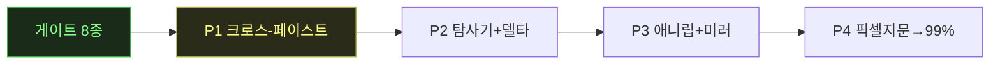

# 🔴 LIVE — canvas 캠페인 무인 런 상태판

> 무인 런 중 오케스트레이터가 이벤트마다 갱신·push. **새로고침으로 최신 확인.** (런 없을 때 = 마지막 런의 최종 상태)

**런 상태**: 🔴 가동 중 — P1 크로스-페이스트 파일럿 · 마지막 갱신: 2026-07-13 (세션 10 시작)

## 현재 페이즈

(✅=완료 초록 · 🟡=진행 노랑 · 현재: **P1 진행 중**)

## 가동 중 에이전트
| 에이전트 | 작업 | 투입 시각 | 상태 |
|---|---|---|---|
| 오케(Fable) | P1 조율·게이트 | 세션 10 | 🔴 |

## 티켓 보드
| 상태 | 티켓 |
|---|---|
| ✅ 완료 | 게이트 8종 · GitHub 이관 · clone-kb 부트스트랩 |
| 🟡 진행 | P1 크로스-페이스트 파일럿 (A 실측→B 어댑터→C 라운드트립→D 적대검증) |
| ⬜ 대기 | 탐사기 · 애니메이션 리퍼 · 픽셀 지문 |

## 최근 이벤트
```
2026-07-13 18:10  상태판 신설 (다음 무인 런부터 이벤트마다 자동 갱신)
2026-07-13 세션10  P1 시작 — 진입문서·기법카드 로드 완료, A(실물 클립보드 규격 재실측) 착수
```
