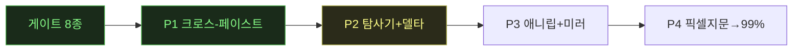

# 🔴 LIVE — canvas 캠페인 무인 런 상태판

> 무인 런 중 오케스트레이터가 이벤트마다 갱신·push. **새로고침으로 최신 확인.** (런 없을 때 = 마지막 런의 최종 상태)

**런 상태**: ⚪ 대기 (세션 11 종료 — P2 게이트 통과) · 마지막 갱신: 2026-07-14

## 현재 페이즈

(✅=완료 초록 · 🟡=진행 노랑 · 현재: **P1 완료, P2 대기**)

## 가동 중 에이전트
| 에이전트 | 작업 | 투입 시각 | 상태 |
|---|---|---|---|
| 오케(Fable) | 세션 11 P2 조율·게이트 | 세션 11 | ✅ 종료 |
| 빌더 B(sonnet) | hfClipboard.ts 어댑터+Cmd+C/V 배선 | 세션 10 | ✅ 완료(5695f3f) |
| 실측 A2(sonnet) | 실물 paste 의미론 실측 | 세션 10 | ✅ 완료(f43d3ff) |
| 빌더 B2(sonnet) | 클론 paste 의미론 정렬 | 세션 10 | ✅ 완료(59d8ef4) |
| 검증 C(sonnet) | 라운드트립 검증(실물↔클론) | 세션 10 | ✅ 완료(a3eab93) |
| 빌더 B3(sonnet) | unknown 슬러그 렌더 수복 | 세션 10 | ✅ 완료(a21f491) |
| 검증 D(opus) | P1 전체 적대 검증 게이트 | 세션 10 | ✅ 통과(§Z, MET·결함 0) |

## 티켓 보드
| 상태 | 티켓 |
|---|---|
| ✅ 완료 | 게이트 8종 · GitHub 이관 · clone-kb 부트스트랩 |
| 🟡 진행 | — |
| ✅ 완료(추가) | P1 크로스-페이스트 파일럿 — 게이트 통과(왕복 4/4 diff 0), cross-paste 카드 verified 승격 |
| ⬜ 대기 | P2 탐사기+델타 소탕(무인 적합) · 크로스-페이스트 잔여(다중노드·⇧⌘C·오버레이) · 애니메이션 리퍼 · 픽셀 지문 |

## 최근 이벤트
```
2026-07-13 18:10  상태판 신설 (다음 무인 런부터 이벤트마다 자동 갱신)
2026-07-13 세션10  P1 시작 — 진입문서·기법카드 로드 완료, A(실물 클립보드 규격 재실측) 착수
2026-07-13 세션10  A 완료·게이트 통과(b6d2eb3) — ★중대발견: 실물 Cmd+C=마커+localStorage 2단 구조(과거 가정 뒤집힘). 5케이스 실측, 보존노드 100% 복원
2026-07-13 세션10  B(어댑터 빌드)+A2(paste 의미론 실측) 병렬 투입
2026-07-13 세션10  B 완료·오케 재검증(tsc·vitest 55/55)·커밋 5695f3f — 어댑터+배선+테스트18. A2 결과로 paste 의미론 정렬 예정
2026-07-13 세션10  A2 완료·커밋 f43d3ff — paste: 전면 id 재매핑(단 node_id quirk)·커서 기반 position·엣지 복원·댕글링 드롭·stale 거부. 방법론: CDP 합성 Cmd+V 무반응→key code 9 필수
2026-07-13 세션10  B2 투입 — 클론 paste를 §6 실측에 정렬(재매핑 확장·quirk 재현·커서 position)
2026-07-13 세션10  B2 완료·오케 재검증(64/64)·커밋 59d8ef4. 잔여 가정 1: 다중노드 배치 스케일(실측 zoom 미기록)
2026-07-13 세션10  C 투입 — 라운드트립 검증: 실물→클론 5픽스처·클론→실물 3타입+·왕복 정규화 diff 0 판정 데이터
2026-07-13 세션10  C 완료(a3eab93) — 실물→클론 5/5·클론→실물 4/4·왕복 4/4 diff 0(기준 3타입+ 초과). 결함 1: paste 결과노드 unknown 렌더(카탈로그 세분 슬러그 부재)
2026-07-13 세션10  B3 투입 — unknown 슬러그 렌더 수복(모델 슬러그→카탈로그 해석)
2026-07-13 세션10  B3 완료(a21f491) — 렌더타임 역참조(직렬화 무변경, diff 0 보존), 73/73, E2E 모델칩 정확
2026-07-13 세션10  D 투입 — opus 적대 검증: 4렌즈(산출물 감사·코드 계약·실동작 스팟·경계/회귀), P1 승격 판정
2026-07-13 세션10  D 통과(§Z) — 승격 기준 충족(MET)·신규 결함 0. P1 완주
2026-07-13 세션10  E 결산 — 워크로그·ledger 6건·카드 2장(verified 승격+교정)·runs §4 로직 평가·대시보드 재생성
2026-07-13 세션10  (보너스) P2 델타 작업 큐 생성 — 30,580건→티켓 322(96%), ★공유 패턴 1(원형 아이콘 버튼, 2156 diffs) 선발견. docs/2026-07-13-p2-delta-queue.md
2026-07-14 세션11  P2 무인 10h 시작 — 런 매니페스트 runs/2026-07-14-canvas-p2-deltasweep-explorer.md, Phase1-A(패턴 1) 투입
2026-07-14 세션11  Phase1-A 1차 정지(통지 대기 — night-run-sop 기지 실패 모드 재발) → SendMessage 재개 지시로 복구
2026-07-14 세션11  Phase1-A 완료·커밋 78b6aa6 — 패턴 1 지문 -87%(3631→474), 대조군 실험으로 역행 없음 입증, isolated 기준선 신설. 티켓 #1~11·15~18·22 일괄 해소
2026-07-14 세션11  Phase1-B 투입 — 큐 다음 배치(확신 티켓) 소비
2026-07-14 세션11  Phase1-B 완료·커밋 488bb72 — 4수복(-301, 19상태 전부 감소·실클릭 회귀 검증)+4 잔여한계 분류(오클러스터·의도적 가드)
2026-07-14 세션11  Phase1-C 투입 — 확신 티켓 배치 3(8~12개)+수확 체감 판단 산출
2026-07-14 세션11  Phase1-C 완료·커밋 22c4b3d — ★전역 line-height 리셋 누락 발견, -1952(-5.9%)·역행 0. 판정: 수확 체감 미도달, 차기=패턴 2~9
2026-07-14 세션11  Phase1-D 투입 — §0.5 패턴 2~9 소탕(~2700 델타, HFSelect/모델피커 카드 계열)
2026-07-14 세션11  Phase1-D 완료·커밋 c1bf3b2 — 5수복+2부분+1구조(-985, 역행 0). ★교훈: border 전면 치환 실험 +756 역행→revert·스코프 적용. 공유 패턴 트랙 소진
2026-07-14 세션11  Phase1-E 투입 — 모호 78티켓 비주얼 트리아지 시트(오너 아침 검토용, notion 기법 2차 실증)
2026-07-14 세션11  Phase1-E 완료·커밋 eda9a1c — 13클러스터·34크롭. ★C1(툴바 SVG scale, 4995)=진짜 CSS 확신 / C4(3014)=오매칭 크롭 증명 / C6=기지 패턴2 연장
2026-07-14 세션11  Phase1-F 투입 — 트리아지 확신분(C1·C11) 즉시 소탕
2026-07-14 세션11  Phase1-F 완료·커밋 13cdbc9 — svg 20×20 근원 수복 등(-315, 역행 0). ★근본원인: 클론 툴바 aria-label 부재(실물은 보유) = 파리티 갭+매칭 실패 원인
2026-07-14 세션11  Phase1-G 투입(소형) — 툴바 aria-label 파리티 수복 후 Phase 2 전환
2026-07-14 세션11  Phase1-G 완료·커밋 d51f8b8 — aria 파리티 복원, 매칭 신뢰화로 -1343(-4.5%). Phase 1 마감: 7커밋, 33538→28642(-14.6%)·역행 0
2026-07-14 세션11  Phase 2 투입 — 탐사기 승격 파일럿(프론티어 큐, 실물+클론). 오케가 실물 인벤토리 4노드 직접 재실측 후 브리프 명기
2026-07-14 세션11  Phase 2 완료·커밋 e32de62 — 신규 상태 7패밀리(기준① 충족)·커버리지 산출(기준②)·무사고. 발견: 클론 한글 '닫기' 누수·Team Chat 패널 spec 밖·미방문 큐 112상태
2026-07-14 세션11  Phase 3 투입 — opus 적대 검증(4렌즈: 수치 감사·시각/기능 회귀·탐사기 산출·경계)
2026-07-14 세션11  Phase 3 통과(§AA) — Phase1 TRUSTED(결함 0)·탐사기 조건부 MET(AA-D1 적발). 세션 종료·결산 완료
2026-07-14 세션11  결산 — 델타 -14.6%·카드 2장 verified 승격·이월 큐 8건(_WORKLOG 세션11). 오너 검토 대기: 트리아지 시트(ref/rip/p2/triage_ambiguous.html)·C9
```
