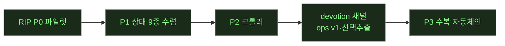

# 🔴 LIVE — notion 캠페인 무인 런 상태판

> 무인 런 중 오케스트레이터가 이벤트마다 갱신·push. **새로고침으로 최신 확인.** (런 없을 때 = 마지막 런의 최종 상태)

**런 상태**: 🔴 10h 무인(2026-07-18 밤) — 큐: ①검수보고서 v2(동배율 페어+골격/CSS 매칭표 — 오너 피드백) ②★리프 전수 스윕 v2(255p 자동 추출→diff→포팅) ③부분갭(콜아웃 이모지메뉴·카드폭·상단바 아이콘) ④Phase B ⑤마감(전판 1회+아침보고)

## 현재 페이즈

(✅=완료 초록 · 현재: **P3 ✅ 완주** — 잔여는 P3-4 R4흡수 검토 · 다음 런 후보: P3-4 / 갤러리 G1 판단 2건 / 크롤러 depth / T47)

## 가동 중 에이전트
⏸ **일시정지 (가동 에이전트 없음)** — 잠자기로 파리티 루프·클론API 서버 정지. 이번 세션(0716) 워커: W-AM~W-BE(백로그·갭채우기·버그헌트3라운드·하네스·Notion API 클론). 전부 게이트 가드→오케 독립검증→csbakk push 완료.

## 다음 페이즈 (오너 확정 1순위)
**★구조-우선 클론(골격 파리티)** — `techniques/structure-first-cloning.md`. 순서: ①골격(DOM 스켈레톤·role·그룹핑 채택 — 1단계: 제목 h1 스펙+번호목록 마커/텍스트 단일부모, 2단계: 블록 래퍼 체인) → ②스타일 셀렉터째 이식 → ③동작/JS. 검증 3축: 구조 게이트(신설)+픽셀 배지+기능 게이트.

## 티켓 보드
| 상태 | 티켓 |
|---|---|
| ✅ 완료 | **Notion API 클론 v1+v2a(DB)** · **T52 컬럼중첩 드롭힌트차단** · 실물중복 정리 · 파리티 루프 · 블록/컬럼 갭 종료 · 잠복버그14 · T2 508/508 · 하네스(태그관대·tie-break) · 결정(0716 4건) |
| 🟡 진행 | — |
| ⬜ 대기(다음) | **파리티 DB스펙+자동 diff** · **클론API v2b**(relation/rollup/formula·people/files·search·code language·table/column 블록) · 클론 정크 정리 · 큐 4종(list뷰·timeline드롭다운·sort-key근본·rowdoc정리) · T53/T54 데드코드 · 갤러리 G1 |

## 이벤트 타임라인 (최근)
- 2026-07-18 오후 **오너 메모 수정 런 완주**(W-CQ~CU/CV/CT, push 09c1172까지 9커밋): ①breadcrumb 공백버그·탭제목·풀페이지 제목 32px ②핸들 위치 **자가보정 전환**(stale 상수 클래스 소멸, h1 +35px급 어긋남 해소)·콜아웃 첫행 핸들 제거·코드 드롭다운 우측 ③DB 컬럼 세로선/가로선 제거·칩 다크배경·rollup 우측정렬·아이콘 SVG(provenance 110) ④토글 자식 밀어내기=이미 정상(회귀게이트 flow13 추가) + **선택 전달 3형제**(JSON/텍스트/MD 복사, selection_text_gate 28). 게이트 4단 티어링 확정 적용(전판은 경계만)
- 2026-07-18 새벽 **⑤⑥애니메이션·타이밍 지문 완료 — 전층 지도 ①~⑥ 완주(⚪)**(W-CO, push 64886a7): rAF 프레임 실측 — 토글 캐럿 200ms(이미 일치)·팝오버 scale(0.96→1) 200ms 진입(@starting-style 포팅)·peek 슬라이드 일치. 연쇄회귀 root-cause 수정(위치계산이 scale 초기프레임 측정 → offsetWidth로). 전 게이트 그린 2회전. animation-ripper 카드 강화 재료 확보
- 2026-07-18 새벽 **T-CG12 Phase A — 싱글턴 포털 거터 가동**(W-CN, push 915185c 외 4커밋): 실물 메커니즘 이식(idle 완전 언마운트·window mousemove 싱글턴·opacity 200ms·createPortal) + 드래그 갭 해결(포털 ⋮⋮가 draggable+setDragImage) + hover_portal_gate 17/17(stash 변별력) + 기존 게이트 6파일 정합. **픽셀 DB/풀블록 +0.1~0.9pp**(idle 구조 실물화 효과). Phase B(레거시 제거)/C(컬럼 내부 히트존) 잔여. 다음=⑤애니메이션·⑥타이밍 지문
- 2026-07-18 새벽 **④이벤트 리스너 지도 완료**(W-CM, push 4ec6faf): 실물=셸 중간층 리스너 0·20종+ 이벤트 전부 **window 1곳 위임**(.notion-cursor-listener는 이름뿐임을 실측 확정) · 클론 React root 위임과 기능 동치 · **T-CG12 리스크 하향**(15종 연쇄→단일 BlockRow+모듈2) — 설계서 `ref/design/T-CG12_hover_gutter_portal.md`(레지스트리+cursorTracker+포털, 3단계 병행 플래그). 다음=T-CG12 Phase A 구현
- 2026-07-18 새벽 **③상태 매트릭스 층 완료**(W-CL, push c0976a4 외): **핵심 발견 — 실물 hover는 CSS :hover가 아니라 JS mousemove 궤적추적+문서 싱글턴 포털 거터**(8스텝 궤적 실증). 수복 3(거터 transition 200ms·--bg-hover 토큰·무근거 .tv-row:hover 제거)·오판 정정 3(quickopen 등 이미 구현)·티켓 T-CG12(거터 마운트 메커니즘=프레임워크급). **state_matrix_gate 신설 12/12**(stash 변별력 검증). 다음=④이벤트 리스너 지도(.notion-cursor-listener가 진입점)
- 2026-07-17 밤 **셸 B안 부분 구현(⚪ 마감)**(W-CK, push 17648a6 외 5커밋): 4층 additive 구현(.page role/aria·selectable-container display:contents·테마 명명·body 봉인) · 대수술 2건 정직 보류(grid 폭모델=아웃라인/커버 재검증 필요·editor 잉여층=13파일 연쇄) · **게이트 90/90** · 픽셀 무하락 A/B 증명(DB 드리프트=기존 상태, stash 재현). 다음 재개 조건: 오너 크롬 재시작→real 탭 복구(T-CG11)→상태 매트릭스(W-CK')→이벤트리스너 지도
- 2026-07-17 밤 **전수 골격 매트릭스 완성(21종)**(W-CJ, push 36098e6 외): 수복5(media role=figure·main 랜드마크)/일치6/재구조보류9/티켓(code구성·link_preview·중첩toggle·**셸 전층 T-CG10**[real 14층 vs 클론 8층, skeleton_shell.json 스펙 확보]). dom_structure_gate 68→**83**. 픽셀 무하락 비트동일 증명. 사고: real 탭 렌더러 데드락(OPFS 공유워커, T-CG11 — 세션 내 복구불가). 다음=T-CG10 셸 재구성(스펙 기확보라 real 불필요)
- 2026-07-17 저녁 **T-CG5 규명+골격 순수화**(W-CI, push f2e3d9d 외): 드리프트 주범=CDN 이미지 디코드 레이스(188 2.9pp 스윙) → **pixel_diff에 캡처상태 assert 신설**(사이드바·스크롤·이미지로드·dpr — 조용한 드리프트 원천 차단, 0.00pp 재현) + dpr 출처기록·--repeat. 콜아웃 2겹 실물 골격 분리(role=note 외피+시각 내피)·h1 30px 상시 실측 확정(-2px 근사 제거)·toggle aria 확정. 12문서 96.30% 무하락. 다음=W-CJ 전수 골격 매칭 스윕(기존 자원만·재생성 0)
- 2026-07-17 오후 **골격 2단계 완료(⚪ 마감)**(W-CH, push 637c68a 외): 래퍼체인 6종 실측=기존 flat-default가 이미 실물 총높이와 일치(W-CA 검증) · T-CG4 마진보정 스택 전부 제거→런 위치별 패딩 모델(data-run) · T-CG3 role/aria 전파(+콜아웃 role=note) · T-CG2 마커 auto(15항목 무클리핑) · **dom_structure_gate 23→68**(stash 변별력 검증). 픽셀 12문서 무하락(-0.008pp 노이즈). 신규 T-CG5: DB류 -1.0~1.6pp 드리프트가 CG/CH 무관 증명 — 다음 세션 규명 과제
- 2026-07-17 오후 **★골격 파리티 1단계 완료 — 도크트린 즉시 실증**(W-CG, push aea2128 외 3커밋): 제목 골격(role=textbox 명시속성 — contentEditable만으론 미부여 규명·패딩 축 교정 0px8px·×48)+리스트 마커/텍스트 전용 flex row(.blk-list-row). **dom_structure_gate 신설 23/23**(stash 변별력 검증). **구조만 바꿨는데 픽셀 00~04 전부 상승(+1.03pp, 97%대)** — 구조-우선의 배당. 2단계 티켓: T-CG2(마커 auto폭)·T-CG3(타 리프 role 갭)·T-CG4(마진보정 스택→실물 패딩 모델 교체)
- 2026-07-17 오후 **골격 파리티 1단계 착수**(W-CG): 오너 지시 '작업 들어가줘' — 구조-우선 도크트린 첫 실행. 실물 스켈레톤 자동 추출→클론 렌더 DOM 재구성→구조 게이트 신설→픽셀 00~04 무하락 증명
- 2026-07-17 오후 **★수렴 루프 종결**(W-CF, push 71b3c90): T65 날짜 풀포맷(26표본 실측 'YYYY년 M월 D일') + **T66 거터 이중예약 규명**(real=96px 패딩 오버레이 vs clone=테이블 컬럼 이중예약 → title이 96px 밀려 있었음) → DB 4종 +0.6~2.0pp. **12/12 이론한계, 평균 96.16%, 신규 발견 0(히드라 종결)**. 잔여 노이즈=서브픽셀 폰트렌더(승인된 00번과 동종 확인). status_col_gate pre-existing 실패 별도 이슈
- 2026-07-17 오후 **수렴 이터레이션 3연속**(W-CC·CD·CE, push 2a6ca36·083fa07·6cd0204): 풀페이지 DB 컨테이너 폭 확장(컬럼 3→전부) · T63 행순서=구인스턴스 데이터 잔재 확증·정합(5/5, real_response.json 행순서 함정 문서화) · **T64 행높이 1px=tr보더 레이어 규명·해소(전행 37px)**. 12문서 평균 **95.65%**, **8/12 이론한계 도달**(리치텍스트5·풀블록2·REL). DB 4종 잔여=T65(날짜 표시형식)·T66(체크박스 거터) — 갭이 픽셀→포맷 수준으로 수렴. 다음=W-CF(T65/T66) 후 무조건 마감
- 2026-07-17 오후 **T60/T61 컬럼순서 완결**(W-CB, push 917377a): T60은 문서 자기모순 오판 — W-BR 규칙(title+코드포인트 정렬) **반례 0 재확증**, 6스키마 clone 헤더 100% 일치. 신규 발견 §11.4: `.tv-wrap` 컨테이너가 1500 뷰포트에서도 720px 제약(컬럼 3개만 렌더 — 실물은 확장) = DB류 마지막 갭. 다음=W-CC로 닫고 최종 마감
- 2026-07-17 낮 **★최종 그라인딩(W-CA, push 2384225): 렌더 평균 95.57%(+2.19pp), 188=94.7%(+15.5pp), 전문서 상승**. 발견: 실물 블록간격=gap0+wrapper내부패딩 모델·페이지헤더 56px 부족·테이블 열폭 title280/나머지200 균일(기존 타입별 차등=근거없는 추측). 리치텍스트=폰트렌더 이론한계 플래토 도달. 잔여=T60(DB 컬럼 표시순서 규칙 — W-BR '가나다' 결론 부분반증, 시딩레이어) 1건
- 2026-07-17 낮 **동일조건 캡처 확립**(W-BZ, push 30cd596): 오너 지시 — 같은 브라우저(9224, 세션쿠키 재사용·로그인 시도 0)에서 실물+클론 캡처, **양쪽 사이드바 접힘(⌘\ 공통)·크롭박스 완전 동일**. 12문서 평균 92.33→93.38%(11/12 상승), 188=79.2%(+4.8). 잔여=진짜 렌더갭 2종만: (a)블록 세로간격 모델(richtext/풀블록) (b)테이블 컬럼폭·툴바(DB). 다음=W-CA 최종 그라인딩(겹치면 검정 목표)
- 2026-07-17 오전 **겹쳐보기 뷰어 + 188 재진단**(W-BY, push 1adafb0): 갤러리에 오너 요청 **오버레이 뷰어**(불투명도 슬라이더+difference 블렌드+겹침/나란히) · 188 저점의 진짜 원인=**측정 크롭 비대칭**(실물 1230 vs 클론 1500 스코프) 규명·수정 → 62.7→74.4%. 컬럼 폭은 양쪽 720px 이미 일치(넓히기 시도→줄바꿈 어긋나 10/12 하락→정직 롤백, 제품 무변경). 게이트 8종 CDP env override(9226 번들 크로뮴 시대 대응). 잔여 노이즈 분해: 세로 margin 누적 고스트 + 캡처 브라우저 버전차(Chrome150 vs Chromium148 — 실물 재캡처는 노션탭 보류 중이라 다음 기회)
- 2026-07-17 오전 **★파일 SoT 완성 — 1페이지=1폴더, 어느 브라우저든 경로 접근**(W-BX, push 390143d): 오너 지시(0712 ⑤의 완성). bridge `data/pages/<id>/page.json`(610폴더)+`databases/<id>/`(233)+workspace.json · GET /state 하이드레이션+디바운스 write-through+다운 폴백배너 · 실코퍼스 1회 파일승격 · **수용기준 통과: 깨끗한 브라우저에서 /p/<id> 직접 렌더**(file_persist_gate 21/21). 부수 실측회귀 3건 수정. 환경: Chrome 업데이트 중첩(4버전)로 신규 인스턴스 즉사 규명 → 클론작업 전용 번들 크로뮴(9226) 전환, 노션탭 churn 금지(봇차단 우려, 오너 지시) 규칙화
- 2026-07-17 아침 **⑥T2 경계+결산 — 10h 루프 완주(⚪)**(W-BW): 게이트 22종 전부 그린·**이번 루프 회귀 0**. click_audit 270/394의 실패 124건=코드 무관 corpus 오염 확정(3중 근거: 이전 stash 재현기록·고아DB 라이브 규명·0712 전례). 아침보고 push(ce8e45a, 결정: ①corpus 고아정리 ②188 컬럼폭 모델 ③다음 확장). 루프 합계 13커밋·가설반증 3건(컬럼순서·아웃라인 공식·콜아웃색 기록)
- 2026-07-17 새벽 **⑤렌더 일치율 자동화 완료**(W-BV, push 3550e9c): 콘텐츠영역 픽셀 diff(`pixel_diff.py`) — 12문서 **평균 91.4%**(리치텍스트 92.6~94.8·DB 92.8~94.3·풀블록 95.1·REL 96.4), 188만 62.7%=콘텐츠 컬럼폭 비율차 구조원인 규명. 갤러리에 파랑 "렌더N%" 배지+🌡히트맵. **이제 렌더 축도 육안 아닌 수치 기준선** — 오너 캡처지적 루프를 배지로 대체. 다음=⑥T2+아침보고+결산
- 2026-07-17 새벽 **④풀블록 시각 실측 완료**(W-BU, push 9f57677): 8블록 실측 → 5건 포팅(이미지 radius 2px·북마크 패딩/제목17px/URL회색·TOC secondary색·파일칩 16/22px·synced idle 테두리 hover-reveal). simpletable·컬럼gap·quote는 이미 일치. 다크 무회귀. 다음=⑤렌더 일치율 자동화(픽셀 diff 배지)
- 2026-07-17 새벽 **③잔여 시각갭 5건 소탕**(W-BT, push c429cb6 등 6커밋): 블록 세로간격 실측 보정(p↔p 12·heading↔p 6·리스트연속 2px) · 코드라벨=lang↔language 죽은키 규명·수복("Python" 표시) · DB 인라인 제목 contenteditable · **아웃라인 공식 오측 판명**(첫헤딩 비례 아니라 고정 0.256, 6문서 교차실측) · 콜아웃 색변형=이미 동작(기록 오측 정정)+테두리 투명. 환경: Chrome 2회 크래시→launch_chrome.sh 재기동(실물 탭 소실). 다음=④풀블록 시각 실측
- 2026-07-17 새벽 **②DB 테이블뷰 CSS 완료**(W-BS, push 3bd8403): **status 칩 = 실물이 API color 무시, 그룹 고정 3색**(todo회색·진행파랑·완료초록 — Done이 color:yellow여도 초록) 발견·전 뷰 적용 + 기존 OPTION_PALETTE가 엉뚱한 변수(IcoAccPri) 실측했던 것 8색 재실측 정정 + 행높이 37px·칩 radius 4·타이틀 📄아이콘. 다크·보드뷰 무회귀. 다음=③잔여 시각갭
- 2026-07-17 새벽 **①DB 요소뜯기 완료**(W-BR, push b1dde71): 오너 지적 3축 근본수정 — 행순서(실물=최신이 위·prepend)·**컬럼순서=title+가나다 정렬**(스키마순 가설 반증, 전수 재현검증)·뷰이름 "Default view". 셀값은 원래 100%. 196 재생성으로 3축 실물 일치 확인. diff.md가 순서를 못 보는 한계 규명(구조만 비교) → 요소 대조는 DOM 실측 정본 `_DB_ELEMENT_DIFF.md`. 다음=②DB 테이블뷰 CSS(Done칩 톤·행높이·링크셀)
- 2026-07-17 새벽 **🔴 10h 무인 루프 개시(오너 지시)**: 큐 = ①DB 요소 뜯기(오너 187/195 지적 — 행순서 반대·컬럼순서·뷰이름 "Default view"·셀값 전수대조, W-BR 가동) → ②DB 테이블뷰 CSS 실측 → ③잔여 시각갭 소탕 → ④풀블록 시각 실측 → ⑤렌더 일치율 자동화(픽셀 diff 배지) → ⑥T2+결산. 갤러리에 문서별 실물/클론/diff 링크 추가(push 1b8b7c4)
- 2026-07-17 새벽 **오너 8개 지적 전체 마감**(W-BQ, push 4c493a7): 아이콘 = 정렬버그(flex stretch+button 중앙정렬) 규명 → 실측 78px·본문컬럼 좌측정렬 · 우측 아웃라인 = 실측 포팅(오프셋 23px·틱은 활성상태 기반 12/16px·첫헤딩 비례 top). 다크·커버 무회귀. **이로써 오너 육안 지적 1~8 전부 처리**(제목wrap T59·콜아웃·폰트·DB stale·툴바 T57·핸들 T58동등·아이콘·우측인디케이터). 실측 정본 `_RENDER_CSS_DIFF.md` §1~7
- 2026-07-17 새벽 **T59 제목 wrap 완료**(W-BP, push 94dce6a): 제목 `<input>`→`<h1 contentEditable=plaintext-only>` 구조 전환(블록 편집 패턴 재사용) — **긴 제목 4줄 wrap, 잘림 해소**(오너 지적 2/4번). Enter→본문 포커스 실물동작 추가. 전 게이트 그린. 리치텍스트·풀블록 클론 재캡처 → 갤러리 갱신됨(제목wrap·콜아웃 개선 확인). 잔여: 아이콘 정렬·DB 인라인 제목(input 유지)
- 2026-07-17 새벽 **CSS 실측 포팅 완료**(W-BN, push 176a540): 실물 computed 실측 결과 — **콜아웃 스타일 반전 발견·수정**(실물=투명bg+테두리, 클론=회색채움), 폰트스택 정정, 구분선색 통일. 헤딩·문단·자간은 이미 일치. **제목 잘림 = CSS 아닌 구조 갭**(클론 `<input>` vs 실물 `<h1 contenteditable>` — input은 줄바꿈 불가) → **T59 티켓**. 다크모드 무회귀. diff 정본 `_RENDER_CSS_DIFF.md`
- 2026-07-17 새벽 **오너 육안 피드백 대응(렌더/CSS 축)**: DB "서로 다른 페이지"=T56 전 stale 스샷 진단→재캡처 완료 · **T57 툴바 실물 정렬**(필터→정렬→⚡→✨→🔍→설정→새로만들기 스플릿버튼, W-BO push ec7ebf3) · **T58=매처 오분류 판정, 티켓 닫음**(핸들 이미 동등) · **W-BN 병렬 가동중**: 실물 computed style 실측→클론 CSS 포팅(제목 줄바꿈·콜아웃·폰트·줄간격·컬럼폭 — 오너 지적 갭). audit 정책 조정: T2는 mutation-heavy 경계만
- 2026-07-16 오전 **파리티 비교 갤러리 딜리버러블**(push 67b0962): 사용자 목표 "노드 생김새·목적대로 비교" 직결 — 큐레이션 12문서(리치텍스트5·DB4·풀블록2·REL1, 전부 API구조 100%)의 실물Notion↔클론 스크린샷 side-by-side + 일치율 배지 + 툴팁. `ref/reports/PARITY-gallery.html`(로컬 열람, `gen_gallery.py` 재생성). 헤드리스 검증 24/24 이미지·툴팁. 다음=파리티-live 중복정리(옛 루프 165폴더)·최종결산
- 2026-07-16 오전 **T56 DB 풀페이지 라우팅**(W-BM, push 18c4d4c): 렌더파리티가 발견한 실제갭 수복 — database id 딥링크 시 조용히 무시되던 버그 → 풀페이지 DB뷰(DatabaseView를 PageView셸에 재사용) + "···→전체 페이지로 열기" 메뉴. embedded/인라인/페이지 무회귀. smoke 18→21. 다음=파리티 비교 갤러리(육안대조 딜리버러블)
- 2026-07-16 오전 **렌더(DOM) 파리티 첫 측정**(W-BL, push ff71425): API 파리티 100% 문서를 실물 브라우저 DOM ↔ 클론 DOM 대조(양쪽 내용 동일 = 델타가 순수 렌더차이). 대표 4문서. 진짜 렌더갭 3건 티켓(T56 DB 풀페이지 딥링크 라우팅·T57 DB툴바 버튼갭[자동화·AI채우기]·T58 리사이즈핸들) + 크롬노이즈/매처한계 분류. **발견: 클론 DB는 독립 풀페이지 없이 항상 embedded block** → 다음 T56이 렌더 파리티 심화의 선행. 측정만(제품 무변경), rip유닛 3종 PASS
- 2026-07-16 오전 **★v2c 완료 — API 파리티 완결(전 12문서 100%)**(W-BK, push e97f0cc): rollup 집계(9함수)+formula 평가(클론 엔진 Python 포팅)를 harness에서 독립 구현 → relation/rollup/formula DB **97.2%→100%**, **계산값까지 실물과 바이트 일치**(rollup.number=1/1/2·formula.number=2). notion_api_db 84/84. 잔여=양방향relation·rollup 24종중 15종·search·페이징(니치·이월). **API 파리티 워크스트림 완결.**
- 2026-07-16 오전 **전 블록 커버리지 확장 완료**(W-BJ, push e54ed20): 블록 매핑 +9종(image/video/bookmark/embed/file/toc/column_list/synced_block/table) · 풀블록 문서 2종 **100%·100%** · relation/rollup/formula DB **97.2%**(잔여=계산값뿐, 계산엔진 없어 out-of-scope 정직보고). 기존 9문서 100% 무하락. notion_api 58/58·db 76/76. **핵심발견: 실물 API는 중첩 children을 type-payload 안에 둬야 함(코드 첫 경험) · link_preview·tab은 실물 공개API로 생성불가(400)**. 잔여 v2c=rollup집계·formula평가(값계산 엔진)·relation양방향·search
- 2026-07-16 오전 **★클론 API v2b 완료 — 파리티 100% 달성**(W-BI, push 63eb794): 자동 diff가 지목한 엔벨로프 갭(블록 parent·children 인라인폐지·DB description/icon/is_inline·property description) 전부 닫음 + 속성 **19종**(v2a 10 + relation/rollup/formula/people/files/created·edited time·by/button). **일치율 richtext 92%→100%·DB 97%→100%(전 문서)**. notion_api 40/40·db 72/72. 잔여 v2c=rollup집계·formula평가·relation양방향·table/column블록·search(구조는 100%, 값계산이 다음). 클론소스 무변경
- 2026-07-16 오전 **파리티 심화 완료**(W-BH, push f0ec1fd·7f2476a): DB 문서 4종(작업트래커·콘텐츠캘린더·CRM·버그트래커, 속성10타입) + **자동 diff 리포트**(`ref/parity-live/_PARITY_REPORT.md` — real↔clone 응답 구조 일치율). **일치율 richtext ~92%·DB ~97%.** 잔여 불일치=엔벨로프(블록 parent.page_id/type, DB description/icon/is_inline)+status 로케일 → **v2b 백로그로 정밀 지목됨.** 부수 하네스버그 2건 수정(콜아웃 rich_text GET소실·DB url스킴). 다음=v2b(엔벨로프완결+relation/rollup/formula)로 일치율↑
- 2026-07-16 오전 재개 완료 2건(push): **T52(b) 컬럼/탭 내부 드래그 좌우분할 힌트 억제**(W-BF, smoke 신규⑪ 18/18) + **★클론 API v2a — DB 지원**(W-BG, `POST/GET /v1/databases`·`/query`·database_id parent 행생성, 속성 10타입 매핑, DB가 실제 테이블뷰로 렌더[상태pill·멀티셀렉chip], **notion_api_db_gate 55/55**, v1 34/34 무영향). 커밋 f6ad56e·37af878. 부수: bridge.py(8770) 미기동으로 bookmark/video 게이트 pre-existing 실패였던 것 기동해 그린화. 다음=파리티 DB스펙+자동diff·클론정크정리
- 2026-07-16 오전 **10h 무인 재개(🔴 가동)**: 실물 PARITY 중복 189개 아카이브(distinct 00~04만 유지, 휴지통 복구가능) · 워커 2병렬 가동 **W-BF(T52 컬럼중첩 드롭힌트차단)**·**W-BG(클론API v2a DB지원)** · 큐: 파리티 심화(DB 스펙+자동diff)·클론정크정리
- 2026-07-16 오전 일시정지(잠자기): **API 파리티 루프 184쌍 생성 후 정지**. 5스펙 순환이라 실물 Notion에 184페이지(대부분 중복, 전부 `영상>PARITY-TEST` 루트 하위 — 통째 아카이브 가능). 핸드오프 `ref/reports/SESSION-2026-07-16-handoff.md`. **다음=실물 중복정리·클론API v2(DB/속성)·T52·파리티 diff자동화**
- 2026-07-16 오전(오너 지시 "api 규격도 클론"): **★Notion 공개 API를 클론에 복제** — `harness/notion_api_server.py`(8771, stdlib) `/v1/pages`·`/v1/blocks/{id}/children`, 블록10종 양방향 매핑·rich_text annotations·에러/헤더 계약, atomic setState 주입→5185 렌더. `notion_api_gate` **34/34**. → **API 파리티**(실물 api.notion.com ↔ 클론8771 동일요청 비교)로 전환(UI 실입력 자동화는 취약 판명 — 실물 정크·클론 빈페이지, API로 피봇). 커밋 11eff53·b747f83·ec74de1
- 2026-07-16 오전(오너 결정 회수): 아침보고서 인터랙티브 결정UI(라디오/체크박스+결정복사, 권장안 pre-check, 툴팁 data-tip) · 결정 확정 ①footer 데모유지 ②transcription out-of-scope ③T52 드롭힌트차단 ④다음큐 4종. UX지침 원칙29·30·31 추가
- 2026-07-16 새벽(무인, 버그헌트 3라운드): **트리 SoT 잔여 flat-scan no-op 실질 14건 수정**(adversarial repro) — W-BA store 10건(컬럼/탭 삽입변환 무동작+콜아웃 후손파괴)·W-BB 인터랙션 3건(중첩블록 복사 클립보드빔·빈탭 타이핑유출·서식메뉴 오표시)·W-BC 백링크 1건(탭 멘션). flat-scan 클래스 소진확정(잔여=데드코드3+T52). 커밋 b51a23e·ac41f80·49c4d66·63bb5e6·194c4b9
- 2026-07-16 새벽(무인 갭채우기): **tab 블록**(2단컨테이너, 컨테이너 일반화)·**자동값 컬럼 4종**·**button 컬럼**(DB컬럼 갭 종료)·timeline/calendar RIP·**하네스 태그관대매칭+숫자tie-break**·**최종 T2 508/508 회귀0**. 게이트 신설 tab17·autovalue21·button_col19·notion_api34. 파리티 상태지도 02·clone-kb기법초안 03 작성
- 2026-07-15 오후(오너 입회): **트리 리팩터 전체 완주** — #1 SoT 승격(page.blocks=children트리, persist v2 무손실 마이그) + #2 렌더 재귀화(병렬 컬럼 컴포넌트 제거 -305줄, 컬럼 키보드패리티 갭 해소). "두 nesting 시스템" 근본해소·~765줄 제거. T2 500/500·전게이트그린·시각검증
- 2026-07-15 RUN8 잔여: RIP 수복 view_board 구조델타 57→38(-33%)·텍스트34→11(실측 헤더아이콘/add버튼) 게이트그린
- 2026-07-15 RUN8 마감(10h 무인): **트리 리팩터 phase-1b 완주**(store 전 변이 트리화, columns.ts 화해배관 제거) · 신규 블록 bookmark·embed·file·link_preview + status DB컬럼 · #1 실물검증(255p/32DB, teardown 확증) · **T2 508/508** · 아침 HTML보고. 다음=SoT 승격(입회)·phase-2 렌더재귀화(입회)
- 2026-07-15 새벽 RUN8: **트리 phase-1b 완료**(store 전 변이 트리화, moveBlocks까지, 8게이트 그린 유지) · bookmark 블록(실물66회) · SoT 승격은 persist포맷 변경이라 입회 결정 보류 · 다음=status 컬럼·추가 누락블록
- 2026-07-15 새벽 RUN8 진행: 트리 phase-1a(변환기)·1b-1(delete/dup/move)·1b-2(insert류) 트리화 완료·push, 전 게이트 그린 유지 · 구코드 잠복버그(depth점프 고아) 트리버전이 수정 · bookmark 블록(실물66회) 착수 · moveBlocks만 미전환(predecessor 프리미티브 필요)
- 2026-07-15 새벽 RUN8 개시(10h 무인): 안전망·데일리분리·quick wins·트리변환기(phase-1a) 토대 완료 → 실물검증(255p/32DB/depth8, teardown 확증·bookmark 최다) → 트리 phase-1b(store 트리화) 착수
- 2026-07-14 밤 RUN7(유인): **devotion "AI 보내기" 첫 실전 왕복** 성공 · 영상 ⋮⋮ 핸들 메뉴 회귀 수복(W-R 과통일 → 타입인지 MediaHandleMenu, video_block_gate 42/42) · 사이드바 닫기 버튼 신규(실측) · 토글 아이콘 글리프→실측 SVG 교체(재열기=햄버거 규명, 부채0) · 티어링 준수(T2 미실행)
- 2026-07-14 저녁 RUN6 완주(1h 무인): W-R 회귀 3건 수복(컬럼 풀메뉴·마퀴 존·선택추적+selectRange 실버그) · **검증 티어링 T0/T1/T2**(smoke_flows 15체크/23초, 검출력 증명 6FAIL→15/15) · W-T **예외 설정 패널**(테마 3택+예외 6종 토글, settings_gate 23/23) · T2 마감 click_audit **508/508**
- 2026-07-13 RUN3 완주: RIP P0~P2 · click_audit 501/501 · 커밋 6
- 2026-07-13 오후: 사용자 결정 5건 실행 · devotion 채널 3종(페이지 영속·선택추출·ops v1) 개통 · clone-kb 주입
- 2026-07-13 16:2x RUN4 개시: 진입 의식 완료(카드=rip-repair-loop·rip-crawler) · devotion 수거함 fz 수신확인 annotate(seq7) · 환경 3종 UP(9224/5185/8770) · P3 착수
- 2026-07-13 17:5x P3-1 완료: classify_layered(레벨0 반응유무→레벨2 엄격→레벨1 구조완화, --layered opt-in) · 반응다름 8→2(닫기/Escape/여백클릭×2/다음페이지/작업메뉴 6건 [기능일치-모양차이] 승격, 진짜델타 9건 비승격 보존) · test_rip_classify.py 6/6 PASS · delta_v3.md 생성
- 2026-07-13 18:0x P3-3 완료: rip_repair.py(triage/rerip/verify+history) · view_gallery 파일럿 triage G1=17/G2=45/G3=22/G4=0 → 고신뢰 G2 수정(커밋 2aa2157) → 델타 282→237(-16%) · view_board 스팟 903→903 회귀 0 · parity_exceptions 무결
- 2026-07-13 18:3x RUN4 마감: click_audit 508/508(100%) · tsc/build 클린 · RIP-PIPELINE/HANDOFF/_WORKLOG/ledger/cases 결산 완료
- 2026-07-13 19:0x 후속(W-C): 오너 피드백 "G1 텍스트만으론 판단불가" → rip_repair.py visual(오버레이+크롭+정체설명 시트) 당일 구현 · 게이트 4검증 PASS · 신기법 visual-triage-sheet(experimental) 등록
- 2026-07-13 20:0x 후속(W-D): 오너 결정 original-first → **ADR-0008** 채택 · view_gallery G1 17건 수복(hover 액션쌍·대형 add-tile·커버 wrapper·hiddenProps 설정갭) · **구조 델타 30→5(-83%)** · t_wishlist 템플릿 회귀 무결 · click_audit 508/508 재통과 · 커밋 4c85089
- 2026-07-13 밤 RUN5 완주(2h 무인, W-E~W-I 4워커): **동영상 블록 신설**(네이티브 플레이어·DnD 업로드·툴바·⋯메뉴·리사이즈·캡션, 게이트 27/27, 브릿지 Range 결함 발견·수정, 커밋 2802f43·bc4533a) · **RIP 2층 실물대조**(G2 2건 수복 bb30e39, G1 3건 오너대기) · **rip_align --match-v2**(11상태 스윕 개선5/악화0, 갤러리 5→2) · 마감 click_audit **508/508**·tsc/build 클린
- 2026-07-14 오후(W-Q): **미디어 컬럼 split 파리티**(오너 체크리스트 4항) — 이미지↔영상 split·컬럼 내 거터 핸들·컬럼 하단 입력·gap 46px 실측 적용 · 근본원인=드래그 중 hover 미갱신+video 히트테스트 이탈 · column_media_gate 16/16 신설 · 전 게이트 회귀 그린 · click_audit 508/508
- 2026-07-14 오후(W-N~W-P): 오너 델타 리포트 3건 수복(정렬 팝오버·⋯메뉴 앵커 실측 ±2px 게이트, 아이콘 10종 실측 SVG) · **asset-provenance-gate 신설**(자작 자산 자동 적발, 부채 12 발굴→전량 해소, 등록 106) · **실물 조작 규칙 개정**(read-only 도그마 소거 — R&D 개방, 원상복구 원칙) · 게이트 37/37
- 2026-07-14 오전(W-M): 오너 협조 실측으로 비디오 G1 3건 전부 해소(핸들·툴바·pointerEvents) · CLONE_ONLY 구조델타 0 달성 · 게이트 29/29 · 커밋 e50f773
- 2026-07-14 새벽(오너 버그 리포트 대응, W-J·W-K): **DnD 무반응 근본수정**(.editor-trailer 핸들러 부재, 커밋 580da51) — 합성 DragEvent 거짓 양성을 CDP Input.dispatchDragEvent 네이티브 게이트로 교체(29/29) · 오너 페이지에 수정 증거 드롭 · parity_exceptions_gate FAIL=픽스처 절대좌표 결함 판정·수리(제품 무죄, 게이트 3종 PASS) · regression-harness-suite 카드 §함정 2건 추가
