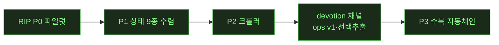

# 🔴 LIVE — notion 캠페인 무인 런 상태판

> 무인 런 중 오케스트레이터가 이벤트마다 갱신·push. **새로고침으로 최신 확인.** (런 없을 때 = 마지막 런의 최종 상태)

**런 상태**: 🔴 가동(2026-07-16 오전 10h 무인) — **★API 파리티 완결: 전 12문서 100%**(리치텍스트·DB·풀블록·relation/rollup/formula, 계산값까지 실물과 바이트 일치). 클론이 Notion 공개 API를 로컬에서 말함(엔드포인트·블록 20+종·속성 19종·rollup9함수·formula엔진). 그 전: T52·블록/컬럼 갭·잠복버그14·T2 508/508 · 마지막 갱신: 2026-07-16 오전

## 현재 페이즈

(✅=완료 초록 · 현재: **P3 ✅ 완주** — 잔여는 P3-4 R4흡수 검토 · 다음 런 후보: P3-4 / 갤러리 G1 판단 2건 / 크롤러 depth / T47)

## 가동 중 에이전트
⏸ **일시정지 (가동 에이전트 없음)** — 잠자기로 파리티 루프·클론API 서버 정지. 이번 세션(0716) 워커: W-AM~W-BE(백로그·갭채우기·버그헌트3라운드·하네스·Notion API 클론). 전부 게이트 가드→오케 독립검증→csbakk push 완료.

## 티켓 보드
| 상태 | 티켓 |
|---|---|
| ✅ 완료 | **Notion API 클론 v1+v2a(DB)** · **T52 컬럼중첩 드롭힌트차단** · 실물중복 정리 · 파리티 루프 · 블록/컬럼 갭 종료 · 잠복버그14 · T2 508/508 · 하네스(태그관대·tie-break) · 결정(0716 4건) |
| 🟡 진행 | — |
| ⬜ 대기(다음) | **파리티 DB스펙+자동 diff** · **클론API v2b**(relation/rollup/formula·people/files·search·code language·table/column 블록) · 클론 정크 정리 · 큐 4종(list뷰·timeline드롭다운·sort-key근본·rowdoc정리) · T53/T54 데드코드 · 갤러리 G1 |

## 이벤트 타임라인 (최근)
- 2026-07-17 새벽 **오너 육안 피드백 대응(렌더/CSS 축)**: DB "서로 다른 페이지"=T56 전 stale 스샷 진단→재캡처 완료 · **T57 툴바 실물 정렬**(필터→정렬→⚡→✨→🔍→설정→새로만들기 스플릿버튼, W-BO push ec7ebf3) · **T58=매처 오분류 판정, 티켓 닫음**(핸들 이미 동등) · **W-BN 병렬 가동중**: 실물 computed style 실측→클론 CSS 포팅(제목 줄바꿈·콜아웃·폰트·줄간격·컬럼폭 — 오너 지적 갭). audit 정책 조정: T2는 mutation-heavy 경계만
- 2026-07-16 오전 **파리티 비교 갤러리 딜리버러블**(push 67b0962): 사용자 목표 "노드 생김새·목적대로 비교" 직결 — 큐레이션 12문서(리치텍스트5·DB4·풀블록2·REL1, 전부 API구조 100%)의 실물Notion↔클론 스크린샷 side-by-side + 일치율 배지 + 툴팁. `ref/reports/PARITY-gallery.html`(로컬 열람, `gen_gallery.py` 재생성). 헤드리스 검증 24/24 이미지·툴팁. 다음=파리티-live 중복정리(옛 루프 165폴더)·최종결산
- 2026-07-16 오전 **T56 DB 풀페이지 라우팅**(W-BM, push 18c4d4c): 렌더파리티가 발견한 실제갭 수복 — database id 딥링크 시 조용히 무시되던 버그 → 풀페이지 DB뷰(DatabaseView를 PageView셸에 재사용) + "···→전체 페이지로 열기" 메뉴. embedded/인라인/페이지 무회귀. smoke 18→21. 다음=파리티 비교 갤러리(육안대조 딜리버러블)
- 2026-07-16 오전 **렌더(DOM) 파리티 첫 측정**(W-BL, push ff71425): API 파리티 100% 문서를 실물 브라우저 DOM ↔ 클론 DOM 대조(양쪽 내용 동일 = 델타가 순수 렌더차이). 대표 4문서. 진짜 렌더갭 3건 티켓(T56 DB 풀페이지 딥링크 라우팅·T57 DB툴바 버튼갭[자동화·AI채우기]·T58 리사이즈핸들) + 크롬노이즈/매처한계 분류. **발견: 클론 DB는 독립 풀페이지 없이 항상 embedded block** → 다음 T56이 렌더 파리티 심화의 선행. 측정만(제품 무변경), rip유닛 3종 PASS
- 2026-07-16 오전 **★v2c 완료 — API 파리티 완결(전 12문서 100%)**(W-BK, push e97f0cc): rollup 집계(9함수)+formula 평가(클론 엔진 Python 포팅)를 harness에서 독립 구현 → relation/rollup/formula DB **97.2%→100%**, **계산값까지 실물과 바이트 일치**(rollup.number=1/1/2·formula.number=2). notion_api_db 84/84. 잔여=양방향relation·rollup 24종중 15종·search·페이징(니치·이월). **API 파리티 워크스트림 완결.**
- 2026-07-16 오전 **전 블록 커버리지 확장 완료**(W-BJ, push e54ed20): 블록 매핑 +9종(image/video/bookmark/embed/file/toc/column_list/synced_block/table) · 풀블록 문서 2종 **100%·100%** · relation/rollup/formula DB **97.2%**(잔여=계산값뿐, 계산엔진 없어 out-of-scope 정직보고). 기존 9문서 100% 무하락. notion_api 58/58·db 76/76. **핵심발견: 실물 API는 중첩 children을 type-payload 안에 둬야 함(코드 첫 경험) · link_preview·tab은 실물 공개API로 생성불가(400)**. 잔여 v2c=rollup집계·formula평가(값계산 엔진)·relation양방향·search
- 2026-07-16 오전 **★클론 API v2b 완료 — 파리티 100% 달성**(W-BI, push 63eb794): 자동 diff가 지목한 엔벨로프 갭(블록 parent·children 인라인폐지·DB description/icon/is_inline·property description) 전부 닫음 + 속성 **19종**(v2a 10 + relation/rollup/formula/people/files/created·edited time·by/button). **일치율 richtext 92%→100%·DB 97%→100%(전 문서)**. notion_api 40/40·db 72/72. 잔여 v2c=rollup집계·formula평가·relation양방향·table/column블록·search(구조는 100%, 값계산이 다음). 클론소스 무변경
- 2026-07-16 오전 **파리티 심화 완료**(W-BH, push f0ec1fd·7f2476a): DB 문서 4종(작업트래커·콘텐츠캘린더·CRM·버그트래커, 속성10타입) + **자동 diff 리포트**(`ref/parity-live/_PARITY_REPORT.md` — real↔clone 응답 구조 일치율). **일치율 richtext ~92%·DB ~97%.** 잔여 불일치=엔벨로프(블록 parent.page_id/type, DB description/icon/is_inline)+status 로케일 → **v2b 백로그로 정밀 지목됨.** 부수 하네스버그 2건 수정(콜아웃 rich_text GET소실·DB url스킴). 다음=v2b(엔벨로프완결+relation/rollup/formula)로 일치율↑
- 2026-07-16 오전 재개 완료 2건(push): **T52(b) 컬럼/탭 내부 드래그 좌우분할 힌트 억제**(W-BF, smoke 신규⑪ 18/18) + **★클론 API v2a — DB 지원**(W-BG, `POST/GET /v1/databases`·`/query`·database_id parent 행생성, 속성 10타입 매핑, DB가 실제 테이블뷰로 렌더[상태pill·멀티셀렉chip], **notion_api_db_gate 55/55**, v1 34/34 무영향). 커밋 f6ad56e·37af878. 부수: bridge.py(8770) 미기동으로 bookmark/video 게이트 pre-existing 실패였던 것 기동해 그린화. 다음=파리티 DB스펙+자동diff·클론정크정리
- 2026-07-16 오전 **10h 무인 재개(🔴 가동)**: 실물 PARITY 중복 189개 아카이브(distinct 00~04만 유지, 휴지통 복구가능) · 워커 2병렬 가동 **W-BF(T52 컬럼중첩 드롭힌트차단)**·**W-BG(클론API v2a DB지원)** · 큐: 파리티 심화(DB 스펙+자동diff)·클론정크정리
- 2026-07-16 오전 일시정지(잠자기): **API 파리티 루프 184쌍 생성 후 정지**. 5스펙 순환이라 실물 Notion에 184페이지(대부분 중복, 전부 `영상>PARITY-TEST` 루트 하위 — 통째 아카이브 가능). 핸드오프 `ref/reports/SESSION-2026-07-16-handoff.md`. **다음=실물 중복정리·클론API v2(DB/속성)·T52·파리티 diff자동화**
- 2026-07-16 오전(오너 지시 "api 규격도 클론"): **★Notion 공개 API를 클론에 복제** — `harness/notion_api_server.py`(8771, stdlib) `/v1/pages`·`/v1/blocks/{id}/children`, 블록10종 양방향 매핑·rich_text annotations·에러/헤더 계약, atomic setState 주입→5185 렌더. `notion_api_gate` **34/34**. → **API 파리티**(실물 api.notion.com ↔ 클론8771 동일요청 비교)로 전환(UI 실입력 자동화는 취약 판명 — 실물 정크·클론 빈페이지, API로 피봇). 커밋 11eff53·b747f83·ec74de1
- 2026-07-16 오전(오너 결정 회수): 아침보고서 인터랙티브 결정UI(라디오/체크박스+결정복사, 권장안 pre-check, 툴팁 data-tip) · 결정 확정 ①footer 데모유지 ②transcription out-of-scope ③T52 드롭힌트차단 ④다음큐 4종. UX지침 원칙29·30·31 추가
- 2026-07-16 새벽(무인, 버그헌트 3라운드): **트리 SoT 잔여 flat-scan no-op 실질 14건 수정**(adversarial repro) — W-BA store 10건(컬럼/탭 삽입변환 무동작+콜아웃 후손파괴)·W-BB 인터랙션 3건(중첩블록 복사 클립보드빔·빈탭 타이핑유출·서식메뉴 오표시)·W-BC 백링크 1건(탭 멘션). flat-scan 클래스 소진확정(잔여=데드코드3+T52). 커밋 b51a23e·ac41f80·49c4d66·63bb5e6·194c4b9
- 2026-07-16 새벽(무인 갭채우기): **tab 블록**(2단컨테이너, 컨테이너 일반화)·**자동값 컬럼 4종**·**button 컬럼**(DB컬럼 갭 종료)·timeline/calendar RIP·**하네스 태그관대매칭+숫자tie-break**·**최종 T2 508/508 회귀0**. 게이트 신설 tab17·autovalue21·button_col19·notion_api34. 파리티 상태지도 02·clone-kb기법초안 03 작성
- 2026-07-15 오후(오너 입회): **트리 리팩터 전체 완주** — #1 SoT 승격(page.blocks=children트리, persist v2 무손실 마이그) + #2 렌더 재귀화(병렬 컬럼 컴포넌트 제거 -305줄, 컬럼 키보드패리티 갭 해소). "두 nesting 시스템" 근본해소·~765줄 제거. T2 500/500·전게이트그린·시각검증
- 2026-07-15 RUN8 잔여: RIP 수복 view_board 구조델타 57→38(-33%)·텍스트34→11(실측 헤더아이콘/add버튼) 게이트그린
- 2026-07-15 RUN8 마감(10h 무인): **트리 리팩터 phase-1b 완주**(store 전 변이 트리화, columns.ts 화해배관 제거) · 신규 블록 bookmark·embed·file·link_preview + status DB컬럼 · #1 실물검증(255p/32DB, teardown 확증) · **T2 508/508** · 아침 HTML보고. 다음=SoT 승격(입회)·phase-2 렌더재귀화(입회)
- 2026-07-15 새벽 RUN8: **트리 phase-1b 완료**(store 전 변이 트리화, moveBlocks까지, 8게이트 그린 유지) · bookmark 블록(실물66회) · SoT 승격은 persist포맷 변경이라 입회 결정 보류 · 다음=status 컬럼·추가 누락블록
- 2026-07-15 새벽 RUN8 진행: 트리 phase-1a(변환기)·1b-1(delete/dup/move)·1b-2(insert류) 트리화 완료·push, 전 게이트 그린 유지 · 구코드 잠복버그(depth점프 고아) 트리버전이 수정 · bookmark 블록(실물66회) 착수 · moveBlocks만 미전환(predecessor 프리미티브 필요)
- 2026-07-15 새벽 RUN8 개시(10h 무인): 안전망·데일리분리·quick wins·트리변환기(phase-1a) 토대 완료 → 실물검증(255p/32DB/depth8, teardown 확증·bookmark 최다) → 트리 phase-1b(store 트리화) 착수
- 2026-07-14 밤 RUN7(유인): **devotion "AI 보내기" 첫 실전 왕복** 성공 · 영상 ⋮⋮ 핸들 메뉴 회귀 수복(W-R 과통일 → 타입인지 MediaHandleMenu, video_block_gate 42/42) · 사이드바 닫기 버튼 신규(실측) · 토글 아이콘 글리프→실측 SVG 교체(재열기=햄버거 규명, 부채0) · 티어링 준수(T2 미실행)
- 2026-07-14 저녁 RUN6 완주(1h 무인): W-R 회귀 3건 수복(컬럼 풀메뉴·마퀴 존·선택추적+selectRange 실버그) · **검증 티어링 T0/T1/T2**(smoke_flows 15체크/23초, 검출력 증명 6FAIL→15/15) · W-T **예외 설정 패널**(테마 3택+예외 6종 토글, settings_gate 23/23) · T2 마감 click_audit **508/508**
- 2026-07-13 RUN3 완주: RIP P0~P2 · click_audit 501/501 · 커밋 6
- 2026-07-13 오후: 사용자 결정 5건 실행 · devotion 채널 3종(페이지 영속·선택추출·ops v1) 개통 · clone-kb 주입
- 2026-07-13 16:2x RUN4 개시: 진입 의식 완료(카드=rip-repair-loop·rip-crawler) · devotion 수거함 fz 수신확인 annotate(seq7) · 환경 3종 UP(9224/5185/8770) · P3 착수
- 2026-07-13 17:5x P3-1 완료: classify_layered(레벨0 반응유무→레벨2 엄격→레벨1 구조완화, --layered opt-in) · 반응다름 8→2(닫기/Escape/여백클릭×2/다음페이지/작업메뉴 6건 [기능일치-모양차이] 승격, 진짜델타 9건 비승격 보존) · test_rip_classify.py 6/6 PASS · delta_v3.md 생성
- 2026-07-13 18:0x P3-3 완료: rip_repair.py(triage/rerip/verify+history) · view_gallery 파일럿 triage G1=17/G2=45/G3=22/G4=0 → 고신뢰 G2 수정(커밋 2aa2157) → 델타 282→237(-16%) · view_board 스팟 903→903 회귀 0 · parity_exceptions 무결
- 2026-07-13 18:3x RUN4 마감: click_audit 508/508(100%) · tsc/build 클린 · RIP-PIPELINE/HANDOFF/_WORKLOG/ledger/cases 결산 완료
- 2026-07-13 19:0x 후속(W-C): 오너 피드백 "G1 텍스트만으론 판단불가" → rip_repair.py visual(오버레이+크롭+정체설명 시트) 당일 구현 · 게이트 4검증 PASS · 신기법 visual-triage-sheet(experimental) 등록
- 2026-07-13 20:0x 후속(W-D): 오너 결정 original-first → **ADR-0008** 채택 · view_gallery G1 17건 수복(hover 액션쌍·대형 add-tile·커버 wrapper·hiddenProps 설정갭) · **구조 델타 30→5(-83%)** · t_wishlist 템플릿 회귀 무결 · click_audit 508/508 재통과 · 커밋 4c85089
- 2026-07-13 밤 RUN5 완주(2h 무인, W-E~W-I 4워커): **동영상 블록 신설**(네이티브 플레이어·DnD 업로드·툴바·⋯메뉴·리사이즈·캡션, 게이트 27/27, 브릿지 Range 결함 발견·수정, 커밋 2802f43·bc4533a) · **RIP 2층 실물대조**(G2 2건 수복 bb30e39, G1 3건 오너대기) · **rip_align --match-v2**(11상태 스윕 개선5/악화0, 갤러리 5→2) · 마감 click_audit **508/508**·tsc/build 클린
- 2026-07-14 오후(W-Q): **미디어 컬럼 split 파리티**(오너 체크리스트 4항) — 이미지↔영상 split·컬럼 내 거터 핸들·컬럼 하단 입력·gap 46px 실측 적용 · 근본원인=드래그 중 hover 미갱신+video 히트테스트 이탈 · column_media_gate 16/16 신설 · 전 게이트 회귀 그린 · click_audit 508/508
- 2026-07-14 오후(W-N~W-P): 오너 델타 리포트 3건 수복(정렬 팝오버·⋯메뉴 앵커 실측 ±2px 게이트, 아이콘 10종 실측 SVG) · **asset-provenance-gate 신설**(자작 자산 자동 적발, 부채 12 발굴→전량 해소, 등록 106) · **실물 조작 규칙 개정**(read-only 도그마 소거 — R&D 개방, 원상복구 원칙) · 게이트 37/37
- 2026-07-14 오전(W-M): 오너 협조 실측으로 비디오 G1 3건 전부 해소(핸들·툴바·pointerEvents) · CLONE_ONLY 구조델타 0 달성 · 게이트 29/29 · 커밋 e50f773
- 2026-07-14 새벽(오너 버그 리포트 대응, W-J·W-K): **DnD 무반응 근본수정**(.editor-trailer 핸들러 부재, 커밋 580da51) — 합성 DragEvent 거짓 양성을 CDP Input.dispatchDragEvent 네이티브 게이트로 교체(29/29) · 오너 페이지에 수정 증거 드롭 · parity_exceptions_gate FAIL=픽스처 절대좌표 결함 판정·수리(제품 무죄, 게이트 3종 PASS) · regression-harness-suite 카드 §함정 2건 추가
