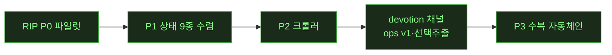

# ⚪ LIVE — notion 캠페인 무인 런 상태판

> 무인 런 중 오케스트레이터가 이벤트마다 갱신·push. **새로고침으로 최신 확인.** (런 없을 때 = 마지막 런의 최종 상태)

**런 상태**: ⚪ 대기 (RUN8 완주 — 트리 리팩터 phase-1b·블록5종·실물검증, T2 508/508) · 마지막 갱신: 2026-07-15 아침

## 현재 페이즈

(✅=완료 초록 · 현재: **P3 ✅ 완주** — 잔여는 P3-4 R4흡수 검토 · 다음 런 후보: P3-4 / 갤러리 G1 판단 2건 / 크롤러 depth / T47)

## 가동 중 에이전트
| 에이전트 | 작업 | 투입 시각 | 상태 |
|---|---|---|---|
| 오케스트레이터(Fable) | RUN5 판정·게이트 검수 | 21:0x | 마감 회귀 대기 |
| W-E(sonnet) | 동영상 블록 파리티 | 20:1x | ✅ 게이트 27/27·click_audit 508/508 |
| W-G(sonnet) | 비디오 RIP 2층 실물대조 | 21:2x | ✅ G2 2건 수복·G1 3건 오너대기 |
| W-H(sonnet) | 갤러리 --relative 재검 | 21:5x | ✅ 가설 기각·원인 3갈래 규명(정직 보고) |
| W-I(sonnet) | rip_align --match-v2 | 22:1x | ✅ 11상태 스윕 개선5/악화0 |

## 티켓 보드
| 상태 | 티켓 |
|---|---|
| ✅ 완료 | P3 자동체인(분류기 계층화+rip_repair) · T34 달력 · T35 ⋯메뉴 · T46 와이드캔버스 · 결정5건 |
| 🟡 진행 | — |
| ⬜ 대기 | P3-4 R4흡수 · 갤러리 G1 판단 2건 · T47 툴바 잔여 · T51 Yjs(배포 시점) · 크롤러 depth |

## 이벤트 타임라인 (최근)
- 2026-07-15 RUN8 마감(10h 무인): **트리 리팩터 phase-1b 완주**(store 전 변이 트리화, columns.ts 화해배관 제거) · 신규 블록 bookmark·embed·file·link_preview + status DB컬럼 · #1 실물검증(255p/32DB, teardown 확증) · **T2 508/508** · 아침 HTML보고. 다음=SoT 승격(입회)·phase-2 렌더재귀화(입회)
- 2026-07-15 새벽 RUN8: **트리 phase-1b 완료**(store 전 변이 트리화, moveBlocks까지, 8게이트 그린 유지) · bookmark 블록(실물66회) · SoT 승격은 persist포맷 변경이라 입회 결정 보류 · 다음=status 컬럼·추가 누락블록
- 2026-07-15 새벽 RUN8 진행: 트리 phase-1a(변환기)·1b-1(delete/dup/move)·1b-2(insert류) 트리화 완료·push, 전 게이트 그린 유지 · 구코드 잠복버그(depth점프 고아) 트리버전이 수정 · bookmark 블록(실물66회) 착수 · moveBlocks만 미전환(predecessor 프리미티브 필요)
- 2026-07-15 새벽 RUN8 개시(10h 무인): 안전망·데일리분리·quick wins·트리변환기(phase-1a) 토대 완료 → 실물검증(255p/32DB/depth8, teardown 확증·bookmark 최다) → 트리 phase-1b(store 트리화) 착수
- 2026-07-14 밤 RUN7(유인): **devotion "AI 보내기" 첫 실전 왕복** 성공 · 영상 ⋮⋮ 핸들 메뉴 회귀 수복(W-R 과통일 → 타입인지 MediaHandleMenu, video_block_gate 42/42) · 사이드바 닫기 버튼 신규(실측) · 토글 아이콘 글리프→실측 SVG 교체(재열기=햄버거 규명, 부채0) · 티어링 준수(T2 미실행)
- 2026-07-14 저녁 RUN6 완주(1h 무인): W-R 회귀 3건 수복(컬럼 풀메뉴·마퀴 존·선택추적+selectRange 실버그) · **검증 티어링 T0/T1/T2**(smoke_flows 15체크/23초, 검출력 증명 6FAIL→15/15) · W-T **예외 설정 패널**(테마 3택+예외 6종 토글, settings_gate 23/23) · T2 마감 click_audit **508/508**
- 2026-07-13 RUN3 완주: RIP P0~P2 · click_audit 501/501 · 커밋 6
- 2026-07-13 오후: 사용자 결정 5건 실행 · devotion 채널 3종(페이지 영속·선택추출·ops v1) 개통 · clone-kb 주입
- 2026-07-13 16:2x RUN4 개시: 진입 의식 완료(카드=rip-repair-loop·rip-crawler) · devotion 수거함 fz 수신확인 annotate(seq7) · 환경 3종 UP(9224/5185/8770) · P3 착수
- 2026-07-13 17:5x P3-1 완료: classify_layered(레벨0 반응유무→레벨2 엄격→레벨1 구조완화, --layered opt-in) · 반응다름 8→2(닫기/Escape/여백클릭×2/다음페이지/작업메뉴 6건 [기능일치-모양차이] 승격, 진짜델타 9건 비승격 보존) · test_rip_classify.py 6/6 PASS · delta_v3.md 생성
- 2026-07-13 18:0x P3-3 완료: rip_repair.py(triage/rerip/verify+history) · view_gallery 파일럿 triage G1=17/G2=45/G3=22/G4=0 → 고신뢰 G2 수정(커밋 2aa2157) → 델타 282→237(-16%) · view_board 스팟 903→903 회귀 0 · parity_exceptions 무결
- 2026-07-13 18:3x RUN4 마감: click_audit 508/508(100%) · tsc/build 클린 · RIP-PIPELINE/HANDOFF/_WORKLOG/ledger/cases 결산 완료
- 2026-07-13 19:0x 후속(W-C): 오너 피드백 "G1 텍스트만으론 판단불가" → rip_repair.py visual(오버레이+크롭+정체설명 시트) 당일 구현 · 게이트 4검증 PASS · 신기법 visual-triage-sheet(experimental) 등록
- 2026-07-13 20:0x 후속(W-D): 오너 결정 original-first → **ADR-0008** 채택 · view_gallery G1 17건 수복(hover 액션쌍·대형 add-tile·커버 wrapper·hiddenProps 설정갭) · **구조 델타 30→5(-83%)** · t_wishlist 템플릿 회귀 무결 · click_audit 508/508 재통과 · 커밋 4c85089
- 2026-07-13 밤 RUN5 완주(2h 무인, W-E~W-I 4워커): **동영상 블록 신설**(네이티브 플레이어·DnD 업로드·툴바·⋯메뉴·리사이즈·캡션, 게이트 27/27, 브릿지 Range 결함 발견·수정, 커밋 2802f43·bc4533a) · **RIP 2층 실물대조**(G2 2건 수복 bb30e39, G1 3건 오너대기) · **rip_align --match-v2**(11상태 스윕 개선5/악화0, 갤러리 5→2) · 마감 click_audit **508/508**·tsc/build 클린
- 2026-07-14 오후(W-Q): **미디어 컬럼 split 파리티**(오너 체크리스트 4항) — 이미지↔영상 split·컬럼 내 거터 핸들·컬럼 하단 입력·gap 46px 실측 적용 · 근본원인=드래그 중 hover 미갱신+video 히트테스트 이탈 · column_media_gate 16/16 신설 · 전 게이트 회귀 그린 · click_audit 508/508
- 2026-07-14 오후(W-N~W-P): 오너 델타 리포트 3건 수복(정렬 팝오버·⋯메뉴 앵커 실측 ±2px 게이트, 아이콘 10종 실측 SVG) · **asset-provenance-gate 신설**(자작 자산 자동 적발, 부채 12 발굴→전량 해소, 등록 106) · **실물 조작 규칙 개정**(read-only 도그마 소거 — R&D 개방, 원상복구 원칙) · 게이트 37/37
- 2026-07-14 오전(W-M): 오너 협조 실측으로 비디오 G1 3건 전부 해소(핸들·툴바·pointerEvents) · CLONE_ONLY 구조델타 0 달성 · 게이트 29/29 · 커밋 e50f773
- 2026-07-14 새벽(오너 버그 리포트 대응, W-J·W-K): **DnD 무반응 근본수정**(.editor-trailer 핸들러 부재, 커밋 580da51) — 합성 DragEvent 거짓 양성을 CDP Input.dispatchDragEvent 네이티브 게이트로 교체(29/29) · 오너 페이지에 수정 증거 드롭 · parity_exceptions_gate FAIL=픽스처 절대좌표 결함 판정·수리(제품 무죄, 게이트 3종 PASS) · regression-harness-suite 카드 §함정 2건 추가
