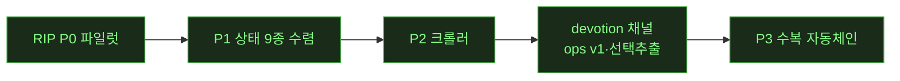

# 🔴 LIVE — notion 캠페인(오너 버그리포트 처리)

> 무인 런 중 오케스트레이터가 이벤트마다 갱신·push. **새로고침으로 최신 확인.** (런 없을 때 = 마지막 런의 최종 상태)

**런 상태**: ⚪ **10h 무인 런 완주**(2026-07-20). 4단계 전부 완료 — ①좌측정렬·baseline 근본수복 ②토글 첫줄Enter·여백 규명 ③**10페이지 전층 이식**(리치텍스트3·풀블록2·DB표3·보드갤2) ④최종 재캡처·통합 픽셀·디테일 보고서. **최종 보고 `ref/reports/RUN-0720-final10-parity.html`**(페이지별 카드10+실페이지 링크+수복목록+티켓). 통합 기준선: 리치텍스트 96~97%·풀블록 97~98%·DB표 92%대·보드/갤 91%대. 잔여 티켓 13건+설계차이 2건

## 현재 페이즈

(✅=완료 초록 · 현재: **P3 ✅ 완주** — 잔여는 P3-4 R4흡수 검토 · 다음 런 후보: P3-4 / 갤러리 G1 판단 2건 / 크롤러 depth / T47)

## 가동 중 에이전트
⚪ 없음 — 런 완주. 이번 런 워커: W-EY(정렬)·W-EZ(토글버그)·W-FA~FD(페이지 전층이식)·W-FE(마감보고서). 전부 csbakk push 완료(최종 3bf6896).

## 다음 페이즈 (오너 확정 1순위)
**★구조-우선 클론(골격 파리티)** — `techniques/structure-first-cloning.md`. 순서: ①골격(DOM 스켈레톤·role·그룹핑 채택 — 1단계: 제목 h1 스펙+번호목록 마커/텍스트 단일부모, 2단계: 블록 래퍼 체인) → ②스타일 셀렉터째 이식 → ③동작/JS. 검증 3축: 구조 게이트(신설)+픽셀 배지+기능 게이트.

## 티켓 보드
| 상태 | 티켓 |
|---|---|
| ✅ 완료 | **Notion API 클론 v1+v2a(DB)** · **T52 컬럼중첩 드롭힌트차단** · 실물중복 정리 · 파리티 루프 · 블록/컬럼 갭 종료 · 잠복버그14 · T2 508/508 · 하네스(태그관대·tie-break) · 결정(0716 4건) |
| 🟡 진행 | — |
| ⬜ 대기(다음) | **파리티 DB스펙+자동 diff** · **클론API v2b**(relation/rollup/formula·people/files·search·code language·table/column 블록) · 클론 정크 정리 · 큐 4종(list뷰·timeline드롭다운·sort-key근본·rowdoc정리) · T53/T54 데드코드 · 갤러리 G1 |

## 이벤트 타임라인 (최근)
- 2026-07-20 **★10h 무인 런 완주 — 10페이지 정합 + 최종 보고서**(W-FE, push 3bf6896): 10페이지 전부 **최종 상태로 동일조건 재캡처**(순차 수복이라 초기 캡처는 후속 수복 미반영이었음) + 통합 픽셀 측정 → **최초의 공정 기준선**: 01 97.02·02 96.21·03 97.18·04 98.30·05 97.38·06 91.80·07 92.29·08 96.60·09 91.10·10 91.01%(#09/10 최초 정량화). 보고서 `RUN-0720-final10-parity.html`(페이지별 카드10: 노션↔클론 나란히+클릭확대+**실페이지 링크**+수복목록+남은갭+픽셀, 하단에 측정함정 3종·재사용도구). 헤드리스 검증 20/20 이미지·console 0. 잔여 티켓 13건+설계차이 2건. ledger 5건 append+대시보드 재생성
- 2026-07-20 **3단계(4/4) 보드·갤러리 — 3관찰 판정·수복**(W-FD, push 3bb354d·5bbf285): ①구조차이(real 풀페이지DB vs clone 콜아웃+인라인DB)=**데이터/픽스처 설계 선택**으로 판정(build_t2.py 주석 확인, 무근거 변경 안 함) ②**보드 그룹순서·NONE 위치=진짜 렌더갭** 수복 ③**카드 날짜 서브텍스트=per-view hiddenProps 누락** 수복(갤러리 선례 준용). 추가: 카드 그룹색 tint·radius 4→10·갤러리 다크 border/bg·보드 헤더 라벨 12→14px. probe에 board/gallery 추출기 추가. 티켓: 공유 DatabaseView 탭바 오버플로(#06-08 공통)·tint 알파·border vs box-shadow. dom 94/94·status_col 13/13·smoke 23/23. **→ 3단계 10페이지 전층 이식 완주, 4단계 마감 보고서로**
- 2026-07-20 **3단계(3/4) DB 표뷰 3페이지 수복 4건**(W-FC, push 264a6f1): ①**헤더 property-type 아이콘 9종**이 유니코드 글리프/이모지(Aa/≡/#/📅/☑…)였던 것을 real `/icons/*_gray.svg` mask 자산으로 교체 ②number 셀 우측정렬(real text-align:end) ③PARITY-195 **유령 빈 행** 삭제(live store 잔재, 4번째 드리프트) ④PARITY-195 **컬럼폭 인플레이션**(`.tv-table{min-width:100%}`+table-layout:auto가 여유폭을 비례배분해 280/200→308/220) 제거. probe에 `kind="table"` 지원 추가(위치매칭·colRelX). **★측정 함정 2종 추가 문서화: real은 padding/font가 inner div에 있음(outer 래퍼 아님) · leftOffset 절대비교 무효(root 좌표계 상이)**. 날짜 로케일: 재측정하니 양쪽 다 한글 — W-EQ 관찰 미재현(정직 기록). 게이트 tableview 17/17·api_db 84/84 무회귀
- 2026-07-20 **3단계(2/4) 풀블록 2페이지 — 진짜 구조갭 3건 수복**(W-FB, push 6cd5170): ①**2단컬럼 20px 폭유실** — `.col-add`(＋버튼)가 flex in-flow로 20px 상시 점유해 컬럼이 337→327px shrink → `position:absolute` 앵커 전환, real 337px 정확 일치 ②**quote 글리프 8px** — real DOM은 leaf 자신도 `paddingLeft:8px`(총 33px), 클론 14→22px 교정 ③컬럼 내부 좌우 4px 인셋 제거(real=0). **★측정 방법론 반례 발견: quote는 기존 티켓이 "0px 검증완료"라 기록했지만 실제론 leaf 자체 padding을 놓친 오판정 — box측정과 glyph측정이 항상 같은 결론을 주지 않음**(다음 워커 필수 인지). 드리프트: 클론 #05 콜아웃 이모지 live store 오염(🤪→🔍) 정정. 픽셀 #04 99.1%·#05 98.1% 유지(구조개선은 해상도 밖), 게이트 7종 무회귀. 티켓: h2 2px·북마크 www(게이트 계약 충돌)·image 자르기버튼 텍스트 아티팩트
- 2026-07-20 **3단계(1/4) 리치텍스트 3페이지 전층 정합**(W-FA, push 7ec89b7): **범용 하네스 `page_parity_probe.py` 제작**(PAGES 레지스트리+real/clone/diff/all, #04~#10 재사용 가능) + 실물탭 CDP wedge 우회 스크립트. 3페이지 전층 덤프·diff — **row-level `p` 불일치 7건은 false positive 판별**(glyph-level left_edge_audit로 0px delta 확인, 방법론 caveat 티켓화). **진짜 발견: 클론 #01의 유령 체크박스 5개(4444/5555/…)는 파일 SoT가 아니라 9226 브라우저 프로필 live store 잔재** → store deleteBlock으로 정리(#02·03은 클린). 티켓 2건: 콜아웃(real=아이콘+텍스트 단일 flex row vs 클론 분리)·코드블록(언어라벨이 리프 텍스트에 인라인). 픽셀 #01 97.43→97.49·#02 93.51·#03 98.02. dom 94/94·smoke 23/23
- 2026-07-20 **2단계 완료 — 토글 첫줄 Enter 수복·여백 메커니즘 규명**(W-EZ, push 5e3e35f): **버그E** ffprobe로 노션 규칙 확정(닫힌 토글 헤더 첫줄 Enter→헤더·자식 그대로, 위에 빈 토글 1줄) → 근본=Enter 분기가 `off===0`에도 end-of-text 산식 재사용해 헤더 텍스트가 자기 첫자식으로 내려가고 헤더가 빔 → **`insertBlockBefore` 신설**(전 블록타입 일반화). **버그F 재현 성공**: fold-triangle 8회 결정론적(gap 40↔0, 플레이크0)이라 CSS 결함 아니고, **핸들 클릭→`.bhm-menu` backdrop이 열린 상태에서 fold 클릭을 삼켜 메뉴만 닫히고 collapse 불변**이 "여백 생겼다 없어졌다"의 정확한 메커니즘 — 업계표준 바깥클릭 패턴이라 추측 수정 없이 정직 보고(코드 무변경). 신규 게이트 12/12·3/3, 기존 6종 무회귀, 픽셀 bbox=None
- 2026-07-20 **★1단계 완료 — "삐뚤빼뚤" 근본 규명·수복**(W-EY, push 8d61f8c): 실물 9224 실측(`font_align_probe_real.py`) → ①폰트 스택은 이미 일치(W-BN), mono fallback만 소폭 보정 ②**좌측 어긋남 근본: 클론 전 블록타입이 padding-left:0이라 마커·헤딩·문단·인용이 제각각 x에서 시작. 실물은 통일 공식(리스트/토글 마커 8px·헤딩/문단 6px·인용 8px)** → 그대로 적용, todo 체크박스 gap 7→4px ③**오너 지적(숫자 vs 한글 baseline) 근본: `.blk-marker.num`이 15px·padding-top 0인데 텍스트는 16px/24px+2px — 실물은 마커도 본문과 동일 16px/24px metric** → 교정, glyph top y좌표 0px delta 일치 검증. **픽셀 A/B 전 문서 개선(00 97.4→98.0·01 96.8→97.4·03 97.8→98.3)**·dom 94/94. 재사용 도구 `left_edge_audit.py`(블록별 좌측 x 노션↔클론 대조). 콜아웃 아이콘 offset은 fragile zone이라 정직 보류(delta 기록)
- 2026-07-20 **🔴 10h 무인 런 개시 — 10페이지 완전정합**(오너 지시): 비교갤러리(RUN-0719-compare10.html, 페이지 링크 추가 b75a61b)로 오너가 디테일 지적 → **세로라인 정렬 근본과제**. 오너 질문 2건 답: ①폰트는 스택·metric 실측 이식으로 거의 완전 일치 가능(서브픽셀만 잔여) ②최하단→최상단 래퍼 전층 복사가 곧 §0 도크트린, 지금까진 리프 단위만 해서 페이지 층 구조가 안 맞았음. 단계: 폰트/정렬 기반(W-EY)→버그(토글첫줄Enter·여백재발)→10페이지 전층 이식→디테일 보고서. 직전 완료: W-EV(이미지/영상 클릭선택+Enter+설정 b481005)·W-EX(상단핸들+크기토글 f9ff4c7)
- 2026-07-19 밤 **이미지/영상 선택+Enter 구현·설정옵션**(W-EV, push b481005): ffprobe 메타로 확정 — **정직 발견: 오너 "호버 선택"이 아니라 실측은 클릭 선택**(호버는 툴바만, halo는 클릭시 rgba(35,131,226,.14) 4변 6px=클론 기존 `.blk.selected::before`와 일치). 클릭선택→Enter=아래 빈 텍스트블록+setFocus(단일선택·image/video만). **설정 `mediaSelectEnter`(exceptions.ts, 기본 ON, 예외패널 맨아래, localStorage 영속)** — OFF면 halo 유지·Enter만 무동작. 영상19(ON→OFF→ON)·media_select_enter_gate 18/18·video_block 42/42·column_media 16/16 무회귀. 보고서 RUN-0719-image-select-report.html
- 2026-07-19 **빈 아이템 fwd-delete 삼촌 이동 수복(W-ET 상충 조정)**(W-EU, push 14580c4): W-ET no-op 가드가 21:31 요구(빈아이템 fwd-delete→삼촌 이동)를 막던 것 → 가드 세분화: **빈텍스트&&자식없음이면 삭제+삼촌 맨앞 setFocus, 그 외(내용/접힌자식)는 W-ET no-op 유지**(데이터유실 방지 보존). "컨테이너 경계"와 "빈 블록인가"가 다른 축인데 뭉뚱그려졌던 것. 노션 실측(영상2종 전후프레임): 삼촌 토글/일반 동일 동작. 영상18(3시나리오)·empty_item_fwddelete_uncle_gate 14/14(stash 8/14)·무회귀 전부. 오늘 토글편집 버그 8종+ 전부 종합보고서 RUN-0719-toggle-edit-report.html에 반영
- 2026-07-19 **토글 드래그 자식유실(W-ES 7e4c929)·중첩토글 "여백"→실은 fwd-delete 데이터유실(W-ET c8766e3)**: W-ES=handleBlkDragStart 자식그룹화가 callout/synced만→전 타입 일반화(영상16, 게이트3/3). **W-ET 주의**: 오너 "여백"은 CSS상 정상(gap=0, 재현안됨)이고, ffprobe로 확정한 키시퀀스(fwd-delete×3)로 재현하니 **중첩토글 마지막 자식 fwd-delete가 컨테이너 밖 무관블록 통째삭제(데이터유실)** 발견 — Backspace는 경계인지(W-ER)하는데 Delete만 비대칭이던 것. Delete에 next.depth<depth 가드(no-op)로 수복(영상17, 게이트10/10). **미규명: 오너가 본 "여백" 자체는 원본상태 소실로 완전 재현 못 함(정직 보고)**. ★W-ET no-op이 21:31 요구(빈아이템 fwd-delete→삼촌 이동)와 상충 → W-EU가 "빈아이템=삭제+삼촌커서 / 내용블록=데이터유실방지" 구분 조정
- 2026-07-19 **토글 편집 버그 5종 수복**(W-ER, push 5629ba7): ①드래그 드롭 child가 항상 첫자식→실측대로 **마지막 자식(append)** ②③(같은뿌리) Backspace가 prevId(형제)만 스캔→첫자식은 prevId없어 no-op→**부모 병합 fallback** ④빈토글 Shift+Tab 커서실종=setBlockDepth 리마운트 후 setFocus누락→**Tab/Shift+Tab setFocus** ⑤paste 끼우기불가=isRichHtml이 Chrome 자동 color-span을 rich로 오판→같은앱 복붙이 block-level 오라우팅→**sole-span unwrap**. 영상11~15·toggle_edit_0719_gate 15/15(stash 7/15)·무회귀 전부. **정직 플래그: 버그2 커서위치 — 오너 명세는 병합지점(junction)인데 실측 2회는 끝(end)이라 실측대로 구현+불일치 명시(오너 확인 필요)**. 영상분석 ffprobe capdraw 메타 활용
- 2026-07-19 **0719-5 forward-delete 삭제 근본수복**(W-EO, push 10ba7fe): 근본=`Editor.tsx` onKeyDown에 `Delete` 분기가 다중선택(T14)에만 있고 **단일블록 forward-delete 핸들러 완전 부재**(Backspace는 이미 정상 — 클론 버그영상서 빈블록 Backspace 삭제 확인·FwdDelete만 무반응 확정). 수복=Backspace 거울로 Delete 브랜치 신설(visibleNeighborIndex로 다음 블록 병합/삭제), void/divider/synced 대칭, **자식컨테이너(토글/콜아웃)는 병합시 자식 유실 위험→선택전환**(재차 Delete로 의도삭제, T14 재사용). 영상10(3씬). block_delete_gate 18/18·keyboard_nav 10/10·toggle_enter 16/16. 정직보류: "포맷블록 2단계 Backspace" 규칙은 9224 슬래시메뉴 실측 실패로 미확정 명시(기존 코드동작 유지)
- 2026-07-19 **0718-1 잔여 2건 실측 수복**(W-EP, push 489637f): 블록1⑦ 다크모드 세로선 — 실물 9224 다크토글 후 실측 `rgba(255,255,243,.082)`(클론 추측 9.4%white 교체), 라이트는 기존 실측 유지. 블록1⑤ relation — outerHTML 실측: real은 칩박스 아니라 record-icon(pageBlank 18px)+밑줄링크(박스 없음) → `.tv-rel-*`로 교체(밑줄색 라이트 rgba(28,19,1,.11)/다크 rgba(255,255,235,.1)). 발견: 오너 "세로선 없음"은 문자대로는 아님(옅은 선 있음), "추가선" 인상 주범은 relation 칩박스였을 가능성. tableview_darkborder_relation_gate 17/17(라이트+다크, stash 3/17 변별). 보고서 0718-1 **18/19✅**. → 0719-5 삭제버그(W-EO)
- 2026-07-19 **0718-1 메모 재검증(정직 판정 19항)**(W-EN, push 246c1dc): 오너 요청 "다 수정됐나 시각자료로 재보고" → 각 항목 클론 다크모드 **실제 재캡처**로 확인(문서 신뢰 안 함). **완료 16✅**(breadcrumb·아이콘·버튼·폰트굵기·상태칩·헤딩CSS·핸들위치·콜아웃이모지·코드드롭다운·탭제목·자식밀어내기 등)·**부분 2◐**(relation 칩 vs 링크·상단바 SVG)·**미완 1✗**. ★핵심발견: 블록1⑦ 테이블 세로선이 W-CZ "복원완료" 기록과 달리 **다크모드서 뚜렷** — 라이트 border는 실측인데 다크 override가 generic --border(9.4%white) 추측 재사용(주석도 "다크 실측없음" 인정), 이전 검증이 라이트만 봐서 놓침(§0 사례). 보고서 `RUN-0719-memo0718-status.html`. → W-EP로 다크 세로선 실측+relation 링크 수복
- 2026-07-19 **빈 토글 placeholder 진짜 원인 규명·수복(구조-우선 1:1)**(W-EM 재개, push 86326ea): 아까 "정상(W-EF)" 오판은 **합성 주입이 top-level 빈 토글만 테스트**해서(§0 정책 사례). 실경로 재현으로 진범 확정 — **중첩 빈 토글**(다른 토글의 자식)일 때 placeholder 미표시: 마크업이 `renderBlockList`(top) 분기에만 있고 `renderListChildren`(재귀 자식 렌더)엔 없었음. 오너 클론영상 토글들이 다 중첩. 수복=`emptyToggleGroup` 헬퍼 추출+renderListChildren 빈-토글 분기(열림&자식0만, 2단중첩 지원). **노션 CSS 1:1 확인**: color rgb(120,119,116)≈노션(Δ1)·fs16/fw400/lh24/padding8/radius4/hover rgba(255,255,255,.055)+pointer·골격 8층. **영상09**(실경로 마크다운→placeholder→hover→클릭진입 타이핑)+노션↔클론 비교캡처. toggle_enter_gate G/H 16/16(stash 변별). **+ _POLICY §0 최상위 도크트린 신설**(모든 요소 실물1:1, 재주입 불요 — 오너 "내내 말했는데" 지적)
- 2026-07-19 **커서 실종 근본수복(계측으로 트리거 정정)**(W-EM 재개, push 7939982): 오너가 재현영상(16-22-11) 제공→오케가 ffmpeg 프레임추출로 17.7초 블록+커서 소멸 확인. 워커 계측으로 **오케 가설(">"=quote 전환) 반증** — ">"는 toggle 마크다운(MD_RULES `/^> /→toggle`, 실노션 동일)이고 변환은 포커스 유지, **진범=Backspace**(비텍스트 블록 맨앞 Backspace→setBlockType('text')만 하고 setFocus 누락→toggle/text JSX 달라 contenteditable DOM 재생성→focus body로). W-EH 0719-3①(Enter list-exit)과 동일계열, Backspace 경로만 누락됐던 것. setFocus 한줄 수복. **영상08**(activeElement 배지 body빨강/블록초록으로 캐럿생존 시각화). toggle_enter_gate F 14/14(stash 13/14 변별력). 오너 버그 전량 종결
- 2026-07-19 **0719-4 빈토글 placeholder+Tab 부모열림**(W-EM, push 9556dac): 버그2(Tab 부모 자동열림)=진짜 수복 — setBlockDepth가 부모 collapsed 미변경 → `expandBlock` 액션+`expandNewParentOnIndent`(raw sibling 역탐색으로 진짜 새 부모 찾기) 3개 Tab진입점 적용. 영상 07. 버그1(placeholder 위치·가이드변화·클릭생성)=**이미 정상(W-EF)**, "커서 실종"은 4경로 재현 시도 모두 실패(포커스 항상 새 블록에 붙고 타이핑됨)→무근거 수정 대신 방어 게이트 D4/A3(activeElement+타이핑 검증). 클론캡처 "바보"=이전 수동테스트 잔여자식(placeholder 버그 아님). toggle_enter_gate 13/13(stash 12/13 변별력)·영상 06. 실물=오너 제공 영상 프레임추출 확인(9224 무접촉)
- 2026-07-19 **닫힌토글 형제 collapsed 계승 수복 + 동작영상**(W-EL, push fec034c): W-EF 후속 — 닫힌 토글 Enter로 생긴 형제가 열린토글로 생성되던 버그. 근본=`makeBlock`이 collapsed 미충전(항상 열림), Editor가 nextType='toggle' 계산해두고 insertBlock에 미전달 → insertBlock에 collapsed 인자 추가+Enter핸들러 3호출부 전달. **동작영상 05**(닫힌부모▶ Enter→형제도 ▶ collapsed:true, ffprobe h264 7s). toggle_enter_gate B3/B4 추가 10/10(stash 8/10 변별력)·keyboard_nav 10/10 무회귀. 실물 실측은 harness 분류기가 실계정 타이핑 차단→오너 명세 폴백
- 2026-07-19 **동작 증명 영상 5개**(W-EK, push 5672801): 오너 "동작을 영상으로 증명" 요청 → CDP screencast→ffmpeg로 클론 라이브 동작 녹화. 01토글엔터·02키보드네비·03핸들·04다크텍스트+통합 all(35.7s). 좌표/포커스 로그로 정확성 확인(이미지 핸들 top+3 일치 등). 보고서 `<video>` 임베드(readyState4). 오너 "반영 안된거냐" 질문에 실동작 영상으로 종결
- 2026-07-19 **★오너 선작업 버그 9건 전부 수복·증명 완료**(W-EF~W-EJ, push d796540): ①토글엔터 자식/형제+placeholder+캐럿색(6e4e346) ②핸들위치=JS공식 fallback 회귀(0e9174a) ③키보드네비 5증상=flat siblings 순회 뿌리(6fcf995) ④다크모드 텍스트 어두움=드래그핸들 grabbable stuck(de8e1b5). **종합보고서** — 노션↔클론 시각증거 매칭표(페이지내 임베드·클릭확대), **실동작 8시나리오 지금 라이브 재캡처 전부 PASS**(오너 "반영 안된거냐" 종결). 신규 게이트 toggle_enter 8·keyboard_nav 10·handle_stuck_dark 4. 헤드리스 검증 통과
- 2026-07-19 **텍스트색 버그 규명**(W-EI): 다크모드 "가끔 어두움"=드래그핸들 mousedown→opacity:.5, 핸들 살짝 벗어나 mouseup시 복원 미발화→grabbable stuck→이후 타이핑 텍스트 다 반투명(다크배경서 블렌드로 어둡게). window 전역 mouseup/dragend/blur 안전망 수복. handle_stuck_dark_gate 4/4
- 2026-07-19 **키보드 네비 5증상 수복**(W-EH, push 6fcf995): 공통 뿌리 — ↑/↓ 핸들러가 flat siblings(닫힌 토글 숨은자식 포함) 순회 → 렌더 안 된 자식으로 focus 실패("이동 안 됨") → `visibleNeighborIndex()`(렌더된 visibleRows 기준)로 교체(열림=자식 진입·닫힘=서브트리 스킵). 블록6=거터가 mousemove만 봐 타이핑 중 안 사라짐→`suppressHoverForTyping()`. 0719-3①=빈 리스트 exit setFocus 누락 캐럿유실 수복. **keyboard_nav_gate 신설 10/10**(stash 4/10 변별력)·real 9224 시각증거+클론 패리티. 실측 스크래치 정리·원상복구
- 2026-07-19 **핸들 위치 회귀 근본규명·수복**(W-EG, push 0e9174a): 오너 "골격 다 가져왔는데 왜?" → **골격/CSS 회귀 아님, JS 위치공식 fallback 버그**. W-CS(9ec10c9, 07-18)가 heading 정렬 고치며 핸들을 top+3→getCenterY()−14로 변경, void블록(image/video/embed/bookmark/file/button/divider/toc)은 `.blk-content` 없어 fallback(정중앙)에 걸림 → 이미지/영상 핸들 가운데. top앵커 복원 + scrollbar-gutter:stable(토글 열닫 스크롤바 수평지터). hover_portal_gate 확장 I/J, 15/17(2개 Phase C 기존). 노션↔클론 캡처 확보(`ref/screens/wEG_*`). 9224 goto 0. + 클립보드 파리티 설계문서(ref/design/CLIPBOARD-PARITY.md)·clone-kb experimental 카드 clipboard-format-interop
- 2026-07-19 **★골격 완전정합 런 완주(⚪) — T-LS6 CLOSED**(W-EE, push 6234002): header_4(.blk-h4 block override+content relocate, 높이 43.4px 무변)·link_preview(카드void 그룹 합류)·button(외곽/pill blk-button 충돌 rename+block override, DB버튼컬럼 무영향 19/19) 3종 GAP→OK. **완전일치 15→17/21(81.0%)·박스 99.3%·폰트 96.8%**·픽셀 무하락. 매칭표·아침보고 재생성(헤드리스 검증). 남은 갭 4종+UNMAPPED 2=전부 오너 결정/대수술/아티팩트. **무인 런 여기서 마감** — 남은 건 오너 입회 아키텍처 결정 대상
- 2026-07-19 **TYPE_MAP 정정 — 완전일치 15/21(71.4%) 정직화**(W-ED, push 3b9995b): 기구현 4종 TYPE_MAP 등록+page 스코프분리(DB행=SKIP·sub-page link=UNMAPPED). 등록 3종이 실제론 GAP으로 드러나 근본원인 규명: header_4(=.blk-h4에 T-LS4 block override 누락 1줄)·link_preview(카드void 8px 그룹 누락 1줄)·button(외곽 wrapper와 내부 pill이 같은 blk-button 클래스라 CSS 누출 버그, rename 필요) → **T-LS6 신설**. 완전일치 15/18→15/21(테스트 대상 3종 증가로 %는 내렸으나 더 정확). 매칭표·아침보고 재생성. T-LS3 stale 4종 CLOSED. → W-EE로 T-LS6 3종 수복
- 2026-07-19 **UNMAPPED 5종 = 실은 4종 기구현 발견**(W-EC, push a2e3873): read-only 조사 — header_4(=h4)·button·external_object_instance(=link_preview)·collection_view_page(=DatabaseFullPage) 전부 **이미 클론 구현됨**(T-LS2/T-LS3의 grep miss 오기재를 git log로 반증). diff TYPE_MAP 미등록으로 UNMAPPED 오분류된 것뿐. **진짜 미구현은 인라인 "하위 페이지 링크" 블록 1종(freq~30)만** — 오너 결정큐2가 "5종"이 아니라 실질 1종으로 축소. → W-ED로 TYPE_MAP 등록+매칭표/티켓 최종 정정
- 2026-07-19 **골격 완전정합 캠페인 마감 결산**(W-EB, push 0c28d24 + ledger append): 매칭표 embed 반영 **완전일치 15/18(83.3%)·전체필드 97.5%·박스99.2%** · 아침보고 `RUN-0719-morning-skeleton.html`(런요약 20워커/26커밋·오너 결정큐 4항목 인터랙티브·티켓보드, 헤드리스 검증 통과) · ledger 5건(diff강화·대수술5연속·스윕전수·멀티셀렉버그·클립보드) append+대시보드 재생성. 잔여=대수술 티켓(quote/toc chain·셸폭모델)+UNMAPPED 5종(오너확인) → W-EC 스코프 조사로 결정 근거 준비
- 2026-07-19 **embed 수복 + toc 폰트 아티팩트 판별**(W-EA, push 4bc50ad): embed를 카드형 void 패턴(padding 8px·display block)으로 합류 → **GAP→OK, OK 14→15(83.3%)**, 188 94.51→**98.7%**(+4.19). ★toc 폰트(fs14/lh21)는 **아티팩트로 정직 판별·미수복** — 같은 페이지 image/video도 일제히 0.875배(그 페이지 텍스트축소 설정이지 블록 고유값 아님, T-LS4 동형). 무근거 px 변경 금지 준수. toc/quote chain_depth는 column_list/tab 공유 컴포넌트 대수술이라 티켓. dom 94/94·embed_file 19/19. → 리프 골격 자연 수렴점(잔여=대수술 티켓/오너확인) → W-EB 마감 결산
- 2026-07-19 **★리프 골격 전수 매칭표 결산**(W-DZ, push d6bcb7b·c8b838a): diff 최종집계 — 테스트가능 18종 중 **완전일치 14(77.8%)**, 전체 필드 **96.5%**(폰트 fs/fw/lh 96.3%·박스 97.6%·chain 88.9%). 매칭표 HTML `RUN-0719-leaf-skeleton-parity.html`(24 blockType 카드: leaf→root 체인표+폰트표+박스표+verdict, 헤드리스 검증 통과). 남은 GAP 4: quote(chain, 실측신뢰도부족 티켓)·**toc(chain+폰트버그 fs14→16·lh21→24)**·table(SVG만 T-LS1)·**embed(padding 8888 vs 4040·display block vs flex)** + UNMAPPED 5종(렌더러 부재, 오너 확인 필요)+셸 폭모델(별개 T-CG10). toc/embed 경량 수복 가능 → W-EA
- 2026-07-19 **file 골격 GAP→OK · quote 티켓 유지**(W-DY, push e76e8bb): 열린 토글 children 그룹 wrapper(blk-toggle-group+fold-a/b) 신설, 하위는 W-DU 리스트 4겹·재귀헬퍼 재사용 → **file chain 2→9 real 일치·margin 0·픽셀 합성 A/B 바이트동일**. quote는 재검토 결과 4겹 적용시 chain 7(real 5)로 형태 불일치+nested 실측이 중복 data-block-id 아티팩트 의심 → 무근거 변경 금지로 **T-LS5 티켓 유지**(real 정밀 재실측 선행 조건). diff OK 13→14. dom 94/94·smoke 23/23. → 리프 골격 대수술 사실상 완결(리스트·table·file real 일치), 잔여=quote·UNMAPPED5·셸폭모델. W-DZ 결산(매칭표) 착수
- 2026-07-19 **★table 3중 계층 골격 대수술**(W-DX, push 038bdf8): SimpleTable 단일 div→실물 3중 data-block 계층(8 div 삽입, 전부 zero box-model=골격깊이만 늘리고 픽셀 무관) → **chain_depth 2→10 real 완전 일치**, 10개 CSS 필드(fs/fw/lh/m/p/color/bg/bd/radius/display) 전부 일치, 픽셀 합성 A/B 바이트 동일. 우려한 13파일 연쇄 없음(domBlockIds가 `.blk[data-block]` 콤보라 data-block만 부여해 격리·중복id 오동작 차단). "real 14"는 콜아웃중첩 오염 구값·정본 top-level 10 정정. 잔여 GAP=SVG아이콘(T-LS1, 골격밖). SimpleTable.tsx 1파일. 9224 goto 0(기존 자원 충분)
- 2026-07-19 **★중첩 wrapper 4겹 확장 — chain_depth 리프 갭 해소**(W-DU, push 354a9db): renderListChildren에 실물 E/D/C/B 4겹 재현(blk-list-e/d/c 투명 통과층 3개 추가) → **bulleted/numbered/todo chain_depth 4→7 real 정확 일치·verdict GAP→OK** · 1단·2단 재귀 픽셀 합성 A/B 바이트 동일(getbbox None). dom 94/94·smoke 23/23. 리프 골격 갭 중 리스트 계열 완결, 잔여 골격 GAP=table(3중구조)·quote(별경로)·file(toggle wrapper)
- 2026-07-19 **★리프 스윕 116/116 전수 완주**(W-DW, push bc6a26d): 잔여 13p 순회, 우선순위 목록 자연 소진(강제 종료 아님). 최종 **유니크 시그니처 202건·blockType 24종 고정**. 마지막 배치 신규 4건 전부 기존 타입 구조변형(collection_view·page 카드 레이아웃). 오너 지시 "리프 전수" 달성 → 이제 diff 통합 재판정(W-DU wrapper 4겹 반영)으로 최종 골격 갭 집계 가능
- 2026-07-19 **리프스윕 배치9 — 103/116, 수렴 신호**(W-DV, push a31ace1): 15p 순회(88→103), 신규 시그니처 +5(193→198)·**신규 타입 0**·top-level 유입 0. 후반 12p 중 9p가 신규 0으로 수렴 뚜렷하나 임계 미달(마지막 3p서 +2). 잔여 13p → W-DW 완주. 확인된 blockType 23종 고정
- 2026-07-19 **노션 클립보드 저장위치 규명**(W-DR, push e7214f6): 오너 요청 조사. localStorage/sessionStorage/IndexedDB **전부 무변화**(힉스필드와 반대) → payload는 **클립보드 커스텀 MIME `text/_notion-blocks-v3-production`**(노션 내부 block row 스키마). 추출 1줄=`paste 이벤트 getData('text/_notion-blocks-v3-production')`. Chrome async clipboard.read()는 커스텀타입 미노출→**trusted OS paste 필수**. 파이프라인 가능(구조 통째 추출). 운영교훈: 멀티크롬 osascript name-activate가 엉뚱한 창 활성화→`bring_to_front()` 써야·pbcopy+Cmd+V가 keystroke보다 안정. 리포트 `ref/rip/notion_clipboard_investigation.md`
- 2026-07-19 **셸 층 파일럿 + chain_depth 오귀인 정정**(W-DT, push 57a601d): real 14층 스펙 재검증 후 안전 additive 1층(#root에 layer13 CSS 정합) 추가, 픽셀 5문서 Δ=0, **dom_structure 90→94**. ★중요 정정: 리프 chain_depth 갭(real7 vs clone4)은 **앱 셸 아님**(리프 chain은 .notion-page-content까지만 측정, 14층 셸은 그 위) → 진짜 원인=중첩 wrapper 2겹(실물 4겹 E/D/C/B) 단순화, **T-LS5 소관**으로 재귀속. 셸 잔여(폭모델·editor 잉여층)는 T-CG10 대수술 유지
- 2026-07-19 **멀티셀렉→토글 자식유실 버그 근본수복**(W-DS, push a1616eb): 오너 영상2건. 같은 뿌리 두 갈래 — ①드래그: `handleBlkDragStart`가 domBlockIds 필터라 접힌 토글 자식이 DOM 미렌더→후보 제외→moveBlocks 유실 → `pickSelectedWithChildren`(트리 기반, DOM 무관)로 교체 ②Tab: `setBlockDepth`가 자식 서브트리 depth를 안 밀어 nestByDepth 불변식 붕괴 → `shiftBlockDepthDeep`(서브트리 재귀) 신설. 계측(treeToFlat depth dump)으로 확정. **multiselect_nest_gate 신설 4/4**(stash 2/4→4/4 변별력)·smoke 23/23·columns/columnedit 11/11. 자식 있는 단일블록 Tab도 덤으로 정확해짐
- 2026-07-19 **중첩 렌더링 2단+ 재귀 확장**(W-DQ, push 6a70215): 실물 3단 중첩 실측(1단마다 4겹 wrapper 재귀 반복·전 조상 marginLeft 0) → `renderListChildren` 재귀 헬퍼로 임의 깊이 지원, **픽셀 합성 A/B 바이트 동일**. quote(blockquote 시맨틱 별개 모델)·file(toggle children wrapper 부재)은 blast radius 커 정직 티켓, toc는 컬럼 컨테이너 문제로 스코프밖 재분류. 배치7 88/116(신규 시그13·타입0). goto 23회(브리프가 실측+스윕 동시 요구해 예산 초과 — 다음부터 실측/스윕 분리 교훈). + 오너 버그리포트 2건(멀티셀렉→토글 드롭/Tab 자식유실) 접수→W-DS, 클립보드 조사→W-DR 병렬 착수
- 2026-07-19 **★중첩 렌더링 대수술 파일럿 성공**(W-DP, push f91145f): 실물 중첩 골격 실측(4겹 무명 wrapper, 들여쓰기=C층 24px 마커박스가 B컬럼을 형제로 미는 flexbox·자식 리프 margin 0) → bulleted/numbered/todo 1단 중첩을 flat-sibling+marginLeft → `.blk-list-group`/`.blk-list-children` 래퍼 div로 전환. **리프 margin GAP 완전해소(24→0)·chain_depth 2→4·픽셀 합성 A/B 바이트 동일(getbbox None)**. 큐레이션 12문서 무변화(nested list 0건이라 합성이 핵심증거). 미착수 quote/toc/file·2단+·chain 4→7(나머지 3겹=앱 셸 T-CG10). dom 90/90·columns 11/11·columnedit 11/11. + clone-kb structure-first 카드 강화(측정기준 동치화+99% 조건 3항)
- 2026-07-19 **★chain_depth = 진짜 골격 갭 확정(nested 대조)**(W-DO, push 1a1b785): diff에 nested-context 재현 구현 — 실물 리프의 조상구조(중첩/컬럼/토글)를 클론에도 재현해 공정 대조 → 6타입 전부 컨텍스트 재현 후에도 GAP(clone depth 2 불변) = **아티팩트 가설 기각**. 근본: 클론=flat sibling+`marginLeft:depth*24`, 실물=중첩 1단마다 4~6겹 자식 컨테이너 래퍼 div(리프 margin 0). 리프 m real=0 vs clone=24px까지 실측. 배치6 완주 75/116(신규 시그7·타입0·top-level 미유입 재확인). 이 중첩 렌더 아키텍처 갭+table 3중구조 = 남은 골격 대수술 2건(T-LS5) → W-DP 착수
- 2026-07-19 **diff 대표선택 개선+배치5 — chain_depth 근본진단**(W-DN, push 7e39158): 대표 시그니처를 chain_depth 최소 우선으로 바꿔 재판정 → chain_depth GAP 6개(bulleted/todo/numbered/quote/toc/file)는 **알고리즘 문제 아님, 코퍼스에 top-level 표본 자체가 0** 확정(실물 문서서 항상 중첩). table만 대표 교체로 fs/lh false positive 2필드 해소(verdict는 T-LS5 대수술이라 GAP 유지). 배치5 완주 62/116(신규 시그22·신규타입 0·top-level 미유입). → nested-context 대조(W-DO)만이 chain_depth 확정 경로
- 2026-07-19 **T-LS4 후속 골격 수복**(W-DM, push af71c75): toggle `.blk-fold-row` flex 래퍼 신설(+이전 세션이 깨뜨려둔 toggleable 헤딩 동시 수복) · lists p/display를 `.blk-list-row`로 relocate(선택자 특이도 충돌 원천해소) · file p/display 해소 · **doc01 -0.4pp 규명=콜아웃 padding이 W-CI 산술타협값 17px(실물 12px 아님)+세션간 숨은 의존성 붕괴 → 실물 12px 교체로 96.5(원래)→96.8% 순증**. GAP 필드레벨 대부분 해소, chain_depth만 잔존(top-level 표본 코퍼스 부재=측정 아티팩트 정황). dom 90/90·smoke 23/23·픽셀 무회귀. 누적 OK 9→10
- 2026-07-19 **★T-LS4 골격 대수술 — `.blk` flex→block 전환 성공**(W-DL, push b597c00·b448fc5): 실물 spacing 모델 규명(리프 자신은 padding0·block, 간격은 leaf 내부 자식 div 패딩에서 — ancestor-walk로 안 보이던 층) → text/h1/h2/h3/quote/divider를 block+padding재배치로 전환, image/video/bookmark/code/toc는 real 8px 패딩으로 교정. **골격 바꿨는데 픽셀 무하락(풀블록 188: 95.6→98.7% +3.1pp — 구조-우선의 배당)**. GAP **17→8**(9타입 OK 전환)·dom 90/90. 잔여: toggle(flex-row 래퍼 필요)·lists p/chain·file/toc·doc01 -0.4pp 미해소 → W-DM
- 2026-07-19 **★diff 강화로 거짓 OK 적발 — 리프 17타입 전부 GAP**(W-DK, push ae5f25c): 오너 지시 반영해 diff_clone을 color만 보던 것→**fs/fw/lh/margin/padding/border/radius/display+골격깊이 전부 대조**로 강화 → **OK 16→0, GAP 1→17**. 근본 2건: **T-LS4** `.blk{display:flex;padding:4px 0}` base가 실물(block·padding0)과 다름 — 전 17타입에 픽셀보정 스택이 그 위에 쌓인 computed-복사 함정(대수술) · T-LS5 table 3층 계층. 저빈도 fs/lh 수복 시도는 배치4에서 샘플 늘자 뒤집혀 정직 롤백(대표시그 컨텍스트 오염 교훈). 배치4 완주 49/116(신규15). → W-DL로 T-LS4 착수
- 2026-07-19 **★오너 지시 — 폰트/골격 완전 일치 + 리프 전수 재개**: "골격 구조 스타일 다 똑같게, 최하단 자식부터 골격 다 보고, 폰트 사이즈·크기·굵기까지. 99% 아니면 계속." → **diff_clone.py가 color만 비교하고 폰트(fs/fw/lh)·마진·패딩·보더·골격깊이를 "정보용"으로 눈감던 것 적발**(computed-복사 실수의 축소판 — 거짓 OK). W-DK로 diff 강화(전 속성+chain_depth GAP화)→진짜 갭 노출→수복, 배치4~ 전수 완주(조기수렴 종료 금지). 최종=리프 골격 전수 매칭표(체인+폰트 실물vs클론 ✓/✗)
- 2026-07-19 **리프스윕 배치2·3 + 갤러리 카드폭 확정**(W-DI 73324a3 / W-DJ 4230e94): 배치2 12p(23/116, 신규25)·배치3 13p(**36/116**, 신규56 — 수렴 전혀 아님, 스파이크 페이지 다수). extract_js 정규식버그 수정(숫자 포함 클래스 오분류, 소급수정). 갤러리 카드폭 이진탐색으로 컨테이너 535/536px 열전환 경계 역산 → **base=260px 유일특정·수복**(medium 220→260). 신규 UNMAPPED 4종(button/header_4/collection_view_page/external_object_instance) T-LS3 티켓
- 2026-07-19 **리프스윕 재가동+Phase C 실측 완결+보드 카드폭 수복**(W-DH, push a5708f0): ①배치1 8/8(누적 11/116), 시그니처 33→**55**(신규 22) — sweep_real을 정책 goto+누적 병합으로 패치, drive-by 수복 1(URL 셀 ↗→real SVG), 티켓 T-LS1(SimpleTable 셀 인라인 멘션/링크 리치텍스트 부재 — 36-svg 갭 근본원인)·T-LS2(page BlockType 렌더러 0) ②Phase C: 좁은컬럼 hover 실측 — 핸들 -47/-71px, **클리핑·옆컬럼 침범 없음(우려 실측 기각)**, 레거시 제거는 버그 아닌 아키정합 과제로 T-CG12-C 티켓(컬럼 게이트 8종 연쇄) ③보드 카드폭: real 276/260 vs clone 260/248 → 수복·라이브 검증. 갤러리는 반응형 그리드 컨테이너 폭 미통제로 비교 무효 판정 — 프리셋 확정 후속. goto 10/15 예산 내·9224 안정
- 2026-07-19 **상단바 아이콘 전수 대조 완결 + 컬럼 기하 실측**(W-DG, push 9a3f1d1): 상단바 SVG 6종 해시 대조 → **클론과 100% 일치, 교체 0건**("댓글·시계 아이콘" 가정은 실측 정정 — 실물 상단바에 애초 없음). 좁은컬럼(219px, 17%) 좌표 8개 실측 확보. hover 실측 직전 탭 소멸로 정책 중단했으나 **오케 후속 판정: 데드락 아님**(CDP attach+evaluate 정상 응답) — 오너가 중복 탭 정리한 것. 카드폭 클론측 확보(보드 248/갤러리 227.5px)·리프스윕 미착수 → W-DH로 재개(sweep_real domcontentloaded 패치 포함). 운영 교훈: 오너 공용 브라우저에선 "탭 개수 변화"는 중단 사유 아님(로그인 화면·CDP 무응답만)
- 2026-07-19 **콜아웃 이모지 피커 실측→구현 완주**(W-DF, push 89550a3): 실물 피커=role=dialog "페이지 아이콘"(T16 페이지 아이콘 피커와 공유 컴포넌트 확증), 408×390·radius10·3겹 그림자·overlay-container 포털, 탭 이모지/아이콘/업로드+제거, 검색 "필터" autofocus·랜덤·컨텍스트 제안 "콜아웃" 24종·CLDR 8그룹 퀵네비 — `skeleton_emoji_picker.json`+실캡처. 클론 EmojiPicker.tsx+유니코드 카탈로그+setBlockEmoji(컬럼 중첩 재귀)+**emoji_picker_gate 신설 15/15**·회귀 5게이트 그린. Phase C는 좁은컬럼 실측 직전 9224 탭 이상(1→3)으로 정책 중단 → 오케 판정: **오너 로그인 세션과 중첩된 것, 봇차단 아님**(자동화 new_page 0건 검증·탭 자연 안정화) → W-DG로 재개. 카드폭·상단바=T-DF1 이월
- 2026-07-19 **T-DD1 = 제품 회귀 확정·수복**(W-DE, push e7480fd): 게이트 구식이 아니라 T-CG12 포털의 2중 버그 — ①cursorTracker notify가 id 문자열만으로 중복제거 → 같은 id 재등록(드래그로 컬럼 진입 등) 시 hover 통지가 삼켜짐 ②수정 후에도 React useState가 동일 문자열에 Object.is 베일아웃 → {id,seq} 이벤트 계약으로 전환+(id,target참조) 쌍 dedupe. column_media 크래시→**16/16**(2연속)·hover_portal 14/14 유지·smoke 23/23. **정크 판정: 브리프 전제 절반 반증** — "고아 10건" 중 2건은 db_workout의 살아있는 row(옛 탭 localStorage가 이번 write-through에 뒤늦게 flush된 시드 오염 — 별건 기록)라 유지, 확정 고아 8건+TESTP_wcw_measure만 아카이브(복구 가능)
- 2026-07-18 밤 **오너 복귀·결정 0719 4건 확정 + T-DA4 해소**: ①크롬 재시작+리프스윕 재개(배치 완화) ②실측 우선순위=이모지피커→Phase C→카드폭·아이콘 ③정크 11건=소유 추적 후 판정 ④M9 영상·checked 표본·재시작 전부 수락. 오케가 전용 인스턴스만 정확 종료(TERM)→launch_chrome.sh 재기동 → **attach+evaluate 정상, 프로필 쿠키 생존으로 재로그인 불요**(워크스페이스 즉시 로드). W-DE/W-DF 병렬 가동(스코프 배타: 9226 클론 / 9224 실물)
- 2026-07-19 아침 **런 마감(⚪)**(W-DD, push 0116c45): 전판 게이트 — 실행가능 12개 중 **11 PASS**(dom 90/90·api 58/58·api_db 84/84·smoke 23/23·persist_migration 28/28·hover_portal 14/14·synced 16/16·tab 17/17·selection·state_matrix 13/13·file_persist 20/21 기존한계) / **1 실물 FAIL: column_media(.blk-handle 타임아웃 2/16)** — Phase B 거터 제거 부작용 후보, 마지막-이터레이션 규칙대로 미수복·**T-DD1** 티켓 / **40 SKIP**(9224 하드코딩 — GATE_CDP_URL 미지원, 하네스 부채로 기록). 아침보고 `RUN-0719-morning.html`(런 요약 6워커·오너 결정 4항목·게이트표·티켓보드, 헤드리스 검증 통과). 오너 결정 대기: ①T-DA4 크롬 재시작+리프스윕 재개 방식 ②실측 우선순위 ③정크 보류 11건 ④M9 영상·checked 표본
- 2026-07-19 새벽 **클론 단독 백로그 3건**(W-DC, push c8c76cd): ①콜아웃 이모지 피커 — 리포 전체 실측자산 검색 결과 피커 열린 골격 캡처 0건 → **추측 구현 없이 티켓**(tab_list 전례 준수, T-DA4 후속) ②T53/T54 데드코드 — 전수 grep 재검증(0 콜사이트) 후 store 래퍼 3함수 제거(columns.ts 헬퍼는 게이트가 직접 테스트해 유지) ③정크 정리 — 641폴더 도달성 스캔(rootOrder+children+DB rows 1100), 안전 확정 37건만 `_archive/`로 mv(복구 가능)·보류 11건 목록화·PARITY 중복은 실제 없음(가정 정정). smoke 23/23·file_persist 20/21(기존한계)·tsc/build 클린. 부수 발견: columnedit 계열 logic_gate.py가 9224 하드코딩(env override 없음) — 하네스 갭 기록
- 2026-07-18 밤 **T-CG12 Phase B 완료 — 포털 유일 경로화**(W-DB, push 95ae2f3): hoverPortalFlag 삭제·Editor/BlockHoverPortal 플래그 분기 제거·죽은 CSS 5규칙 제거(순수 사구획 삭제). 컬럼 내부만 정직 보류(포털 48px 오프셋이 좁은 컬럼 침범 위험 — 실측 필요, T-DA4 후속). 모순 발견 1건: 콜아웃 헤더 hover 옛 CSS 주석이 W-CS 실측(캡처 근거)과 반대 → 실측 채택·양쪽 티켓 인용. 게이트 hover_portal 14/14(레거시 케이스 3 정리)·dom 90/90·smoke 23/23·tsc/build 클린. 픽셀 스팟은 9224 불가로 스킵(복구 후 재확인 티켓)
- 2026-07-18 밤 **리프 전수 스윕 v2 — 부분 완료 + 안전 중단**(W-DA, push 38bdc16): 하네스 신설(`harness/leaf_sweep/` 골격체인+CSS+SVG 추출·시그니처 dedup·클론 diff) · 실코퍼스 327p 중 다양성 상위 3p 방문, 유니크 시그니처 33·블록타입 17종 확보 · **타입 대조 14/15 OK(93%)**, GAP 1(simpletable SVG — 표본 불일치라 조사 티켓) · **4페이지째부터 9224 goto 연속 타임아웃 → 정책대로 즉시 중단**(재로그인·재시작 시도 0). 오케 후속 판정: 잔재 드라이버 정리 후에도 브라우저·페이지레벨 CDP 모두 무응답 = **렌더러 데드락(T-DA4, T-CG11 동일 패턴)**. 로그인 화면 아님·탭 보존됨. 크롬 재시작은 무인 금지라 실측 작업(카드폭·상단바 아이콘·잔여 113p) 오너 복귀까지 보류. 부수 발견: 클론 641p는 PARITY 픽스처+시드이지 notion_api pull 코퍼스와 별개(브리프 가정 정정)
- 2026-07-18 밤 **검수 ✗ 7건 수복 완료**(W-CZ, push a722e30까지 4커밋): ①필터/정렬 아이콘 — "교체 완료" 기존 기록이 오기재(실제론 다른 20×20)였음을 적발, real filterSmall/arrowUpDownSmall 16×16 재이식 ②**세로선 상충 재판정** — real 바디 셀에 border-right rgba(42,28,0,.07) 실존(W-CT의 "50+ none"은 육안 오판정) → 복원 + 헤더구분선=행 wrapper box-shadow inset 구조까지 정정 ③rollup 아이콘 search_gray.svg 원본 이식(🔍 이모지 대체) ④h2 핸들 real 비대칭(top26/bottom6) 반영 9.59px(real 9.90) ⑤checked 표본 코퍼스 부재 재확인(정직 보류) ⑥코드 언어=real도 저장형 property 확정(드롭다운 가역 확인 — 클론 아키텍처 정답, 갭은 fixture 데이터버그) · provenance 116/부채0 · dom 90/90·api_db 84/84·smoke 23/23 · v2 보고서 카드 갱신(완전일치 9→14). **함정 2건 발견**: bridge/pages(통신채널)≠bridge/data/pages(SoT) 별개 저장소 · filePersist merge가 editedAt 신선도 판정이라 timestamp 안 올리면 캐시가 갱신 무시
- 2026-07-18 밤 **검수보고서 v2**(W-CY, push e13d919): 오너 피드백("좌우 이미지가 다른데? 골격·CSS 매칭 확인") 대응 — bbox 앵커 동일영역·동배율(480px) 페어 + 골격 체인표 + CSS 값표(✓/✗) 전면 재구축. **판정 완전일치 9/부분일치 7(명시 ✗)/미확정 1(M9)** — "수정 완료"로 잘못 보고돼 있던 7건을 매칭표가 적발 → W-CZ 수복 큐로
- 2026-07-18 오후 **오너 메모 수정 런 완주**(W-CQ~CU/CV/CT, push 09c1172까지 9커밋): ①breadcrumb 공백버그·탭제목·풀페이지 제목 32px ②핸들 위치 **자가보정 전환**(stale 상수 클래스 소멸, h1 +35px급 어긋남 해소)·콜아웃 첫행 핸들 제거·코드 드롭다운 우측 ③DB 컬럼 세로선/가로선 제거·칩 다크배경·rollup 우측정렬·아이콘 SVG(provenance 110) ④토글 자식 밀어내기=이미 정상(회귀게이트 flow13 추가) + **선택 전달 3형제**(JSON/텍스트/MD 복사, selection_text_gate 28). 게이트 4단 티어링 확정 적용(전판은 경계만)
- 2026-07-18 새벽 **⑤⑥애니메이션·타이밍 지문 완료 — 전층 지도 ①~⑥ 완주(⚪)**(W-CO, push 64886a7): rAF 프레임 실측 — 토글 캐럿 200ms(이미 일치)·팝오버 scale(0.96→1) 200ms 진입(@starting-style 포팅)·peek 슬라이드 일치. 연쇄회귀 root-cause 수정(위치계산이 scale 초기프레임 측정 → offsetWidth로). 전 게이트 그린 2회전. animation-ripper 카드 강화 재료 확보
- 2026-07-18 새벽 **T-CG12 Phase A — 싱글턴 포털 거터 가동**(W-CN, push 915185c 외 4커밋): 실물 메커니즘 이식(idle 완전 언마운트·window mousemove 싱글턴·opacity 200ms·createPortal) + 드래그 갭 해결(포털 ⋮⋮가 draggable+setDragImage) + hover_portal_gate 17/17(stash 변별력) + 기존 게이트 6파일 정합. **픽셀 DB/풀블록 +0.1~0.9pp**(idle 구조 실물화 효과). Phase B(레거시 제거)/C(컬럼 내부 히트존) 잔여. 다음=⑤애니메이션·⑥타이밍 지문
- 2026-07-18 새벽 **④이벤트 리스너 지도 완료**(W-CM, push 4ec6faf): 실물=셸 중간층 리스너 0·20종+ 이벤트 전부 **window 1곳 위임**(.notion-cursor-listener는 이름뿐임을 실측 확정) · 클론 React root 위임과 기능 동치 · **T-CG12 리스크 하향**(15종 연쇄→단일 BlockRow+모듈2) — 설계서 `ref/design/T-CG12_hover_gutter_portal.md`(레지스트리+cursorTracker+포털, 3단계 병행 플래그). 다음=T-CG12 Phase A 구현
- 2026-07-18 새벽 **③상태 매트릭스 층 완료**(W-CL, push c0976a4 외): **핵심 발견 — 실물 hover는 CSS :hover가 아니라 JS mousemove 궤적추적+문서 싱글턴 포털 거터**(8스텝 궤적 실증). 수복 3(거터 transition 200ms·--bg-hover 토큰·무근거 .tv-row:hover 제거)·오판 정정 3(quickopen 등 이미 구현)·티켓 T-CG12(거터 마운트 메커니즘=프레임워크급). **state_matrix_gate 신설 12/12**(stash 변별력 검증). 다음=④이벤트 리스너 지도(.notion-cursor-listener가 진입점)
- 2026-07-17 밤 **셸 B안 부분 구현(⚪ 마감)**(W-CK, push 17648a6 외 5커밋): 4층 additive 구현(.page role/aria·selectable-container display:contents·테마 명명·body 봉인) · 대수술 2건 정직 보류(grid 폭모델=아웃라인/커버 재검증 필요·editor 잉여층=13파일 연쇄) · **게이트 90/90** · 픽셀 무하락 A/B 증명(DB 드리프트=기존 상태, stash 재현). 다음 재개 조건: 오너 크롬 재시작→real 탭 복구(T-CG11)→상태 매트릭스(W-CK')→이벤트리스너 지도
- 2026-07-17 밤 **전수 골격 매트릭스 완성(21종)**(W-CJ, push 36098e6 외): 수복5(media role=figure·main 랜드마크)/일치6/재구조보류9/티켓(code구성·link_preview·중첩toggle·**셸 전층 T-CG10**[real 14층 vs 클론 8층, skeleton_shell.json 스펙 확보]). dom_structure_gate 68→**83**. 픽셀 무하락 비트동일 증명. 사고: real 탭 렌더러 데드락(OPFS 공유워커, T-CG11 — 세션 내 복구불가). 다음=T-CG10 셸 재구성(스펙 기확보라 real 불필요)
- 2026-07-17 저녁 **T-CG5 규명+골격 순수화**(W-CI, push f2e3d9d 외): 드리프트 주범=CDN 이미지 디코드 레이스(188 2.9pp 스윙) → **pixel_diff에 캡처상태 assert 신설**(사이드바·스크롤·이미지로드·dpr — 조용한 드리프트 원천 차단, 0.00pp 재현) + dpr 출처기록·--repeat. 콜아웃 2겹 실물 골격 분리(role=note 외피+시각 내피)·h1 30px 상시 실측 확정(-2px 근사 제거)·toggle aria 확정. 12문서 96.30% 무하락. 다음=W-CJ 전수 골격 매칭 스윕(기존 자원만·재생성 0)
- 2026-07-17 오후 **골격 2단계 완료(⚪ 마감)**(W-CH, push 637c68a 외): 래퍼체인 6종 실측=기존 flat-default가 이미 실물 총높이와 일치(W-CA 검증) · T-CG4 마진보정 스택 전부 제거→런 위치별 패딩 모델(data-run) · T-CG3 role/aria 전파(+콜아웃 role=note) · T-CG2 마커 auto(15항목 무클리핑) · **dom_structure_gate 23→68**(stash 변별력 검증). 픽셀 12문서 무하락(-0.008pp 노이즈). 신규 T-CG5: DB류 -1.0~1.6pp 드리프트가 CG/CH 무관 증명 — 다음 세션 규명 과제
- 2026-07-17 오후 **★골격 파리티 1단계 완료 — 도크트린 즉시 실증**(W-CG, push aea2128 외 3커밋): 제목 골격(role=textbox 명시속성 — contentEditable만으론 미부여 규명·패딩 축 교정 0px8px·×48)+리스트 마커/텍스트 전용 flex row(.blk-list-row). **dom_structure_gate 신설 23/23**(stash 변별력 검증). **구조만 바꿨는데 픽셀 00~04 전부 상승(+1.03pp, 97%대)** — 구조-우선의 배당. 2단계 티켓: T-CG2(마커 auto폭)·T-CG3(타 리프 role 갭)·T-CG4(마진보정 스택→실물 패딩 모델 교체)
- 2026-07-17 오후 **골격 파리티 1단계 착수**(W-CG): 오너 지시 '작업 들어가줘' — 구조-우선 도크트린 첫 실행. 실물 스켈레톤 자동 추출→클론 렌더 DOM 재구성→구조 게이트 신설→픽셀 00~04 무하락 증명
- 2026-07-17 오후 **★수렴 루프 종결**(W-CF, push 71b3c90): T65 날짜 풀포맷(26표본 실측 'YYYY년 M월 D일') + **T66 거터 이중예약 규명**(real=96px 패딩 오버레이 vs clone=테이블 컬럼 이중예약 → title이 96px 밀려 있었음) → DB 4종 +0.6~2.0pp. **12/12 이론한계, 평균 96.16%, 신규 발견 0(히드라 종결)**. 잔여 노이즈=서브픽셀 폰트렌더(승인된 00번과 동종 확인). status_col_gate pre-existing 실패 별도 이슈
- 2026-07-17 오후 **수렴 이터레이션 3연속**(W-CC·CD·CE, push 2a6ca36·083fa07·6cd0204): 풀페이지 DB 컨테이너 폭 확장(컬럼 3→전부) · T63 행순서=구인스턴스 데이터 잔재 확증·정합(5/5, real_response.json 행순서 함정 문서화) · **T64 행높이 1px=tr보더 레이어 규명·해소(전행 37px)**. 12문서 평균 **95.65%**, **8/12 이론한계 도달**(리치텍스트5·풀블록2·REL). DB 4종 잔여=T65(날짜 표시형식)·T66(체크박스 거터) — 갭이 픽셀→포맷 수준으로 수렴. 다음=W-CF(T65/T66) 후 무조건 마감
- 2026-07-17 오후 **T60/T61 컬럼순서 완결**(W-CB, push 917377a): T60은 문서 자기모순 오판 — W-BR 규칙(title+코드포인트 정렬) **반례 0 재확증**, 6스키마 clone 헤더 100% 일치. 신규 발견 §11.4: `.tv-wrap` 컨테이너가 1500 뷰포트에서도 720px 제약(컬럼 3개만 렌더 — 실물은 확장) = DB류 마지막 갭. 다음=W-CC로 닫고 최종 마감
- 2026-07-17 낮 **★최종 그라인딩(W-CA, push 2384225): 렌더 평균 95.57%(+2.19pp), 188=94.7%(+15.5pp), 전문서 상승**. 발견: 실물 블록간격=gap0+wrapper내부패딩 모델·페이지헤더 56px 부족·테이블 열폭 title280/나머지200 균일(기존 타입별 차등=근거없는 추측). 리치텍스트=폰트렌더 이론한계 플래토 도달. 잔여=T60(DB 컬럼 표시순서 규칙 — W-BR '가나다' 결론 부분반증, 시딩레이어) 1건
- 2026-07-17 낮 **동일조건 캡처 확립**(W-BZ, push 30cd596): 오너 지시 — 같은 브라우저(9224, 세션쿠키 재사용·로그인 시도 0)에서 실물+클론 캡처, **양쪽 사이드바 접힘(⌘\ 공통)·크롭박스 완전 동일**. 12문서 평균 92.33→93.38%(11/12 상승), 188=79.2%(+4.8). 잔여=진짜 렌더갭 2종만: (a)블록 세로간격 모델(richtext/풀블록) (b)테이블 컬럼폭·툴바(DB). 다음=W-CA 최종 그라인딩(겹치면 검정 목표)
- 2026-07-17 오전 **겹쳐보기 뷰어 + 188 재진단**(W-BY, push 1adafb0): 갤러리에 오너 요청 **오버레이 뷰어**(불투명도 슬라이더+difference 블렌드+겹침/나란히) · 188 저점의 진짜 원인=**측정 크롭 비대칭**(실물 1230 vs 클론 1500 스코프) 규명·수정 → 62.7→74.4%. 컬럼 폭은 양쪽 720px 이미 일치(넓히기 시도→줄바꿈 어긋나 10/12 하락→정직 롤백, 제품 무변경). 게이트 8종 CDP env override(9226 번들 크로뮴 시대 대응). 잔여 노이즈 분해: 세로 margin 누적 고스트 + 캡처 브라우저 버전차(Chrome150 vs Chromium148 — 실물 재캡처는 노션탭 보류 중이라 다음 기회)
- 2026-07-17 오전 **★파일 SoT 완성 — 1페이지=1폴더, 어느 브라우저든 경로 접근**(W-BX, push 390143d): 오너 지시(0712 ⑤의 완성). bridge `data/pages/<id>/page.json`(610폴더)+`databases/<id>/`(233)+workspace.json · GET /state 하이드레이션+디바운스 write-through+다운 폴백배너 · 실코퍼스 1회 파일승격 · **수용기준 통과: 깨끗한 브라우저에서 /p/<id> 직접 렌더**(file_persist_gate 21/21). 부수 실측회귀 3건 수정. 환경: Chrome 업데이트 중첩(4버전)로 신규 인스턴스 즉사 규명 → 클론작업 전용 번들 크로뮴(9226) 전환, 노션탭 churn 금지(봇차단 우려, 오너 지시) 규칙화
- 2026-07-17 아침 **⑥T2 경계+결산 — 10h 루프 완주(⚪)**(W-BW): 게이트 22종 전부 그린·**이번 루프 회귀 0**. click_audit 270/394의 실패 124건=코드 무관 corpus 오염 확정(3중 근거: 이전 stash 재현기록·고아DB 라이브 규명·0712 전례). 아침보고 push(ce8e45a, 결정: ①corpus 고아정리 ②188 컬럼폭 모델 ③다음 확장). 루프 합계 13커밋·가설반증 3건(컬럼순서·아웃라인 공식·콜아웃색 기록)
- 2026-07-17 새벽 **⑤렌더 일치율 자동화 완료**(W-BV, push 3550e9c): 콘텐츠영역 픽셀 diff(`pixel_diff.py`) — 12문서 **평균 91.4%**(리치텍스트 92.6~94.8·DB 92.8~94.3·풀블록 95.1·REL 96.4), 188만 62.7%=콘텐츠 컬럼폭 비율차 구조원인 규명. 갤러리에 파랑 "렌더N%" 배지+🌡히트맵. **이제 렌더 축도 육안 아닌 수치 기준선** — 오너 캡처지적 루프를 배지로 대체. 다음=⑥T2+아침보고+결산
- 2026-07-17 새벽 **④풀블록 시각 실측 완료**(W-BU, push 9f57677): 8블록 실측 → 5건 포팅(이미지 radius 2px·북마크 패딩/제목17px/URL회색·TOC secondary색·파일칩 16/22px·synced idle 테두리 hover-reveal). simpletable·컬럼gap·quote는 이미 일치. 다크 무회귀. 다음=⑤렌더 일치율 자동화(픽셀 diff 배지)
- 2026-07-17 새벽 **③잔여 시각갭 5건 소탕**(W-BT, push c429cb6 등 6커밋): 블록 세로간격 실측 보정(p↔p 12·heading↔p 6·리스트연속 2px) · 코드라벨=lang↔language 죽은키 규명·수복("Python" 표시) · DB 인라인 제목 contenteditable · **아웃라인 공식 오측 판명**(첫헤딩 비례 아니라 고정 0.256, 6문서 교차실측) · 콜아웃 색변형=이미 동작(기록 오측 정정)+테두리 투명. 환경: Chrome 2회 크래시→launch_chrome.sh 재기동(실물 탭 소실). 다음=④풀블록 시각 실측
- 2026-07-17 새벽 **②DB 테이블뷰 CSS 완료**(W-BS, push 3bd8403): **status 칩 = 실물이 API color 무시, 그룹 고정 3색**(todo회색·진행파랑·완료초록 — Done이 color:yellow여도 초록) 발견·전 뷰 적용 + 기존 OPTION_PALETTE가 엉뚱한 변수(IcoAccPri) 실측했던 것 8색 재실측 정정 + 행높이 37px·칩 radius 4·타이틀 📄아이콘. 다크·보드뷰 무회귀. 다음=③잔여 시각갭
- 2026-07-17 새벽 **①DB 요소뜯기 완료**(W-BR, push b1dde71): 오너 지적 3축 근본수정 — 행순서(실물=최신이 위·prepend)·**컬럼순서=title+가나다 정렬**(스키마순 가설 반증, 전수 재현검증)·뷰이름 "Default view". 셀값은 원래 100%. 196 재생성으로 3축 실물 일치 확인. diff.md가 순서를 못 보는 한계 규명(구조만 비교) → 요소 대조는 DOM 실측 정본 `_DB_ELEMENT_DIFF.md`. 다음=②DB 테이블뷰 CSS(Done칩 톤·행높이·링크셀)
- 2026-07-17 새벽 **🔴 10h 무인 루프 개시(오너 지시)**: 큐 = ①DB 요소 뜯기(오너 187/195 지적 — 행순서 반대·컬럼순서·뷰이름 "Default view"·셀값 전수대조, W-BR 가동) → ②DB 테이블뷰 CSS 실측 → ③잔여 시각갭 소탕 → ④풀블록 시각 실측 → ⑤렌더 일치율 자동화(픽셀 diff 배지) → ⑥T2+결산. 갤러리에 문서별 실물/클론/diff 링크 추가(push 1b8b7c4)
- 2026-07-17 새벽 **오너 8개 지적 전체 마감**(W-BQ, push 4c493a7): 아이콘 = 정렬버그(flex stretch+button 중앙정렬) 규명 → 실측 78px·본문컬럼 좌측정렬 · 우측 아웃라인 = 실측 포팅(오프셋 23px·틱은 활성상태 기반 12/16px·첫헤딩 비례 top). 다크·커버 무회귀. **이로써 오너 육안 지적 1~8 전부 처리**(제목wrap T59·콜아웃·폰트·DB stale·툴바 T57·핸들 T58동등·아이콘·우측인디케이터). 실측 정본 `_RENDER_CSS_DIFF.md` §1~7
- 2026-07-17 새벽 **T59 제목 wrap 완료**(W-BP, push 94dce6a): 제목 `<input>`→`<h1 contentEditable=plaintext-only>` 구조 전환(블록 편집 패턴 재사용) — **긴 제목 4줄 wrap, 잘림 해소**(오너 지적 2/4번). Enter→본문 포커스 실물동작 추가. 전 게이트 그린. 리치텍스트·풀블록 클론 재캡처 → 갤러리 갱신됨(제목wrap·콜아웃 개선 확인). 잔여: 아이콘 정렬·DB 인라인 제목(input 유지)
- 2026-07-17 새벽 **CSS 실측 포팅 완료**(W-BN, push 176a540): 실물 computed 실측 결과 — **콜아웃 스타일 반전 발견·수정**(실물=투명bg+테두리, 클론=회색채움), 폰트스택 정정, 구분선색 통일. 헤딩·문단·자간은 이미 일치. **제목 잘림 = CSS 아닌 구조 갭**(클론 `<input>` vs 실물 `<h1 contenteditable>` — input은 줄바꿈 불가) → **T59 티켓**. 다크모드 무회귀. diff 정본 `_RENDER_CSS_DIFF.md`
- 2026-07-17 새벽 **오너 육안 피드백 대응(렌더/CSS 축)**: DB "서로 다른 페이지"=T56 전 stale 스샷 진단→재캡처 완료 · **T57 툴바 실물 정렬**(필터→정렬→⚡→✨→🔍→설정→새로만들기 스플릿버튼, W-BO push ec7ebf3) · **T58=매처 오분류 판정, 티켓 닫음**(핸들 이미 동등) · **W-BN 병렬 가동중**: 실물 computed style 실측→클론 CSS 포팅(제목 줄바꿈·콜아웃·폰트·줄간격·컬럼폭 — 오너 지적 갭). audit 정책 조정: T2는 mutation-heavy 경계만
- 2026-07-16 오전 **파리티 비교 갤러리 딜리버러블**(push 67b0962): 사용자 목표 "노드 생김새·목적대로 비교" 직결 — 큐레이션 12문서(리치텍스트5·DB4·풀블록2·REL1, 전부 API구조 100%)의 실물Notion↔클론 스크린샷 side-by-side + 일치율 배지 + 툴팁. `ref/reports/PARITY-gallery.html`(로컬 열람, `gen_gallery.py` 재생성). 헤드리스 검증 24/24 이미지·툴팁. 다음=파리티-live 중복정리(옛 루프 165폴더)·최종결산
- 2026-07-16 오전 **T56 DB 풀페이지 라우팅**(W-BM, push 18c4d4c): 렌더파리티가 발견한 실제갭 수복 — database id 딥링크 시 조용히 무시되던 버그 → 풀페이지 DB뷰(DatabaseView를 PageView셸에 재사용) + "···→전체 페이지로 열기" 메뉴. embedded/인라인/페이지 무회귀. smoke 18→21. 다음=파리티 비교 갤러리(육안대조 딜리버러블)
- 2026-07-16 오전 **렌더(DOM) 파리티 첫 측정**(W-BL, push ff71425): API 파리티 100% 문서를 실물 브라우저 DOM ↔ 클론 DOM 대조(양쪽 내용 동일 = 델타가 순수 렌더차이). 대표 4문서. 진짜 렌더갭 3건 티켓(T56 DB 풀페이지 딥링크 라우팅·T57 DB툴바 버튼갭[자동화·AI채우기]·T58 리사이즈핸들) + 크롬노이즈/매처한계 분류. **발견: 클론 DB는 독립 풀페이지 없이 항상 embedded block** → 다음 T56이 렌더 파리티 심화의 선행. 측정만(제품 무변경), rip유닛 3종 PASS
- 2026-07-16 오전 **★v2c 완료 — API 파리티 완결(전 12문서 100%)**(W-BK, push e97f0cc): rollup 집계(9함수)+formula 평가(클론 엔진 Python 포팅)를 harness에서 독립 구현 → relation/rollup/formula DB **97.2%→100%**, **계산값까지 실물과 바이트 일치**(rollup.number=1/1/2·formula.number=2). notion_api_db 84/84. 잔여=양방향relation·rollup 24종중 15종·search·페이징(니치·이월). **API 파리티 워크스트림 완결.**
- 2026-07-16 오전 **전 블록 커버리지 확장 완료**(W-BJ, push e54ed20): 블록 매핑 +9종(image/video/bookmark/embed/file/toc/column_list/synced_block/table) · 풀블록 문서 2종 **100%·100%** · relation/rollup/formula DB **97.2%**(잔여=계산값뿐, 계산엔진 없어 out-of-scope 정직보고). 기존 9문서 100% 무하락. notion_api 58/58·db 76/76. **핵심발견: 실물 API는 중첩 children을 type-payload 안에 둬야 함(코드 첫 경험) · link_preview·tab은 실물 공개API로 생성불가(400)**. 잔여 v2c=rollup집계·formula평가(값계산 엔진)·relation양방향·search
- 2026-07-16 오전 **★클론 API v2b 완료 — 파리티 100% 달성**(W-BI, push 63eb794): 자동 diff가 지목한 엔벨로프 갭(블록 parent·children 인라인폐지·DB description/icon/is_inline·property description) 전부 닫음 + 속성 **19종**(v2a 10 + relation/rollup/formula/people/files/created·edited time·by/button). **일치율 richtext 92%→100%·DB 97%→100%(전 문서)**. notion_api 40/40·db 72/72. 잔여 v2c=rollup집계·formula평가·relation양방향·table/column블록·search(구조는 100%, 값계산이 다음). 클론소스 무변경
- 2026-07-16 오전 **파리티 심화 완료**(W-BH, push f0ec1fd·7f2476a): DB 문서 4종(작업트래커·콘텐츠캘린더·CRM·버그트래커, 속성10타입) + **자동 diff 리포트**(`ref/parity-live/_PARITY_REPORT.md` — real↔clone 응답 구조 일치율). **일치율 richtext ~92%·DB ~97%.** 잔여 불일치=엔벨로프(블록 parent.page_id/type, DB description/icon/is_inline)+status 로케일 → **v2b 백로그로 정밀 지목됨.** 부수 하네스버그 2건 수정(콜아웃 rich_text GET소실·DB url스킴). 다음=v2b(엔벨로프완결+relation/rollup/formula)로 일치율↑
- 2026-07-16 오전 재개 완료 2건(push): **T52(b) 컬럼/탭 내부 드래그 좌우분할 힌트 억제**(W-BF, smoke 신규⑪ 18/18) + **★클론 API v2a — DB 지원**(W-BG, `POST/GET /v1/databases`·`/query`·database_id parent 행생성, 속성 10타입 매핑, DB가 실제 테이블뷰로 렌더[상태pill·멀티셀렉chip], **notion_api_db_gate 55/55**, v1 34/34 무영향). 커밋 f6ad56e·37af878. 부수: bridge.py(8770) 미기동으로 bookmark/video 게이트 pre-existing 실패였던 것 기동해 그린화. 다음=파리티 DB스펙+자동diff·클론정크정리
- 2026-07-16 오전 **10h 무인 재개(🔴 가동)**: 실물 PARITY 중복 189개 아카이브(distinct 00~04만 유지, 휴지통 복구가능) · 워커 2병렬 가동 **W-BF(T52 컬럼중첩 드롭힌트차단)**·**W-BG(클론API v2a DB지원)** · 큐: 파리티 심화(DB 스펙+자동diff)·클론정크정리
- 2026-07-16 오전 일시정지(잠자기): **API 파리티 루프 184쌍 생성 후 정지**. 5스펙 순환이라 실물 Notion에 184페이지(대부분 중복, 전부 `영상>PARITY-TEST` 루트 하위 — 통째 아카이브 가능). 핸드오프 `ref/reports/SESSION-2026-07-16-handoff.md`. **다음=실물 중복정리·클론API v2(DB/속성)·T52·파리티 diff자동화**
- 2026-07-16 오전(오너 지시 "api 규격도 클론"): **★Notion 공개 API를 클론에 복제** — `harness/notion_api_server.py`(8771, stdlib) `/v1/pages`·`/v1/blocks/{id}/children`, 블록10종 양방향 매핑·rich_text annotations·에러/헤더 계약, atomic setState 주입→5185 렌더. `notion_api_gate` **34/34**. → **API 파리티**(실물 api.notion.com ↔ 클론8771 동일요청 비교)로 전환(UI 실입력 자동화는 취약 판명 — 실물 정크·클론 빈페이지, API로 피봇). 커밋 11eff53·b747f83·ec74de1
- 2026-07-16 오전(오너 결정 회수): 아침보고서 인터랙티브 결정UI(라디오/체크박스+결정복사, 권장안 pre-check, 툴팁 data-tip) · 결정 확정 ①footer 데모유지 ②transcription out-of-scope ③T52 드롭힌트차단 ④다음큐 4종. UX지침 원칙29·30·31 추가
- 2026-07-16 새벽(무인, 버그헌트 3라운드): **트리 SoT 잔여 flat-scan no-op 실질 14건 수정**(adversarial repro) — W-BA store 10건(컬럼/탭 삽입변환 무동작+콜아웃 후손파괴)·W-BB 인터랙션 3건(중첩블록 복사 클립보드빔·빈탭 타이핑유출·서식메뉴 오표시)·W-BC 백링크 1건(탭 멘션). flat-scan 클래스 소진확정(잔여=데드코드3+T52). 커밋 b51a23e·ac41f80·49c4d66·63bb5e6·194c4b9
- 2026-07-16 새벽(무인 갭채우기): **tab 블록**(2단컨테이너, 컨테이너 일반화)·**자동값 컬럼 4종**·**button 컬럼**(DB컬럼 갭 종료)·timeline/calendar RIP·**하네스 태그관대매칭+숫자tie-break**·**최종 T2 508/508 회귀0**. 게이트 신설 tab17·autovalue21·button_col19·notion_api34. 파리티 상태지도 02·clone-kb기법초안 03 작성
- 2026-07-15 오후(오너 입회): **트리 리팩터 전체 완주** — #1 SoT 승격(page.blocks=children트리, persist v2 무손실 마이그) + #2 렌더 재귀화(병렬 컬럼 컴포넌트 제거 -305줄, 컬럼 키보드패리티 갭 해소). "두 nesting 시스템" 근본해소·~765줄 제거. T2 500/500·전게이트그린·시각검증
- 2026-07-15 RUN8 잔여: RIP 수복 view_board 구조델타 57→38(-33%)·텍스트34→11(실측 헤더아이콘/add버튼) 게이트그린
- 2026-07-15 RUN8 마감(10h 무인): **트리 리팩터 phase-1b 완주**(store 전 변이 트리화, columns.ts 화해배관 제거) · 신규 블록 bookmark·embed·file·link_preview + status DB컬럼 · #1 실물검증(255p/32DB, teardown 확증) · **T2 508/508** · 아침 HTML보고. 다음=SoT 승격(입회)·phase-2 렌더재귀화(입회)
- 2026-07-15 새벽 RUN8: **트리 phase-1b 완료**(store 전 변이 트리화, moveBlocks까지, 8게이트 그린 유지) · bookmark 블록(실물66회) · SoT 승격은 persist포맷 변경이라 입회 결정 보류 · 다음=status 컬럼·추가 누락블록
- 2026-07-15 새벽 RUN8 진행: 트리 phase-1a(변환기)·1b-1(delete/dup/move)·1b-2(insert류) 트리화 완료·push, 전 게이트 그린 유지 · 구코드 잠복버그(depth점프 고아) 트리버전이 수정 · bookmark 블록(실물66회) 착수 · moveBlocks만 미전환(predecessor 프리미티브 필요)
- 2026-07-15 새벽 RUN8 개시(10h 무인): 안전망·데일리분리·quick wins·트리변환기(phase-1a) 토대 완료 → 실물검증(255p/32DB/depth8, teardown 확증·bookmark 최다) → 트리 phase-1b(store 트리화) 착수
- 2026-07-14 밤 RUN7(유인): **devotion "AI 보내기" 첫 실전 왕복** 성공 · 영상 ⋮⋮ 핸들 메뉴 회귀 수복(W-R 과통일 → 타입인지 MediaHandleMenu, video_block_gate 42/42) · 사이드바 닫기 버튼 신규(실측) · 토글 아이콘 글리프→실측 SVG 교체(재열기=햄버거 규명, 부채0) · 티어링 준수(T2 미실행)
- 2026-07-14 저녁 RUN6 완주(1h 무인): W-R 회귀 3건 수복(컬럼 풀메뉴·마퀴 존·선택추적+selectRange 실버그) · **검증 티어링 T0/T1/T2**(smoke_flows 15체크/23초, 검출력 증명 6FAIL→15/15) · W-T **예외 설정 패널**(테마 3택+예외 6종 토글, settings_gate 23/23) · T2 마감 click_audit **508/508**
- 2026-07-13 RUN3 완주: RIP P0~P2 · click_audit 501/501 · 커밋 6
- 2026-07-13 오후: 사용자 결정 5건 실행 · devotion 채널 3종(페이지 영속·선택추출·ops v1) 개통 · clone-kb 주입
- 2026-07-13 16:2x RUN4 개시: 진입 의식 완료(카드=rip-repair-loop·rip-crawler) · devotion 수거함 fz 수신확인 annotate(seq7) · 환경 3종 UP(9224/5185/8770) · P3 착수
- 2026-07-13 17:5x P3-1 완료: classify_layered(레벨0 반응유무→레벨2 엄격→레벨1 구조완화, --layered opt-in) · 반응다름 8→2(닫기/Escape/여백클릭×2/다음페이지/작업메뉴 6건 [기능일치-모양차이] 승격, 진짜델타 9건 비승격 보존) · test_rip_classify.py 6/6 PASS · delta_v3.md 생성
- 2026-07-13 18:0x P3-3 완료: rip_repair.py(triage/rerip/verify+history) · view_gallery 파일럿 triage G1=17/G2=45/G3=22/G4=0 → 고신뢰 G2 수정(커밋 2aa2157) → 델타 282→237(-16%) · view_board 스팟 903→903 회귀 0 · parity_exceptions 무결
- 2026-07-13 18:3x RUN4 마감: click_audit 508/508(100%) · tsc/build 클린 · RIP-PIPELINE/HANDOFF/_WORKLOG/ledger/cases 결산 완료
- 2026-07-13 19:0x 후속(W-C): 오너 피드백 "G1 텍스트만으론 판단불가" → rip_repair.py visual(오버레이+크롭+정체설명 시트) 당일 구현 · 게이트 4검증 PASS · 신기법 visual-triage-sheet(experimental) 등록
- 2026-07-13 20:0x 후속(W-D): 오너 결정 original-first → **ADR-0008** 채택 · view_gallery G1 17건 수복(hover 액션쌍·대형 add-tile·커버 wrapper·hiddenProps 설정갭) · **구조 델타 30→5(-83%)** · t_wishlist 템플릿 회귀 무결 · click_audit 508/508 재통과 · 커밋 4c85089
- 2026-07-13 밤 RUN5 완주(2h 무인, W-E~W-I 4워커): **동영상 블록 신설**(네이티브 플레이어·DnD 업로드·툴바·⋯메뉴·리사이즈·캡션, 게이트 27/27, 브릿지 Range 결함 발견·수정, 커밋 2802f43·bc4533a) · **RIP 2층 실물대조**(G2 2건 수복 bb30e39, G1 3건 오너대기) · **rip_align --match-v2**(11상태 스윕 개선5/악화0, 갤러리 5→2) · 마감 click_audit **508/508**·tsc/build 클린
- 2026-07-14 오후(W-Q): **미디어 컬럼 split 파리티**(오너 체크리스트 4항) — 이미지↔영상 split·컬럼 내 거터 핸들·컬럼 하단 입력·gap 46px 실측 적용 · 근본원인=드래그 중 hover 미갱신+video 히트테스트 이탈 · column_media_gate 16/16 신설 · 전 게이트 회귀 그린 · click_audit 508/508
- 2026-07-14 오후(W-N~W-P): 오너 델타 리포트 3건 수복(정렬 팝오버·⋯메뉴 앵커 실측 ±2px 게이트, 아이콘 10종 실측 SVG) · **asset-provenance-gate 신설**(자작 자산 자동 적발, 부채 12 발굴→전량 해소, 등록 106) · **실물 조작 규칙 개정**(read-only 도그마 소거 — R&D 개방, 원상복구 원칙) · 게이트 37/37
- 2026-07-14 오전(W-M): 오너 협조 실측으로 비디오 G1 3건 전부 해소(핸들·툴바·pointerEvents) · CLONE_ONLY 구조델타 0 달성 · 게이트 29/29 · 커밋 e50f773
- 2026-07-14 새벽(오너 버그 리포트 대응, W-J·W-K): **DnD 무반응 근본수정**(.editor-trailer 핸들러 부재, 커밋 580da51) — 합성 DragEvent 거짓 양성을 CDP Input.dispatchDragEvent 네이티브 게이트로 교체(29/29) · 오너 페이지에 수정 증거 드롭 · parity_exceptions_gate FAIL=픽스처 절대좌표 결함 판정·수리(제품 무죄, 게이트 3종 PASS) · regression-harness-suite 카드 §함정 2건 추가
